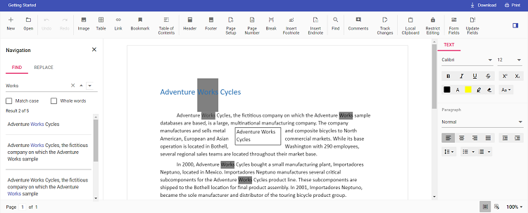

# Change Search Highlight Color in React Document Editor

[React Document Editor](https://www.syncfusion.com/docx-editor-sdk/react-docx-editor) (Document Editor) provides an option to change the default search highlight color using [`searchHighlightColor`](https://ej2.syncfusion.com/react/documentation/api/document-editor/documentEditorSettingsModel#searchhighlightcolor) in Document Editor settings. The color specified for `searchHighlightColor` within [`documentEditorSettings`](https://ej2.syncfusion.com/react/documentation/api/document-editor-container#documenteditorsettings) is used to highlight the searched text. By default, the search highlight color is `yellow`.

Similarly, you can use the [`documentEditorSettings`](https://ej2.syncfusion.com/react/documentation/api/document-editor#documenteditorsettings) property for the DocumentEditor also.

The following example code illustrates how to change the default search highlight color.

```ts
import * as ReactDOM from 'react-dom';
import * as React from 'react';
import {
  DocumentEditorContainerComponent, Toolbar } from '@syncfusion/ej2-react-documenteditor';
DocumentEditorContainerComponent.Inject(Toolbar);
function App() {
  // Specify the desired color to change the default search highlight color
  let searchHighlightColor = {
    searchHighlightColor: 'Grey',
  };
  return (
    <DocumentEditorContainerComponent
      id="container"
      height={'590px'}
      serviceUrl="https://document.syncfusion.com/web-services/docx-editor/api/documenteditor/"
      enableToolbar={true}
      documentEditorSettings={searchHighlightColor}
    />
  );
}
export default App;
ReactDOM.render(<App />, document.getElementById('sample'));

```

> The Web API hosted link `https://document.syncfusion.com/web-services/docx-editor/api/documenteditor/` utilized in the Document Editor's serviceUrl property is intended solely for demonstration and evaluation purposes. For production deployment, please host your own web service with your required server configurations. You can refer and reuse the [GitHub Web Service example](https://github.com/SyncfusionExamples/EJ2-DocumentEditor-WebServices) or [Docker image](https://hub.docker.com/r/syncfusion/word-processor-server) for hosting your own web service and use for the serviceUrl property.

The output will look like the following:

