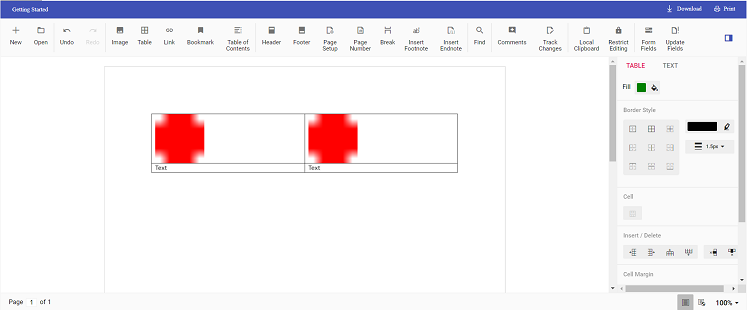

# Insert text or image in a table in React Document Editor

Using [React Document Editor](https://www.syncfusion.com/docx-editor-sdk/react-docx-editor) APIs, you can insert [`text`](../how-to/insert-text-in-current-position#insert-text-in-current-cursor-position) or [`image`](../image#images) in a [`table`](../table#create-a-table) programmatically based on your requirement.

Use [`selection`](../how-to/move-selection-to-specific-position#selects-content-based-on-start-and-end-hierarchical-index) APIs to navigate between rows and cells.

The following example illustrates how to create a 2×2 table and then add text and image programmatically.

```ts
import * as ReactDOM from 'react-dom';
import * as React from 'react';
import {
    DocumentEditorContainerComponent,
    Toolbar,
} from '@syncfusion/ej2-react-documenteditor';

DocumentEditorContainerComponent.Inject(Toolbar);
function App() {
    let container: DocumentEditorContainerComponent;
    function onCreated() {
        // To insert the table in the cursor position
        container.documentEditor.editor.insertTable(2, 2);
        // To insert the image at the first cell of the table
        container.documentEditor.editor.insertImage(
            'data:image/png;base64,iVBORw0KGgoAAAANSUhEUgAAAAUAAAAFCAYAAACNbyblAAAAHElEQVQI12P4    //8/w38GIAXDIBKE0DHxgljNBAAO9TXL0Y4OHwAAAABJRU5ErkJggg=='
        );
        // To move the cursor to next cell
        moveCursorToNextCell();
        // To insert the image at the second cell of the table
        container.documentEditor.editor.insertImage(
            'data:image/png;base64,iVBORw0KGgoAAAANSUhEUgAAAAUAAAAFCAYAAACNbyblAAAAHElEQVQI12P4    //8/w38GIAXDIBKE0DHxgljNBAAO9TXL0Y4OHwAAAABJRU5ErkJggg=='
        );
        // To move the cursor to next row
        moveCursorToNextRow();
        // To insert text in the cursor position
        container.documentEditor.editor.insertText('Text');
        // To move the cursor to next cell
        moveCursorToNextCell();
        // To insert text in the cursor position
        container.documentEditor.editor.insertText('Text');
    }
function moveCursorToNextCell() {
  // To get current selection start offset
  var startOffset = container.documentEditor.selection.startOffset;
  // Increasing cell index to consider next cell
  var startOffsetArray = startOffset.split(';');
  startOffsetArray[3] = parseInt(startOffsetArray[3]) + 1;
  // Changing start offset
  startOffset = startOffsetArray.join(';');
  // Navigating selection using select method
  container.documentEditor.selection.select(startOffset, startOffset);
}

function moveCursorToNextRow() {
  // To get current selection start offset
  var startOffset = container.documentEditor.selection.startOffset;
  // Increasing row index to consider next row
  var startOffsetArray = startOffset.split(';');
  startOffsetArray[2] = parseInt(startOffsetArray[2]) + 1;
  // Going back to first cell
  startOffsetArray[3] = 0;
  // Changing start offset
  startOffset = startOffsetArray.join(';');
  // Navigating selection using select method
  container.documentEditor.selection.select(startOffset, startOffset);
}
    return (
        <DocumentEditorContainerComponent
            id="container"
            ref={(scope) => {
                container = scope;
            }}
            height={'590px'}
            serviceUrl="https://document.syncfusion.com/web-services/docx-editor/api/documenteditor/"
            enableToolbar={true}
            created={onCreated}
        />
    );
}
export default App;
ReactDOM.render(<App />, document.getElementById('sample'));
```

N> The Web API hosted link `https://document.syncfusion.com/web-services/docx-editor/api/documenteditor/` utilized in the Document Editor's serviceUrl property is intended solely for demonstration and evaluation purposes. For production deployment, please host your own web service with your required server configurations. You can refer and reuse the [GitHub Web Service example](https://github.com/SyncfusionExamples/EJ2-DocumentEditor-WebServices) or [Docker image](https://hub.docker.com/r/syncfusion/word-processor-server) for hosting your own web service and use for the serviceUrl property.

The output will be as shown below.

