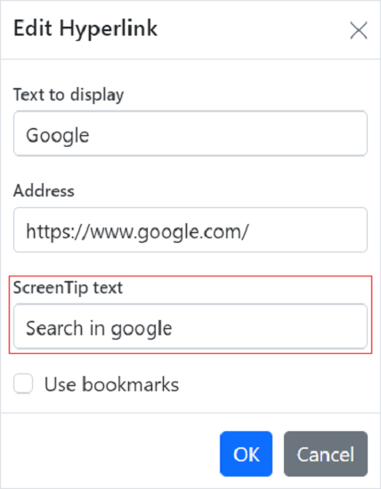

# Link in React Document editor component

[React DOCX Editor](https://www.syncfusion.com/docx-editor-sdk/react-docx-editor) (Document Editor) supports the hyperlink field. You can link a part of the document content to the Internet, a file location, a mail address, or any text within the document.

## Navigate a hyperlink

Document Editor triggers the `requestNavigate` event whenever the user presses the Ctrl key or taps a hyperlink within the document. This event provides the necessary details about link type, navigation URL, and local URL (if any) as arguments, and allows you to easily customize the hyperlink navigation functionality.

### Add the requestNavigate event for DocumentEditor

The following example illustrates how to add the `requestNavigate` event for the DocumentEditor.












        


### Add the requestNavigate event for DocumentEditorContainer component

The following example illustrates how to add the `requestNavigate` event for the DocumentEditorContainer component.

```ts
import * as ReactDOM from 'react-dom';
import * as React from 'react';
import {
  DocumentEditorContainerComponent,
  Toolbar,
  RequestNavigateEventArgs
} from '@syncfusion/ej2-react-documenteditor';

DocumentEditorContainerComponent.Inject(Toolbar);
export class Default extends React.Component {
  onCreated() {
    // Add event listener for requestNavigate event to customize hyperlink navigation functionality
    this.container.documentEditor.requestNavigate = (args: RequestNavigateEventArgs) => {
        if (args.linkType !== 'Bookmark') {
            let link: string = args.navigationLink;
            if (args.localReference.length > 0) {
            link += '#' + args.localReference;
            }
            //Navigate to the selected URL.
            window.open(link);
            args.isHandled = true;
        }
    };
  }
  render() {
    return (
      <DocumentEditorContainerComponent
        id="container"
        ref={(scope) => {
          this.container = scope;
        }}
        height={'590px'}
        serviceUrl="https://document.syncfusion.com/web-services/docx-editor/api/documenteditor/"
        enableToolbar={true}
        created={this.onCreated.bind(this)}
      />
    );
  }
}
ReactDOM.render(<Default />, document.getElementById('sample'));
```

> The Web API hosted link `https://document.syncfusion.com/web-services/docx-editor/api/documenteditor/` utilized in the Document Editor's serviceUrl property is intended solely for demonstration and evaluation purposes. For production deployment, please host your own web service with your required server configurations. You can refer and reuse the [GitHub Web Service example](https://github.com/SyncfusionExamples/EJ2-DocumentEditor-WebServices) or [Docker image](https://hub.docker.com/r/syncfusion/word-processor-server) for hosting your own web service and use for the serviceUrl property.

If the selection is in a hyperlink, trigger this event by calling the `navigateHyperlink` method of the `Selection` instance. Refer to the following example.

```ts
documenteditor.selection.navigateHyperlink();
```

## Copy link

Document Editor copies the link text of a hyperlink field to the clipboard if the selection is in a hyperlink. Refer to the following example.

```ts
documenteditor.selection.copyHyperlink();
```

## Add hyperlink

To create a basic hyperlink in the document, press `ENTER` / `SPACEBAR` / `SHIFT + ENTER` / `TAB` key after typing the address, for instance [`http://www.google.com`](http://www.google.com). Document Editor automatically converts this address to a hyperlink field. The text can be considered as a valid URL if it starts with any of the following.

> `<http://>`<br>
> `<https://>`<br>
> `file:///`<br>
> `www.`<br>
> `mailto:`<br>

Refer to the following example.












        


## Customize screen tip

You can customize the screen tip text for the hyperlink by using the sample code below.

```ts
documenteditor.editor.insertHyperlink('https://www.google.com', 'Google', '<<Screen tip text>>');
```

Screen tip text can be modified through the UI by using the [Hyperlink dialog](./dialog#hyperlink-dialog).



## Remove hyperlink

To remove the link from a hyperlink in the document, press the Backspace key at the end of a hyperlink. By removing the link, it will be converted as plain text. You can use the `removeHyperlink` method of the `Editor` instance if the selection is in a hyperlink. Refer to the following example.

```ts
documenteditor.editor.removeHyperlink();
```

## Hyperlink dialog

Document Editor provides dialog support to insert or edit a hyperlink. Refer to the following example.












        


You can use the following keyboard shortcut to open the hyperlink dialog if the selection is in a hyperlink.

| Key Combination | Description |
|-----------------|-------------|
|Ctrl + K | Open hyperlink dialog that allows you to create or edit a hyperlink|

## Online Demo

Explore how to insert and manage hyperlinks in Word documents using the React Document Editor in this [live demo](https://document.syncfusion.com/demos/docx-editor/react/#/tailwind3/document-editor/links-and-bookmarks).

## See Also

* [Feature modules](./feature-module)
* [Hyperlink dialog](./dialog#hyperlink-dialog)
