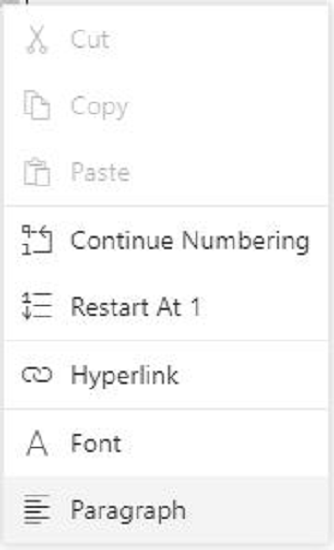

# List format in React Document editor component

[React DOCX Editor](https://www.syncfusion.com/docx-editor-sdk/react-docx-editor) (Document Editor) supports both single-level and multilevel lists. Lists are used to organize data as step-by-step instructions in documents for easy understanding of key points. You can apply a list to paragraphs using the supported APIs.

## Create bullet list

Bullets are usually used for unordered lists. To apply a bulleted list to selected paragraphs, use the following method of the `Editor` instance.

> applyBullet(bullet, fontFamily);

|Parameter|Type|Description|
|---------|----|-----------|
|Bullet|string|Bullet character.|
|fontFamily|string|Bullet font family.|

Refer to the following sample code.

```ts
documenteditor.editor.applyBullet('\uf0b7', 'Symbol');
```

## Create numbered list

Numbered lists are usually used for ordered lists. To apply a numbered list to selected paragraphs, use the following method of the `Editor` instance.

> applyNumbering(numberFormat,listLevelPattern)

|Parameter|Type|Description|
|---------|----|-----------|
|numberFormat|string|The "%n" representations in the `numberFormat` parameter will be replaced by the respective list level's value. "%1)" will be displayed as "1)".|
|listLevelPattern(optional)|string|Default value is 'Arabic'.|

Refer to the following example.

```ts
documenteditor.editor.applyNumbering('%1)', 'UpRoman');
```

## Clear list

You can also clear the list formatting applied to selected paragraphs. Refer to the following sample code.

```ts
documenteditor.editor.clearList();
```

## Working with lists

The following sample demonstrates how to create bulleted and numbered lists in Document Editor.












        


## Editing numbered list

Document Editor restarts the numbering or continues numbering for a numbered list. These options are found in the built-in context menu if the list value is selected. Refer to the following screenshot.



## Online Demo

Explore how to apply bullets and numbering in Word documents using the React Document Editor in this [live demo](https://document.syncfusion.com/demos/docx-editor/react/#/tailwind3/document-editor/bullets-and-numbering).

## See Also

* [List dialog](./dialog#list-dialog)
