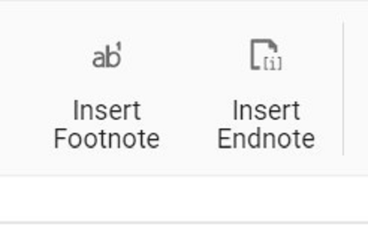
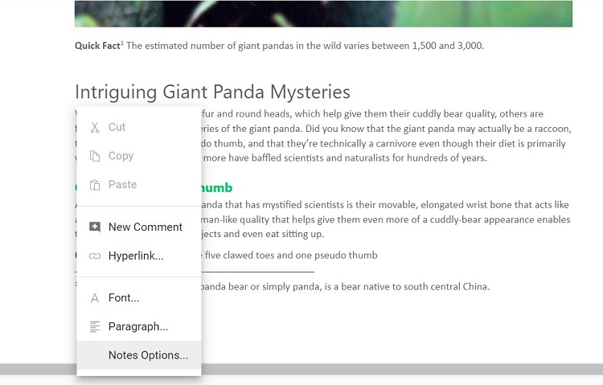

# Notes in React Document Editor component

[React Document Editor](https://www.syncfusion.com/docx-editor-sdk/react-docx-editor) (Document Editor) Container component provides support for inserting footnotes and endnotes through the built-in toolbar. Refer to the following screenshot.



Footnotes and endnotes are both ways of adding extra bits of information to your writing outside of the main text. You can use footnotes and endnotes to add side comments to your work or to cite other publications like books, articles, or websites.

## Insert footnotes

Document Editor exposes an API to insert footnotes at the cursor position programmatically, or they can be inserted at the end of selected text.

```ts
import * as ReactDOM from 'react-dom';
import * as React from 'react';

import {
    DocumentEditorComponent, Print, SfdtExport, WordExport, TextExport, Selection, Search, Editor, ImageResizer, EditorHistory,
    ContextMenu, OptionsPane, HyperlinkDialog, TableDialog, BookmarkDialog, TableOfContentsDialog,
    PageSetupDialog, StyleDialog, ListDialog, ParagraphDialog, BulletsAndNumberingDialog, FontDialog,
    TablePropertiesDialog, BordersAndShadingDialog, TableOptionsDialog, CellOptionsDialog, StylesDialog
} from '@syncfusion/ej2-react-documenteditor';

//Inject required module.
DocumentEditorComponent.Inject(Print, SfdtExport, WordExport, TextExport, Selection, Search, Editor, ImageResizer, EditorHistory, ContextMenu, OptionsPane, HyperlinkDialog, TableDialog, BookmarkDialog, TableOfContentsDialog, PageSetupDialog, StyleDialog, ListDialog, ParagraphDialog, BulletsAndNumberingDialog, FontDialog, TablePropertiesDialog, BordersAndShadingDialog, TableOptionsDialog, CellOptionsDialog, StylesDialog);
function App() {
    let documenteditor: DocumentEditorComponent=new DocumentEditorComponent(undefined);
return (
            <div>
                <button onClick={Footnote}>Insert Footnote</button>
                <DocumentEditorComponent  id="container" height={'330px'} ref={(scope) => { documenteditor = scope; }} serviceUrl="https://document.syncfusion.com/web-services/docx-editor/api/documenteditor/" isReadOnly={false} enablePrint={true}
                    enableSelection={true} enableEditor={true} enableEditorHistory={true}
                    enableContextMenu={true} enableSearch={true} enableOptionsPane={true}
                    enableBookmarkDialog={true} enableBordersAndShadingDialog={true} enableFontDialog={true} enableTableDialog={true} enableParagraphDialog={true} enableHyperlinkDialog={true} enableImageResizer={true} enableListDialog={true}
                    enablePageSetupDialog={true} enableSfdtExport={true}
                    enableStyleDialog={true} enableTableOfContentsDialog={true}
                    enableTableOptionsDialog={true} enableTablePropertiesDialog={true}
                    enableTextExport={true} enableWordExport={true}/>
            </div>
        );
        function Footnote(){
          //Insert footnote.
          documenteditor.editor.insertFootnote();
      }

}
export default App();
ReactDOM.render(<App />, document.getElementById('sample'));

```

> The Web API hosted link `https://document.syncfusion.com/web-services/docx-editor/api/documenteditor/` utilized in the Document Editor's serviceUrl property is intended solely for demonstration and evaluation purposes. For production deployment, please host your own web service with your required server configurations. You can refer and reuse the [GitHub Web Service example](https://github.com/SyncfusionExamples/EJ2-DocumentEditor-WebServices) or [Docker image](https://hub.docker.com/r/syncfusion/word-processor-server) for hosting your own web service and use for the serviceUrl property.

## Insert endnotes

Document Editor exposes an API to insert endnotes at the cursor position programmatically, or they can be inserted at the end of selected text.

```ts
import * as ReactDOM from 'react-dom';
import * as React from 'react';

import {
    DocumentEditorComponent, Print, SfdtExport, WordExport, TextExport, Selection, Search, Editor, ImageResizer, EditorHistory,
    ContextMenu, OptionsPane, HyperlinkDialog, TableDialog, BookmarkDialog, TableOfContentsDialog,
    PageSetupDialog, StyleDialog, ListDialog, ParagraphDialog, BulletsAndNumberingDialog, FontDialog,
    TablePropertiesDialog, BordersAndShadingDialog, TableOptionsDialog, CellOptionsDialog, StylesDialog
} from '@syncfusion/ej2-react-documenteditor';

//Inject required modules.
DocumentEditorComponent.Inject(Print, SfdtExport, WordExport, TextExport, Selection, Search, Editor, ImageResizer, EditorHistory, ContextMenu, OptionsPane, HyperlinkDialog, TableDialog, BookmarkDialog, TableOfContentsDialog, PageSetupDialog, StyleDialog, ListDialog, ParagraphDialog, BulletsAndNumberingDialog, FontDialog, TablePropertiesDialog, BordersAndShadingDialog, TableOptionsDialog, CellOptionsDialog, StylesDialog);

    let documenteditor: DocumentEditorComponent= new DocumentEditorComponent(undefined);
    function App (){
      return (
        <div>
            <button onClick={InsertEndnote}>Insert Endnote</button>
            <DocumentEditorComponent id="container" height={'330px'}  ref={(scope) => { documenteditor = scope; }}  serviceUrl="https://document.syncfusion.com/web-services/docx-editor/api/documenteditor/" isReadOnly={false} enablePrint={true}
            enableSelection={true} enableEditor={true} enableEditorHistory={true}
            enableContextMenu={true} enableSearch={true} enableOptionsPane={true}
            enableBookmarkDialog={true} enableBordersAndShadingDialog={true} enableFontDialog={true} enableTableDialog={true} enableParagraphDialog={true} enableHyperlinkDialog={true} enableImageResizer={true} enableListDialog={true}
            enablePageSetupDialog={true} enableSfdtExport={true}
            enableStyleDialog={true} enableTableOfContentsDialog={true}
            enableTableOptionsDialog={true} enableTablePropertiesDialog={true}
            enableTextExport={true} enableWordExport={true} />
        </div>

      );
      function InsertEndnote() {
        //Insert endnote.
        documenteditor.editor.insertEndnote();
      }
    }
export default App;
ReactDOM.render(<App />, document.getElementById('sample'));

```

> The Web API hosted link `https://document.syncfusion.com/web-services/docx-editor/api/documenteditor/` utilized in the Document Editor's serviceUrl property is intended solely for demonstration and evaluation purposes. For production deployment, please host your own web service with your required server configurations. You can refer and reuse the [GitHub Web Service example](https://github.com/SyncfusionExamples/EJ2-DocumentEditor-WebServices) or [Docker image](https://hub.docker.com/r/syncfusion/word-processor-server) for hosting your own web service and use for the serviceUrl property.

## Update or edit footnotes and endnotes

You can update or edit the footnotes and endnotes using the built-in context menu shown by right-clicking the footnote or endnote. The Footnote/Endnote dialog box pops up, and you can customize the number format and the starting value. Refer to the following screenshot.



## Online Demo

Explore how to add and manage notes in Word documents using the React Document Editor in this [live demo](https://document.syncfusion.com/demos/docx-editor/react/#/tailwind3/document-editor/notes).
