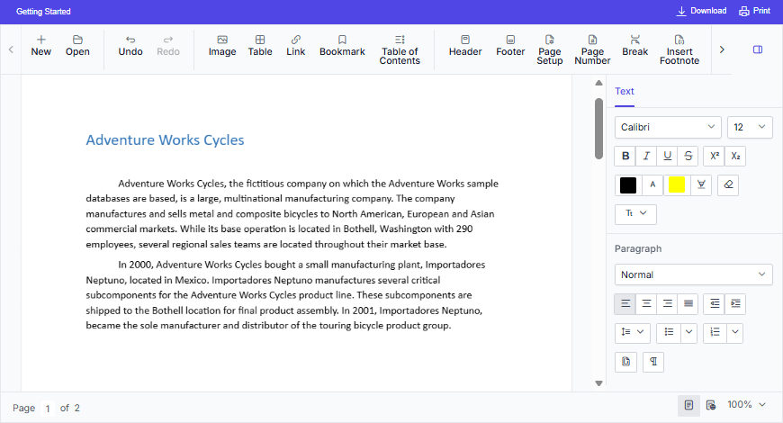

# Overview of the React Document Editor

The [React Document Editor](https://www.syncfusion.com/docx-editor-sdk/react-docx-editor) (Document Editor) is a feature-rich, user-interactive component that enables creating, editing, viewing, and printing Word documents with advanced formatting, editing capabilities, and broad support for document import and export formats.

## Key Features

* [Opens](./import) the native `Syncfusion Document Text (*.sfdt)` format documents on the client side.
* [Saves the documents](./export) on the client side as `Syncfusion Document Text (*.sfdt)` and `Word document (*.docx)`.
* Supports document elements like text, [image](./image), [table](./table), fields, [bookmark](./bookmark), [shapes](./shapes), [section](./section-format), [header and footer](./header-footer).
* Supports the commonly used fields like [hyperlink](./link), page number, page count, and table of contents.
* Supports formats like [text](./text-format), [paragraph](./paragraph-format), [bullets and numbering](./list-format), [table](./table-format), and [page settings](./section-format).
* Provides support to create, edit, and apply [paragraph and character styles](./styles).
* Provides support to [find and replace](./find-and-replace) text within the document.
* Supports all the common editing and formatting operations along with [undo and redo](./history).
* Provides support to [cut](./clipboard#cut), [copy](./clipboard#copy), and [paste](./clipboard#paste) rich text contents within the component. Also allows pasting simple text to and from other applications.
* Provides support to insert and edit [form fields](./form-fields).
* Provides support to insert and edit [comments](./comments).
* Provides support to track the [inserted and deleted content](./track-changes).
* Provides support to perform [spell checking](./spell-check) for any input text.
* Allows user interactions like [zoom](./scrolling-zooming#zooming), [scroll](./scrolling-zooming), and selecting contents through touch, mouse, and keyboard.
* Provides intuitive UI options like context menu, [dialogs](./dialog), and [navigation pane](./find-and-replace#options-pane).
* Provides a [ribbon interface](./ribbon) similar to Microsoft Word, with tab-based commands for quick and intuitive access to features.
* [Localizes](./global-local) all the static text to any desired language.
* Allows creating a lightweight Word viewer using module injection to view and [print](./print) Word documents.
* Provides a [server-side helper library](./web-services) to open Word documents like DOCX, DOC, WordML, RTF, and Text by converting them to SFDT file format.

## Supported platforms for server-side dependencies

The Document Editor component requires server-side interactions for the following operations:

* Open file formats other than SFDT
* Paste with formatting
* Restrict editing
* Spell check
* Save as file formats other than SFDT and DOCX

You can deploy web APIs for the server-side dependencies of the Document Editor component on the following platforms.

* [ASP.NET Core](./web-services/core)
* [ASP.NET MVC](./web-services/mvc)
* [Java](./web-services/java)

To know more about server-side dependencies, refer to this [page](./web-services-overview).

N> If you don't require the above functionalities, then you can deploy it as a pure client-side component without any server-side interactions.