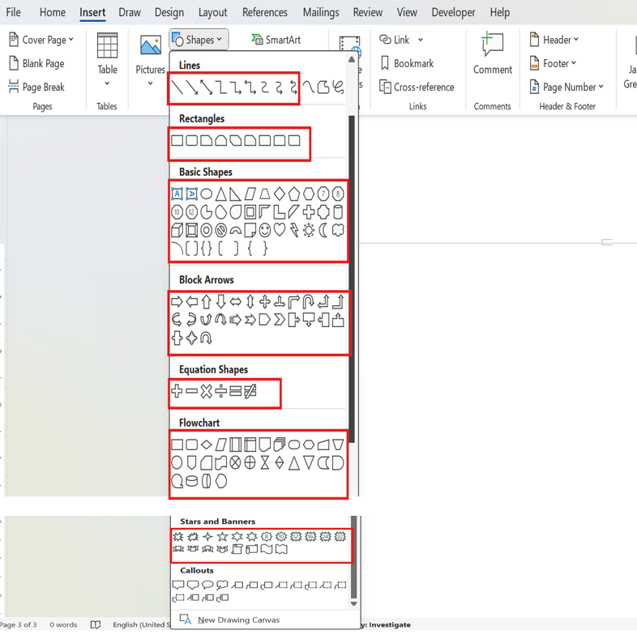
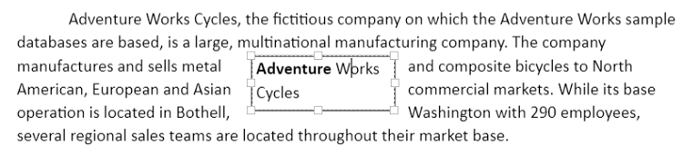
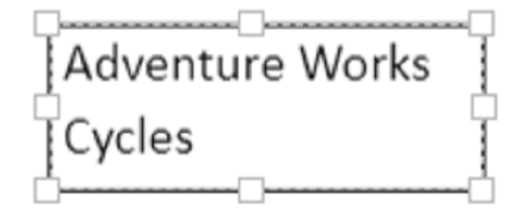

# Shapes in React Document Editor component

Shapes are drawing objects that include a text box, rectangles, lines, curves, circles, etc. They can have preset or custom geometry.

N> At present, [React Document Editor](https://www.syncfusion.com/docx-editor-sdk/react-docx-editor) (Document Editor) does not have support to insert shapes. However, if the document contains a shape while importing, it will be preserved properly.

## Supported shapes

The DocumentEditor has preservation support for Lines, Rectangle, Basic Shapes, Block Arrows, Equation Shapes, Flowchart and Stars and Banners.

N> When using ASP.NET MVC service, the unsupported shapes will be converted to an image and preserved as an image.

## Text box Shape

A text box is a rectangular area on the document where you can enter text. When you click in a text box, a flashing cursor will display indicating that you can begin typing. It allows you to enter multiple lines of text with all text formatting.

## Shape Resizer

The Document Editor also supports a built-in shape resizer to resize the shapes present in the document. The shape resizer accepts both touch and mouse interactions.

## Text wrapping style

Text wrapping refers to how shapes fit with surrounding text in a document. Please [refer to this page](./text-wrapping-style) for more information about text wrapping styles available in Word documents.

## Positioning the shape

Document Editor preserves the position properties of the shape and displays the shape based on position properties. It does not support modifying the position properties. However, the shape will be automatically moved along with the edited text if it is positioned relative to the line or paragraph.

## Online Demo

Explore how to preserve auto shapes and grouped shapes in Word documents using the React Document Editor in this live demo [here](https://document.syncfusion.com/demos/docx-editor/react/#/tailwind3/document-editor/autoshapes).
