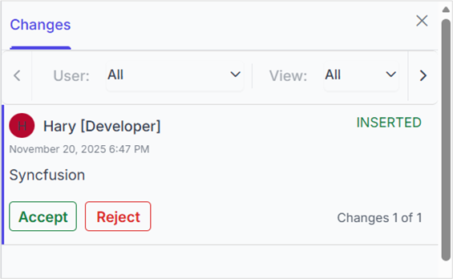
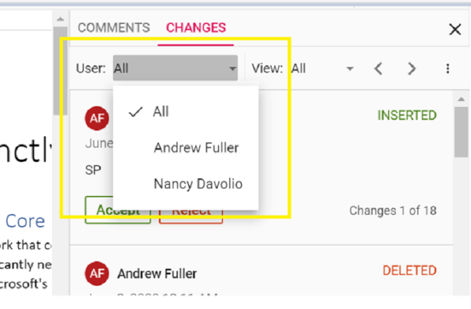

# Track Changes in React DOCX Editor

[React DOCX Editor](https://www.syncfusion.com/docx-editor-sdk/react-docx-editor) (Document Editor) supports Track Changes functionality, which allows you to keep a record of changes or edits made to a document. You can then choose to accept or reject these modifications. It is a useful tool for managing changes made by several reviewers to the same document. When the Track Changes option is enabled, all editing operations are preserved as revisions in the Document Editor.

## Enable Track changes

Track Changes can be enabled using the [enableTrackChanges](https://ej2.syncfusion.com/react/documentation/api/document-editor-container/index-default#enabletrackchanges) property. When enabled, all editing operations are recorded and preserved as revisions in the Document Editor.

The following example demonstrates how to enable track changes.




import { createRoot } from 'react-dom/client';
import './index.css';
import * as React from 'react';

import { DocumentEditorContainerComponent, Toolbar } from '@syncfusion/ej2-react-documenteditor';

DocumentEditorContainerComponent.Inject(Toolbar);
let documenteditor = useRef<DocumentEditorContainerComponent>(null);
function App() {
    return (
        <DocumentEditorContainerComponent
            id="container"
            height="590px"
            ref={documenteditor}
            // Use the following service URL only for demo purposes
            serviceUrl="https://document.syncfusion.com/web-services/docx-editor/api/documenteditor/"
            enableToolbar={true}
            enableTrackChanges={true}
        />
    );
}
export default App;
createRoot(document.getElementById('sample')).render(<App />);




N> Track changes are document level settings. When opening a document, if the document does not have track changes enabled, `enableTrackChanges` is reset to `false` even if you set it to `true` initially. If you want to enable track changes for all the documents, then we recommend enabling track changes in the `documentChange` event. 

The following example demonstrates how to enable track changes for the all the document while opening.




container.current.documentChange = () => {
      if (container.current !== null) {
        container.current.documentEditor.enableTrackChanges = true;
      }
    };




## Show or hide revisions pane

The Show or Hide Revisions Pane in the Document Editor allows users to toggle the visibility of the revisions pane, providing flexibility in managing tracked changes within the document.

The following example code illustrates how to show or hide the revisions pane.




import { createRoot } from 'react-dom/client';
import * as React from 'react';
import {
    DocumentEditorContainerComponent,
    Toolbar,
} from '@syncfusion/ej2-react-documenteditor';

// Inject the required modules
DocumentEditorContainerComponent.Inject(Toolbar);

function App() {
    let container = null;

    React.useEffect(() => {
        if (container) {
            container.documentEditor.showRevisions = true; // To show revisions pane
            container.documentEditor.showRevisions = false; // To hide revisions pane
        }
    }, [container]); // Re-run the effect when the container is initialized

    return (
        

            <DocumentEditorContainerComponent
                id="container"
                ref={(scope) => {
                    container = scope; // Assign the container ref
                }}
                height={'590px'}
                // Use the following service URL only for demo purposes
                serviceUrl="https://document.syncfusion.com/web-services/docx-editor/api/documenteditor/"
                enableToolbar={true}
                enableTrackChanges={true}
            />
        

    );
}

export default App;

// Render the App component into the sample div
createRoot(document.getElementById('sample')).render(<App />);




N> The hosted Web API URL is for demo and evaluation purposes only. For production, host your own web service using the [GitHub Web Service example](https://github.com/SyncfusionExamples/EJ2-Document-Editor-Web-Services) or the [Docker image](https://hub.docker.com/r/syncfusion/word-processor-server).

## Get all tracked revisions

Retrieves all tracked revisions from the current document using the [revisions collection](https://ej2.syncfusion.com/documentation/api/document-editor/revisioncollection) in the Document Editor.

The following example demonstrates how to get all tracked revisions from the current document.




<DocumentEditorComponent id="container" ref={(scope) => { documenteditor = scope; }} enableTrackChanges={true}/>
/**
 * Get revisions from the current document
 */
let revisions : RevisionCollection = documentEditor.revisions;




## Accept or reject all changes

Handles all tracked changes in the document at once, either by accepting or rejecting them. This helps quickly finalize or discard edits without reviewing each change individually.

The following example demonstrates how to accept or reject all changes.




<DocumentEditorComponent id="container" ref={(scope) => { documenteditor = scope; }} enableTrackChanges={true} />
/**
 * Get revisions from the current document
 */
let revisions: RevisionCollection = documentEditor.revisions;
/**
 * Accept all tracked changes
 */
revisions.acceptAll();
/**
 * Reject all tracked changes
 */
revisions.rejectAll();




## Accept or reject a specific revision

Applies changes to a specific tracked revision in the document, allowing precise control to accept or reject individual edits.

The following example demonstrates how to accept or reject a specific revision in the Document Editor.




/**
 * Get revisions from the current document
 */
let revisions: RevisionCollection = documentEditor.revisions;
/**
 * Accept specific changes
 */
if (revisions.length > 0) {
    revisions.get(0).accept();
}
/**
 * Reject specific changes
 */
if (revisions.length > 1) {
    revisions.get(1).reject();
}




## Navigate between the tracked changes

Navigates through tracked changes in the document programmatically, enabling easy movement to the next or previous revision from the current selection.

The following example demonstrates how to navigate through tracked revisions programmatically.




/**
 * Navigate to next tracked change from the current selection.
 */
this.container.documentEditor.selection.navigateNextRevision();
/**
 * Navigate to previous tracked change from the current selection.
 */
this.container.documentEditor.selection.navigatePreviousRevision();




## Custom metadata along with author

The Document Editor allows customizing revisions using [revisionSettings](https://ej2.syncfusion.com/react/documentation/api/document-editor/documenteditorsettingsmodel#revisionsettings). The [customData](https://ej2.syncfusion.com/react/documentation/api/document-editor/revisionsettings#customdata) property allows attaching additional metadata to tracked revisions. This metadata can represent roles, tags, or any custom identifier for a revision. To display this metadata along with the author name in the Track Changes pane, the [showCustomDataWithAuthor](https://ej2.syncfusion.com/react/documentation/api/document-editor/revisionsettings#showcustomdatawithauthor) property must be enabled.

The following example illustrates how to enable and update custom metadata for track changes revisions.




import { createRoot } from 'react-dom/client';
import * as React from 'react';
import {
    DocumentEditorContainerComponent,
    Toolbar,
} from '@syncfusion/ej2-react-documenteditor';

DocumentEditorContainerComponent.Inject(Toolbar);
function App() {
    let container;
    let settings = { revisionSettings: { customData: 'Developer', showCustomDataWithAuthor: true } };
    return (
        <DocumentEditorContainerComponent
            id="container"
            ref={(scope) => {
                container = scope;
            }}
            height={'590px'}
            // Use the following service URL only for demo purposes
            serviceUrl="https://document.syncfusion.com/web-services/docx-editor/api/documenteditor/"
            enableTrackChanges={true}
            documentEditorSettings={settings}
        />
    );
}
export default App;
createRoot(document.getElementById('sample')).render(<App />);




The Track Changes pane will display the author name along with the custom metadata, as shown in the screenshot below.

N> When the document is exported as SFDT, the customData value is stored in the revision collection. Upon reopening the SFDT, the custom data is automatically restored and displayed in the Track Changes pane.In formats other than SFDT (such as DOCX and others), the customData is not preserved, as it is specific to the Document Editor component

## Restrict accept or reject by author

Accepting or rejecting changes can be restricted based on the author’s name. The `beforeAcceptRejectChanges` event is triggered before both accept and reject actions, so the same handler can be used to restrict either operation.

The following example demonstrates how to restrict an author from accept or reject changes.




import { createRoot } from 'react-dom/client';
import * as React from 'react';
import { useRef } from 'react';
import {
    DocumentEditorContainerComponent,
    Toolbar,
} from '@syncfusion/ej2-react-documenteditor';
DocumentEditorContainerComponent.Inject(Toolbar);
function App() {
    const container = useRef<DocumentEditorContainerComponent>(null);
    // Event gets triggered before accepting/rejecting changes
    const beforeAcceptRejectChanges = (args) => {
        // Check the author of the revision
        if (args.author !== 'Hary') {
            // Cancel the accept/reject action
            args.cancel = true;
        }
    };
    return (
        

            <DocumentEditorContainerComponent
                id="container"
                ref={container}
                height={'590px'}
                serviceUrl="https://document.syncfusion.com/web-services/docx-editor/api/documenteditor/"
                enableToolbar={true}
                enableTrackChanges={true}
                beforeAcceptRejectChanges={beforeAcceptRejectChanges}
            />
        

    );
}
export default App;
createRoot(document.getElementById('sample')).render(<App />);




## Filter Changes by User

In the Document Editor, a built-in review panel is available that supports filtering changes based on the user.

## Online Demo

Explore how to track and review changes in Word documents using the React Document Editor in this live demo [here](https://document.syncfusion.com/demos/docx-editor/react/#/tailwind3/document-editor/track-changes).

## Video tutorial 

To learn more about Track Changes in the Document Editor component, refer to the video below.

