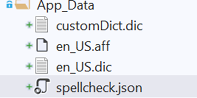

# Core in the React Document Editor component

DocumentEditor depends on server-side interactions for the operations listed below, which can be written in ASP.NET Core using [Syncfusion.EJ2.WordEditor.AspNet.Core](https://www.nuget.org/packages/Syncfusion.EJ2.WordEditor.AspNet.Core).

* Import Word Document
* Paste with formatting
* Restrict Editing
* Spell Check
* Save as file formats other than SFDT and DOCX

N> Syncfusion<sup style="font-size:70%">&reg;</sup> provides a predefined [Word Processor server docker image](https://hub.docker.com/r/syncfusion/word-processor-server) targeting ASP.NET Core 2.1 framework. You can directly pull this docker image and deploy it on a server on the go. You can also create your own docker image by customizing the existing [docker project from GitHub](https://github.com/SyncfusionExamples/Word-Processor-Server-Docker). To know more, refer to this link: [Word Processor Server Docker Image Overview](../server-deployment/word-processor-server-docker-image-overview)

This section explains how to create the service for DocumentEditor in ASP.NET Core.

## Importing Word documents

As the Document Editor client-side script requires the document in SFDT file format, you can convert the Word documents (.dotx,.docx,.docm,.dot,.doc), rich text format documents (.rtf), and text documents (.txt) into SFDT format by using this Web API.

The following example code illustrates how to write a Web API for importing Word documents into the Document Editor component.

```csharp
    [AcceptVerbs("Post")]
    [HttpPost]
    [EnableCors("AllowAllOrigins")]
    [Route("Import")]
    public string Import(IFormCollection data)
    {
        if (data.Files.Count == 0)
            return null;
        Stream stream = new MemoryStream();
        IFormFile file = data.Files[0];
        int index = file.FileName.LastIndexOf('.');
        string type = index > -1 && index < file.FileName.Length - 1 ?
            file.FileName.Substring(index) : ".docx";
        file.CopyTo(stream);
        stream.Position = 0;

        WordDocument document = WordDocument.Load(stream, GetFormatType(type.ToLower()));
        string json = Newtonsoft.Json.JsonConvert.SerializeObject(document);
        document.Dispose();
        return json;
    }
```

### Import a document with TIFF, EMF, and WMF images

Web browsers do not support displaying metafile images like EMF and WMF, or TIFF format images. As a fallback approach, you can convert the metafile/TIFF format image to a raster image using any image converter in the `MetafileImageParsed` event, and this fallback raster image will be displayed in the client-side Document Editor component.

N> In the `MetafileImageParsedEventArgs` event argument, you can get the metafile stream using the `MetafileStream` property, and you can get the `IsMetafile` boolean value to determine whether the image is a metafile image (WMF, EMF) or a TIFF format image. In the example below, the TIFF is converted to a raster image in the `ConvertTiffToRasterImage()` method using [BitMiracle.LibTiff.NET](https://www.nuget.org/packages/BitMiracle.LibTiff.NET).

The following example code illustrates how to use the `MetafileImageParsed` event for creating a fallback raster image for a metafile present in a Word document.

```c#
    using SkiaSharp;
    using BitMiracle.LibTiff.Classic;

    public string Import(IFormCollection data)
    {
        if (data.Files.Count == 0)
            return null;
        Stream stream = new MemoryStream();
        IFormFile file = data.Files[0];
        int index = file.FileName.LastIndexOf('.');
        string type = index > -1 && index < file.FileName.Length - 1 ?
            file.FileName.Substring(index) : ".docx";
        file.CopyTo(stream);
        stream.Position = 0;

        //Hooks MetafileImageParsed event.
        WordDocument.MetafileImageParsed += OnMetafileImageParsed;
        //Converts Stream DOM to SFDT DOM.
        WordDocument document = WordDocument.Load(stream, GetFormatType(type.ToLower()));
        //Unhooks MetafileImageParsed event.
        WordDocument.MetafileImageParsed -= OnMetafileImageParsed;
        //Serializes SFDT DOM to SFDT string.
        string json = Newtonsoft.Json.JsonConvert.SerializeObject(document);
        document.Dispose();
        return json;
    }

    //Converts Metafile to raster image.
    private static void OnMetafileImageParsed(object sender, MetafileImageParsedEventArgs args)
    {       
        if (args.IsMetafile)
        {
            //MetaFile image conversion(EMF and WMF)
            //You can write your own method definition for converting metafile to raster image using any third-party image converter.
            args.ImageStream = ConvertMetafileToRasterImage(args.MetafileStream);
        }
        else
        {
            //TIFF image conversion
            args.ImageStream = ConvertTiffToRasterImage(args.MetafileStream);
        }
    }
    
    // Converting Tiff to Png image using Bitmiracle https://www.nuget.org/packages/BitMiracle.LibTiff.NET
    private static MemoryStream ConvertTiffToRasterImage(Stream tiffStream)
    {
        MemoryStream imageStream = new MemoryStream();
        using (Tiff tif = Tiff.ClientOpen("in-memory", "r", tiffStream, new TiffStream()))
        {
        // Find the width and height of the image
        FieldValue[] value = tif.GetField(BitMiracle.LibTiff.Classic.TiffTag.IMAGEWIDTH);
        int width = value[0].ToInt();

        value = tif.GetField(BitMiracle.LibTiff.Classic.TiffTag.IMAGELENGTH);
        int height = value[0].ToInt();

        // Read the image into the memory buffer
        int[] raster = new int[height * width];
        if (!tif.ReadRGBAImage(width, height, raster))
        {
            throw new Exception("Could not read image");
        }

        // Create a bitmap image using SkiaSharp.
        using (SKBitmap sKBitmap = new SKBitmap(width, height, SKImageInfo.PlatformColorType, SKAlphaType.Premul))
        {
            // Convert a RGBA value to byte array.
            byte[] bitmapData = new byte[sKBitmap.RowBytes * sKBitmap.Height];
            for (int y = 0; y < sKBitmap.Height; y++)
            {
            int rasterOffset = y * sKBitmap.Width;
            int bitsOffset = (sKBitmap.Height - y - 1) * sKBitmap.RowBytes;

            for (int x = 0; x < sKBitmap.Width; x++)
            {
                int rgba = raster[rasterOffset++];
                bitmapData[bitsOffset++] = (byte)((rgba >> 16) & 0xff);
                bitmapData[bitsOffset++] = (byte)((rgba >> 8) & 0xff);
                bitmapData[bitsOffset++] = (byte)(rgba & 0xff);
                bitmapData[bitsOffset++] = (byte)((rgba >> 24) & 0xff);
            }
            }

            // Convert a byte array to SKColor array.
            SKColor[] sKColor = new SKColor[bitmapData.Length / 4];
            int index = 0;
            for (int i = 0; i < bitmapData.Length; i++)
            {
            sKColor[index] = new SKColor(bitmapData[i + 2], bitmapData[i + 1], bitmapData[i], bitmapData[i + 3]);
            i += 3;
            index += 1;
            }

            // Set the SKColor array to SKBitmap.
            sKBitmap.Pixels = sKColor;

            // Save the SKBitmap to PNG image stream.
            sKBitmap.Encode(SKEncodedImageFormat.Png, 100).SaveTo(imageStream);
            imageStream.Flush();
        }
        }
        return imageStream;
    }
```

## Paste with formatting

This Web API converts the system clipboard data (HTML/RTF) to SFDT format which is required to paste content with formatting.

The following example code illustrates how to write a Web API for paste with formatting.

```csharp
    [AcceptVerbs("Post")]
    [HttpPost]
    [EnableCors("AllowAllOrigins")]
    [Route("SystemClipboard")]
    public string SystemClipboard([FromBody]CustomParameter param)
    {
        if (param.content != null && param.content != "")
        {
            try
            {
                //Hooks MetafileImageParsed event.
                WordDocument.MetafileImageParsed += OnMetafileImageParsed;
                WordDocument document = WordDocument.LoadString(param.content, GetFormatType(param.type.ToLower()));
                //Unhooks MetafileImageParsed event.
                WordDocument.MetafileImageParsed -= OnMetafileImageParsed;
                string json = Newtonsoft.Json.JsonConvert.SerializeObject(document);
                document.Dispose();
                return json;
            }
            catch (Exception)
            {
                return "";
            }
        }
        return "";
    }

    public class CustomParameter
    {
        public string content { get; set; }
        public string type { get; set; }
    }

    //Converts Metafile to raster image.
    private static void OnMetafileImageParsed(object sender, MetafileImageParsedEventArgs args)
    {
    //You can write your own method definition for converting metafile to raster image using any third-party image converter.
    args.ImageStream = ConvertMetafileToRasterImage(args.MetafileStream);
    }
```

N> Web browsers do not support displaying metafile images like EMF and WMF. As a fallback approach, you can convert the metafile to a raster image using any image converter in the `MetafileImageParsed` event, and this fallback raster image will be displayed in the client-side Document Editor component.

## Restrict editing

This Web API generates a hash from the specified password and salt value which is required for the restrict editing functionality of the Document Editor component.

The following example code illustrates how to write a Web API to restrict editing.

```csharp
    [AcceptVerbs("Post")]
    [HttpPost]
    [EnableCors("AllowAllOrigins")]
    [Route("RestrictEditing")]
    public string[] RestrictEditing([FromBody] CustomRestrictParameter param)
    {
        if (param.passwordBase64 == "" || param.passwordBase64 == null)
            return null;
        return WordDocument.ComputeHash(param.passwordBase64, param.saltBase64, param.spinCount, param.algorithmSid);
    }
    public class CustomRestrictParameter
    {
        public string passwordBase64 { get; set; }
        public string saltBase64 { get; set; }
        public int spinCount { get; set; }
        public string algorithmSid { get; set; }
    }
```

## Spell Check

Document Editor supports spell checking for input text. It identifies misspelled words and provides suggestions through a dialog and the context menu. The Document Editor client-side script requires this Web API to display error words and suggestions. This Web API returns a JSON response containing details about misspelled words and their suggestions.

### Dictionary setup

The Document Editor performs spell checking using [Hunspell dictionary files](https://github.com/wooorm/dictionaries). These dictionaries can be obtained from their respective sources. 

To set up spell checking, place the required dictionary files, including the .dic, .aff, and JSON configuration file, inside the `App_Data` folder in your project. To support a personal dictionary, place an empty .dic file in the same `App_Data` folder.

Refer to the following screenshot for the folder structure.



The JSON file should contain the configuration details in the following format:




[
  {
    "LanguadeID": 1033,
    "DictionaryPath": "en_US.dic",
    "AffixPath": "en_US.aff",
    "PersonalDictPath": "customDict.dic"
  }
]




### Configure spell check service

- Add the [Syncfusion.EJ2.SpellChecker.AspNet.Core](https://www.nuget.org/packages/Syncfusion.EJ2.SpellChecker.AspNet.Core/) NuGet package to your project.

- In the `Startup.cs` file, configure the spell check files as shown below:




public Startup(IConfiguration configuration, IWebHostEnvironment env)
{
    var builder = new ConfigurationBuilder()
        .SetBasePath(env.ContentRootPath)
        .AddJsonFile("appsettings.json", optional: true, reloadOnChange: true)
        .AddJsonFile($"appsettings.{env.EnvironmentName}.json", optional: true)
        .AddEnvironmentVariables();

    Configuration = builder.Build();

    path = Configuration["SPELLCHECK_DICTIONARY_PATH"];
    string jsonFileName = Configuration["SPELLCHECK_JSON_FILENAME"];
    //check the spell check dictionary path environment variable value and assign default data folder
    //if it is null.
    path = string.IsNullOrEmpty(path) ? Path.Combine(env.ContentRootPath, "App_Data") : Path.Combine(env.ContentRootPath, path);
    //Set the default spellcheck.json file if the JSON filename is empty.
    jsonFileName = string.IsNullOrEmpty(jsonFileName) ? Path.Combine(path, "spellcheck.json") : Path.Combine(path, jsonFileName);
    if (File.Exists(jsonFileName))
    {
        string jsonImport = File.ReadAllText(jsonFileName);
        List<DictionaryData> spellChecks = JsonConvert.DeserializeObject<List<DictionaryData>>(jsonImport);
        List<DictionaryData> spellDictCollection = new List<DictionaryData>();
        string personalDictPath = null;
        //construct the dictionary file path using customer provided path and dictionary name
        if (spellChecks != null)
        {
            foreach (var spellCheck in spellChecks)
            {
                spellDictCollection.Add(new DictionaryData(spellCheck.LanguadeID, Path.Combine(path, spellCheck.DictionaryPath), Path.Combine(path, spellCheck.AffixPath)));
                personalDictPath = Path.Combine(path, spellCheck.PersonalDictPath);
            }
        }
        SpellChecker.InitializeDictionaries(spellDictCollection, personalDictPath, 3);
    }
}




### Web API for word-by-word spell check 

This Web API performs spell checking word by word and returns a JSON response containing information about error words and suggestions, if any. By default, word-by-word spell checking is performed in the Document Editor when spell check is enabled on the client side.

The following example code illustrates how to write a Web API for word-by-word spell checking.




[AcceptVerbs("Post")]
[HttpPost]
[EnableCors("AllowAllOrigins")]
[Route("SpellCheck")]
public string SpellCheck([FromBody] SpellCheckJsonData spellChecker)
{
    try
    {
        SpellChecker spellCheck = new SpellChecker();
        spellCheck.GetSuggestions(spellChecker.LanguageID, spellChecker.TexttoCheck, spellChecker.CheckSpelling, spellChecker.CheckSuggestion, spellChecker.AddWord);
        return Newtonsoft.Json.JsonConvert.SerializeObject(spellCheck);
    }
    catch
    {
        return "{\"SpellCollection\":[],\"HasSpellingError\":false,\"Suggestions\":null}";
    }
}
public class SpellCheckJsonData
{
    public int LanguageID { get; set; }
    public string TexttoCheck { get; set; }
    public bool CheckSpelling { get; set; }
    public bool CheckSuggestion { get; set; }
    public bool AddWord { get; set; }
}




### Web API for page-by-page spell check

This Web API performs spell checking page by page and returns a JSON response containing information about error words and suggestions, if any. By [enabling optimized spell check](https://help.syncfusion.com/document-processing/word/word-processor/react/spell-check#optimized-spell-check) on the client side, you can perform page-by-page spell checking when loading documents.

The following example code illustrates how to write a Web API for page-by-page spell checking.




[AcceptVerbs("Post")]
[HttpPost]
[EnableCors("AllowAllOrigins")]
[Route("SpellCheckByPage")]
public string SpellCheckByPage([FromBody] SpellCheckJsonData spellChecker)
{
    try
    {
        SpellChecker spellCheck = new SpellChecker();
        spellCheck.CheckSpelling(spellChecker.LanguageID, spellChecker.TexttoCheck);
        return Newtonsoft.Json.JsonConvert.SerializeObject(spellCheck);
    }
    catch
    {
        return "{\"SpellCollection\":[],\"HasSpellingError\":false,\"Suggestions\":null}";
    }
}

public class SpellCheckJsonData
{
    public int LanguageID { get; set; }
    public string TexttoCheck { get; set; }
    public bool CheckSpelling { get; set; }
    public bool CheckSuggestion { get; set; }
    public bool AddWord { get; set; }
}




N> You can find the [GitHub Web Service example](https://github.com/SyncfusionExamples/EJ2-DocumentEditor-WebServices) then configure the dictionary set up  to make use for spell check or use the [Docker image](https://hub.docker.com/r/syncfusion/word-processor-server) to host your own web service.

## Save as file formats other than SFDT and DOCX

You can configure this API if you want to save the document in a file format other than DOCX and SFDT on the server side. You can save the document in the following ways:

### Save the document in a database or file server

This Web API saves the document on the server. You can customize this API to save the document into databases or file servers.

The following example code illustrates how to write a Web API to save a document on the server side.

```csharp
    [AcceptVerbs("Post")]
    [HttpPost]
    [EnableCors("AllowAllOrigins")]
    [Route("Save")]
    public void Save([FromBody] SaveParameter data)
    {
        string name = data.FileName;
        string format = RetrieveFileType(name);
        if (string.IsNullOrEmpty(name))
        {
            name = "Document1.doc";
        }
        WDocument document = WordDocument.Save(data.Content);
        // Saves the document to the server file system. You can customize this to save into databases or file servers based on your requirements.
        FileStream fileStream = new FileStream(name, FileMode.OpenOrCreate, FileAccess.ReadWrite);
        document.Save(fileStream, GetWFormatType(format));
        document.Close();
        fileStream.Close();
    }

    public class SaveParameter
    {
        public string Content { get; set; }
        public string FileName { get; set; }
    }
```

### Save as other file formats by passing SFDT string

This Web API converts the SFDT string to the required format and returns the document as a FileStreamResult to the client side. Using this API, you can save the document in a file format other than SFDT and DOCX and download the document in the client browser.

The following example code illustrates how to write a Web API to export SFDT.

```csharp
    [AcceptVerbs("Post")]
    [HttpPost]
    [EnableCors("AllowAllOrigins")]
    [Route("ExportSFDT")]
    public FileStreamResult ExportSFDT([FromBody] SaveParameter data)
    {
        string name = data.FileName;
        string format = RetrieveFileType(name);
        if (string.IsNullOrEmpty(name))
        {
            name = "Document1.doc";
        }
        WDocument document = WordDocument.Save(data.Content);
        return SaveDocument(document, format, name);
    }

    public class SaveParameter
    {
        public string Content { get; set; }
        public string FileName { get; set; }
    }

        private FileStreamResult SaveDocument(WDocument document, string format, string fileName)
    {
        Stream stream = new MemoryStream();
        string contentType = "";
        if (format == ".pdf")
        {
            contentType = "application/pdf";
        }
        else
        {
            WFormatType type = GetWFormatType(format);
            switch (type)
            {
                case WFormatType.Rtf:
                    contentType = "application/rtf";
                    break;
                case WFormatType.WordML:
                    contentType = "application/xml";
                    break;
                case WFormatType.Html:
                    contentType = "application/html";
                    break;
                case WFormatType.Dotx:
                    contentType = "application/vnd.openxmlformats-officedocument.wordprocessingml.template";
                    break;
                case WFormatType.Doc:
                    contentType = "application/msword";
                    break;
                case WFormatType.Dot:
                    contentType = "application/msword";
                    break;
            }
            document.Save(stream, type);
        }
        document.Close();
        stream.Position = 0;
        return new FileStreamResult(stream, contentType)
        {
            FileDownloadName = fileName
        };
    }
```

### Save as other file formats by passing DOCX file

This Web API converts the DOCX document to the required format and returns the document as a FileStreamResult to the client side. Using this API, you can save the document in a file format other than SFDT and DOCX and download the document in the client browser.

The following example code illustrates how to write a Web API to export.

```csharp
    [AcceptVerbs("Post")]
    [HttpPost]
    [EnableCors("AllowAllOrigins")]
    [Route("Export")]
    public FileStreamResult Export(IFormCollection data)
    {
        if (data.Files.Count == 0)
            return null;
        string fileName = this.GetValue(data, "filename");
        string name = fileName;
        string format = RetrieveFileType(name);
        if (string.IsNullOrEmpty(name))
        {
            name = "Document1";
        }
        WDocument document = this.GetDocument(data);
        return SaveDocument(document, format, fileName);
    }

    private string RetrieveFileType(string name)
    {
        int index = name.LastIndexOf('.');
        string format = index > -1 && index < name.Length - 1 ?
            name.Substring(index) : ".doc";
        return format;
    }

    private string GetValue(IFormCollection data, string key)
    {
        if (data.ContainsKey(key))
        {
            string[] values = data[key];
            if (values.Length > 0)
            {
                return values[0];
            }
        }
        return "";
    }
```

N> [View ASP.NET Core Web API sample in GitHub](https://github.com/SyncfusionExamples/EJ2-DocumentEditor-WebServices/tree/master/ASP.NET%20Core).
