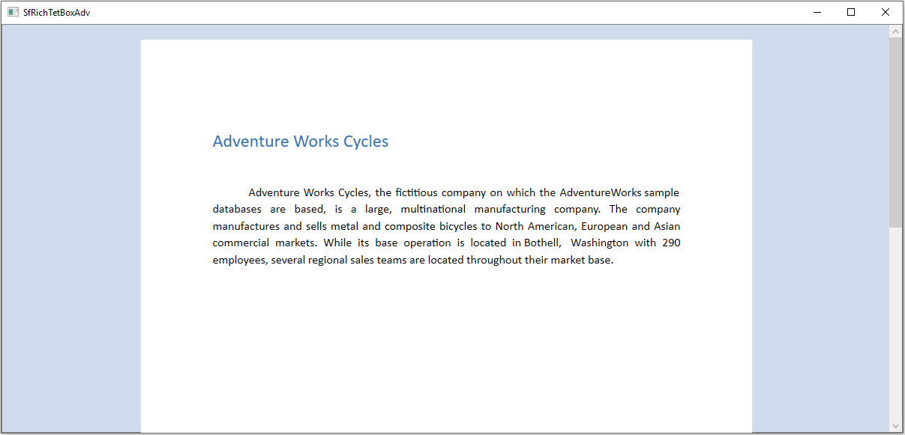
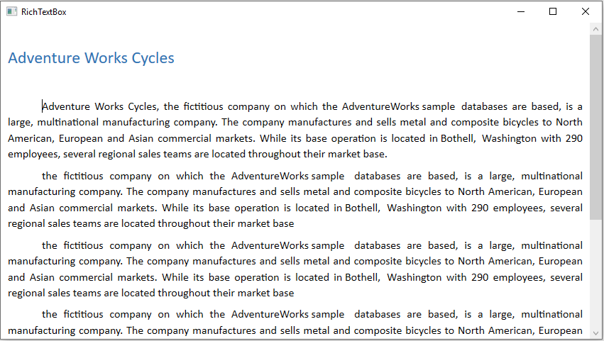
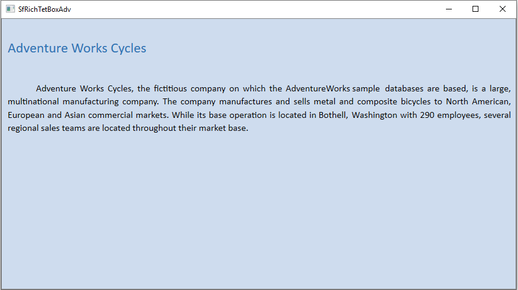
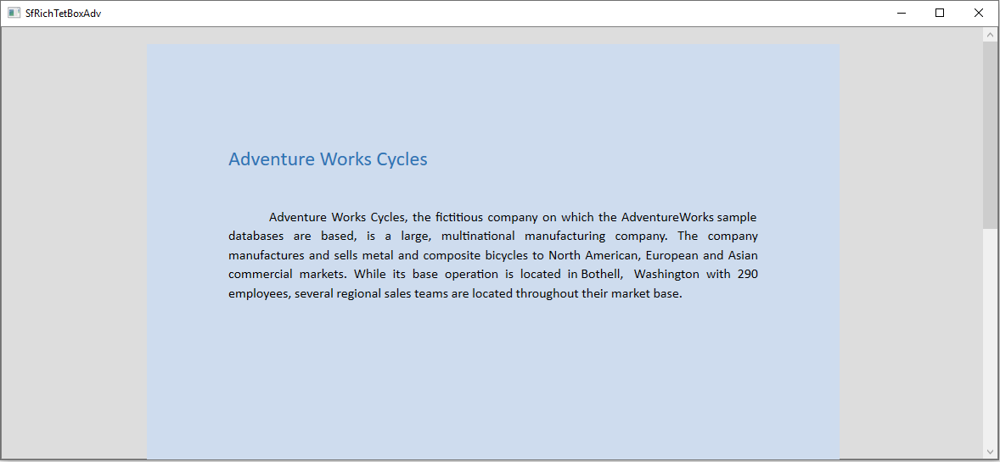
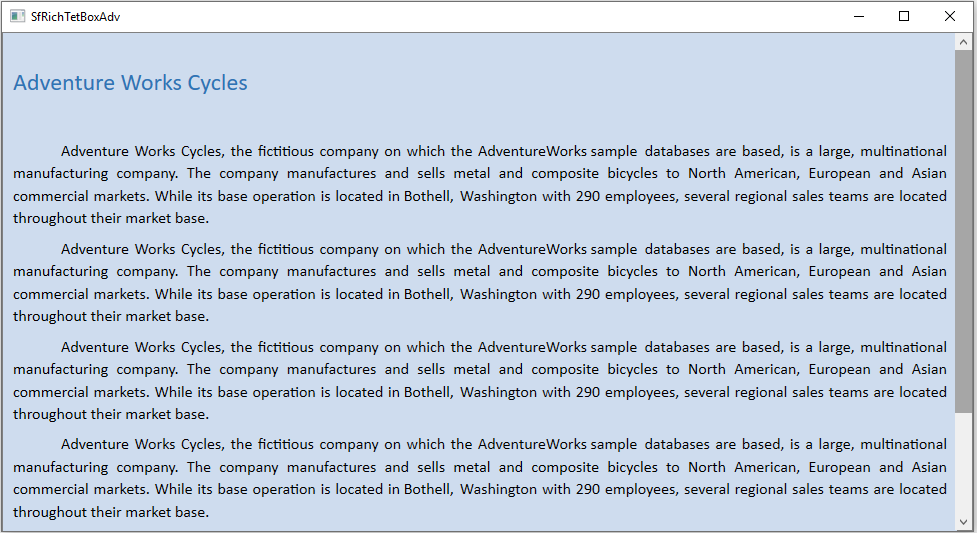

# Setting Background for RichTextBox
The RichTextBox control allows you to change the background color of the SfRichTextBoxAdv control. A background of a control is represented by the [`Background`](https://help.syncfusion.com/cr/uwp/Syncfusion.SfRichTextBoxAdv.SfRichTextBoxAdv.html#background) property of [`SfRichTextBoxAdv`](https://help.syncfusion.com/cr/uwp/Syncfusion.SfRichTextBoxAdv.SfRichTextBoxAdv.html) class. The default value of this property is black, which is set by the control's default template. The XAML snippets in this document assume the `RichTextBoxAdv` namespace is mapped to `clr-namespace:Syncfusion.UI.Xaml.RichTextBoxAdv;assembly=Syncfusion.SfRichTextBoxAdv.UWP`.

The following code illustrates how to apply color as background to the document.



<RichTextBoxAdv:SfRichTextBoxAdv x:Name="richTextBoxAdv" Background="#6699cc" />




// Initializes a new instance of RichTextBoxAdv.
SfRichTextBoxAdv richTextBoxAdv = new SfRichTextBoxAdv();
// Sets the control background color
richTextBoxAdv.Background = new SolidColorBrush(Color.FromRgb(102, 153, 204));




' Initializes a new instance of RichTextBoxAdv.
Dim richTextBoxAdv As New SfRichTextBoxAdv()

' Sets the control background color.
richTextBoxAdv.Background = New SolidColorBrush With {.Color = Color.FromRgb(102, 153, 204)}






**Pages layout**


**Continuous layout** (default — no override)


**Block layout**
The block layout always inherits the control background color.


## Setting background for document pages

The RichTextBox control allows you to change the background color of the document pages. A background of a document is represented by the [`Background`](https://help.syncfusion.com/cr/uwp/Syncfusion.SfRichTextBoxAdv.DocumentAdv.html#background) property of [`DocumentAdv`](https://help.syncfusion.com/cr/uwp/Syncfusion.SfRichTextBoxAdv.DocumentAdv.html) class. The default value of this property is white.

N> This property is independent for a document, so the background will change when the document is changed. To maintain the same background for all documents, you can reset this property in the `DocumentChanged` event.

The following code illustrates how to apply color as background to the document pages.

N> To keep the same document background for all documents, subscribe to the `DocumentChanged` event and reset the background in the handler:
```csharp
richTextBoxAdv.DocumentChanged += (s, e) =>
{
    richTextBoxAdv.Document.Background.Color = Color.FromRgb(102, 153, 204);
};
```



// Initializes a new instance of RichTextBoxAdv.
SfRichTextBoxAdv richTextBoxAdv = new SfRichTextBoxAdv();
// Sets the document background color
richTextBoxAdv.Document.Background.Color = Color.FromRgb(102, 153, 204);




' Initializes a new instance of RichTextBoxAdv.
Dim richTextBoxAdv As New SfRichTextBoxAdv()
' Sets the document background color.
richTextBoxAdv.Document.Background.Color = Color.FromRgb(102, 153, 204)







Pages layout:


Continuous layout:


N> This API is supported starting from release version v17.4.0.X.

## See Also

- [LayoutType](https://help.syncfusion.com/cr/uwp/Syncfusion.SfRichTextBoxAdv.LayoutType.html)
- [DocumentAdv](https://help.syncfusion.com/cr/uwp/Syncfusion.SfRichTextBoxAdv.DocumentAdv.html)
- [SfRichTextBoxAdv](https://help.syncfusion.com/cr/uwp/Syncfusion.SfRichTextBoxAdv.SfRichTextBoxAdv.html)
- [Getting started with UWP RichTextBox](https://help.syncfusion.com/uwp/richtextbox/getting-started)

## How to override the document background in `Continuous` layout type?
By default, the document background property is applied when the [`LayoutType`](https://help.syncfusion.com/cr/uwp/Syncfusion.SfRichTextBoxAdv.LayoutType.html) is continuous. You can suppress the document background and apply the control background by setting [`OverridesDocumentBackground`](https://help.syncfusion.com/cr/uwp/Syncfusion.SfRichTextBoxAdv.SfRichTextBoxAdv.html#overridesdocumentbackground) property to true. The default value of this property is false.

N> This property is valid only when the `LayoutType` is continuous.

The following code illustrates how to override the document background color.



<RichTextBoxAdv:SfRichTextBoxAdv x:Name="richTextBoxAdv" LayoutType="Continuous" Background="#6699cc" OverridesDocumentBackground="True" />




// Initializes a new instance of RichTextBoxAdv.
SfRichTextBoxAdv richTextBoxAdv = new SfRichTextBoxAdv();
// Sets the control background color
richTextBoxAdv.Background = new SolidColorBrush(Color.FromRgb(102, 153, 204));
// Sets the layout type as continuous
richTextBoxAdv.LayoutType = LayoutType.Continuous;
// Enable the OverridesDocumentBackground property.
richTextBoxAdv.OverridesDocumentBackground = true;




' Initializes a new instance of RichTextBoxAdv.
Dim richTextBoxAdv As New SfRichTextBoxAdv()
' Sets the control background color.
richTextBoxAdv.Background = new SolidColorBrush(Color.FromRgb(102, 153, 204))
' Sets the layout type as continuous.
richTextBoxAdv.LayoutType = LayoutType.Continuous
' Enables the OverridesDocumentBackground property.
richTextBoxAdv.OverridesDocumentBackground = true






Continuous layout (with `OverridesDocumentBackground="True"`):

