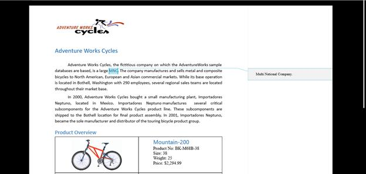
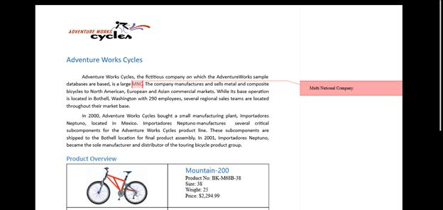

# Comment support in UWP RichTextBox

A Comment is a note or annotation that an author or reviewer can add to the document. The [`SfRichTextBoxAdv`](https://help.syncfusion.com/cr/uwp/Syncfusion.SfRichTextBoxAdv.SfRichTextBoxAdv.html) control supports viewing and editing the comments in a document. It renders the comments present in the document in a review pane, similar to Microsoft Word.


N> Currently, the SfRichTextBoxAdv shows comments only on the `Pages` layout type.

## UI commands for working with comments

The following operations can be performed through command binding in the SfRichTextBoxAdv control:

* Insert a new comment.

* Delete an existing comment.

* Navigate to the next comment.

* Navigate to the previous comment.

* Show or hide the review pane.

The following code example demonstrates how to bind commands for accessing comments in the SfRichTextBoxAdv document. The `ElementName=richTextBoxAdv` binding target is an `SfRichTextBoxAdv` declared in the same XAML scope, e.g.:

```xaml
<RichTextBoxAdv:SfRichTextBoxAdv x:Name="richTextBoxAdv" />
```



<!-- Binds the button to the ShowCommentsCommand -->
<Button Content="Show Comments" Command="{Binding ElementName=richTextBoxAdv, Path=ShowCommentsCommand}" />
<!-- Binds the button to the NewCommentCommand -->
<Button Content="New Comment" Command="{Binding ElementName=richTextBoxAdv, Path=NewCommentCommand}" />
<!-- Binds the button to the DeleteCommentCommand -->
<Button Content="Delete Comment" Command="{Binding ElementName=richTextBoxAdv, Path=DeleteCommentCommand}" />
<!-- Binds the button to the PreviousCommentCommand -->
<Button Content="Previous Comment" Command="{Binding ElementName=richTextBoxAdv, Path=PreviousCommentCommand}" />
<!-- Binds the button to the NextCommentCommand -->
<Button Content="Next Comment" Command="{Binding ElementName=richTextBoxAdv, Path=NextCommentCommand}" />






## Customizing the comment visual style

The SfRichTextBoxAdv provides event support to notify whenever a comment is added to the document. With the help of it, you can customize the visual style for each comment. You can also set the author and initial of the comment.
The following code example demonstrates how to customize comment visual style using the event.


using Syncfusion.UI.Xaml.RichTextBoxAdv;

// Hooks the CommentAdding event of SfRichTextBoxAdv.
richTextBoxAdv.CommentAdding += RichTextBoxAdv_CommentAdding;

// Unhooks the CommentAdding event of SfRichTextBoxAdv.
richTextBoxAdv.CommentAdding -= RichTextBoxAdv_CommentAdding;

// Handles the CommentAdding event of the richTextBoxAdv control.
private void RichTextBoxAdv_CommentAdding(object sender, CommentAddingEventArgs args)
{
    // isFileLoading is a flag you set while loading a document to avoid
    // overriding the author/initial of comments that already exist in the file.
    if (!isFileLoading)
    {
        // Defines the author and initial for the comment.
        args.Comment.Author = "Peter";
        args.Comment.Initial = "Frank";
    }

    // Defines the background brush for the comment.
    args.VisualStyle.BackgroundBrush = new SolidColorBrush(Color.FromArgb(0xff, 0xff, 0xa8, 0xa8));

    // Defines the border brush for the comment.
    args.VisualStyle.BorderBrush = new SolidColorBrush(Color.FromArgb(0xff, 0xFF, 0x01, 0x01));

    // Defines the highlight color for the commented content.
    args.VisualStyle.HighlightColor = Color.FromArgb(0xff, 0xFf, 0xa8, 0x8);

}







## Visibility of the comment pane

The SfRichTextBoxAdv control allows you to determine the visibility of the comment pane using the [IsCommentPaneVisible](https://help.syncfusion.com/cr/uwp/Syncfusion.UI.Xaml.RichTextBoxAdv.EditorSettings.html#Syncfusion_UI_Xaml_RichTextBoxAdv_EditorSettings_IsCommentPaneVisible) property of the [EditorSettings](https://help.syncfusion.com/cr/uwp/Syncfusion.UI.Xaml.RichTextBoxAdv.EditorSettings.html) class.

The following code example illustrates how to read or set the comment pane visibility.



using Syncfusion.UI.Xaml.RichTextBoxAdv;

SfRichTextBoxAdv richTextBoxAdv = new SfRichTextBoxAdv();
bool isCommentPaneVisible = richTextBoxAdv.EditorSettings.IsCommentPaneVisible;
richTextBoxAdv.EditorSettings.IsCommentPaneVisible = true;



Imports Syncfusion.UI.Xaml.RichTextBoxAdv

Dim richTextBoxAdv As New SfRichTextBoxAdv()
Dim isCommentPaneVisible As Boolean = richTextBoxAdv.EditorSettings.IsCommentPaneVisible
richTextBoxAdv.EditorSettings.IsCommentPaneVisible = True




N> The comment APIs (`NewCommentCommand`, `DeleteCommentCommand`, `CommentAdding` event, and `EditorSettings.IsCommentPaneVisible`) are supported from Syncfusion UWP RichTextBox v17.4.0.X onwards.

## See Also

- [Commands in UWP RichTextBox](https://help.syncfusion.com/uwp/richtextbox/commands)
- [SfRichTextBoxAdv API reference](https://help.syncfusion.com/cr/uwp/Syncfusion.SfRichTextBoxAdv.SfRichTextBoxAdv.html)
- [EditorSettings](https://help.syncfusion.com/cr/uwp/Syncfusion.UI.Xaml.RichTextBoxAdv.EditorSettings.html)

