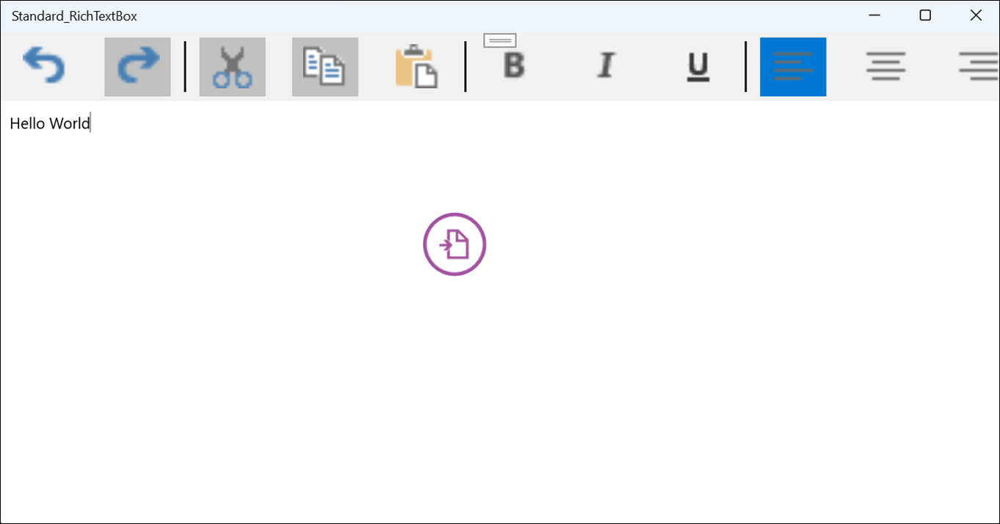

# Use SfRichTextBoxAdv as a standard RichTextBox

Use the following XAML to set up [`SfRichTextBoxAdv`](https://help.syncfusion.com/cr/uwp/Syncfusion.SfRichTextBoxAdv.SfRichTextBoxAdv.html) as a standard RichTextBox with a built-in toolbar for character and paragraph formatting.

N> The XAML below assumes the `RichTextBoxAdv` namespace is mapped to `using:Syncfusion.UI.Xaml.RichTextBoxAdv` and that the toolbar icon files (`Undo.png`, `Redo.png`, `Cut.png`, `Copy.png`, `Paste.png`, `Bold.png`, `Italic.png`, `Underline.png`, `Left.png`, `Center.png`, `Right.png`, `Justify.png`) are placed in the `/Images/` folder of the UWP project.

N> The converters (`UnderlineToggleConverter`, `LeftAlignmentToggleConverter`, `CenterAlignmentToggleConverter`, `RightAlignmentToggleConverter`, `JustifyAlignmentToggleConverter`) are supplied by the Syncfusion UWP RichTextBox assembly. `Underline` and `TextAlignment` are enums on the selection, so each converter maps between the enum value and the `bool?` state required by `ToggleButton.IsChecked`.

## MainPage.xaml



<Page
    x:Class="Standard_RichTextBox.MainPage"
    xmlns="http://schemas.microsoft.com/winfx/2006/xaml/presentation"
    xmlns:x="http://schemas.microsoft.com/winfx/2006/xaml"
    xmlns:local="using:Standard_RichTextBox"
    xmlns:d="http://schemas.microsoft.com/expression/blend/2008"
    xmlns:mc="http://schemas.openxmlformats.org/markup-compatibility/2006"
    mc:Ignorable="d"
    xmlns:RichTextBoxAdv="using:Syncfusion.UI.Xaml.RichTextBoxAdv"
    Background="{ThemeResource ApplicationPageBackgroundThemeBrush}">
    <Page.Resources>
        <RichTextBoxAdv:UnderlineToggleConverter x:Key="UnderlineToggleConverter"/>
        <RichTextBoxAdv:LeftAlignmentToggleConverter x:Key="LeftAlignmentToggleConverter"/>
        <RichTextBoxAdv:CenterAlignmentToggleConverter x:Key="CenterAlignmentToggleConverter"/>
        <RichTextBoxAdv:RightAlignmentToggleConverter x:Key="RightAlignmentToggleConverter"/>
        <RichTextBoxAdv:JustifyAlignmentToggleConverter x:Key="JustifyAlignmentToggleConverter"/>
        
        
    </Page.Resources>

    <Grid Background="#F1F1F1">
        <Grid.RowDefinitions>
            <RowDefinition Height="Auto"/>
            <RowDefinition Height="*"/>
        </Grid.RowDefinitions>
        <Grid>
            <!-- Defines the data context as the SfRichTextBoxAdv. -->
            <StackPanel Orientation="Horizontal" DataContext="{Binding ElementName=richTextBoxAdv}">
                <!-- Toolbar items for undo and redo using command binding. -->
                <StackPanel Orientation="Horizontal">
                    <Button Command="{Binding UndoCommand}" IsTabStop="False">
                        <Image Source="/Images/Undo.png" Height="40" Width="40" />
                    </Button>
                    <Button Command="{Binding RedoCommand}" IsTabStop="False">
                        <Image Source="/Images/Redo.png" Height="40" Width="40" />
                    </Button>
                </StackPanel>
                <!-- Visual separator. -->
                <Border Width="2" Height="46" Background="#1F1F1F"/>
                <!-- Toolbar items for clipboard operations using command binding. -->
                <StackPanel Orientation="Horizontal">
                    <Button Command="{Binding CutCommand}" IsTabStop="False">
                        <Image Source="/Images/Cut.png" Height="40" Width="40" />
                    </Button>
                    <Button Command="{Binding CopyCommand}" IsTabStop="False">
                        <Image Source="/Images/Copy.png" Height="40" Width="40" />
                    </Button>
                    <Button Command="{Binding PasteCommand}" IsTabStop="False">
                        <Image Source="/Images/Paste.png" Height="40" Width="40" />
                    </Button>
                </StackPanel>
                <!-- Visual separator. -->
                <Border Width="2" Height="46" Background="#1F1F1F"/>
                <!-- Toolbar items for character formatting using property binding. -->
                <StackPanel Orientation="Horizontal">
                    <ToggleButton IsChecked="{Binding Selection.CharacterFormat.Bold, Mode=TwoWay}" IsTabStop="False">
                        <Image Source="/Images/Bold.png" Height="40" Width="40" />
                    </ToggleButton>
                    <ToggleButton IsChecked="{Binding Selection.CharacterFormat.Italic, Mode=TwoWay}" IsTabStop="False">
                        <Image Source="/Images/Italic.png" Height="40" Width="40" />
                    </ToggleButton>
                    <ToggleButton IsChecked="{Binding Selection.CharacterFormat.Underline, Converter={StaticResource UnderlineToggleConverter}, Mode=TwoWay}" IsTabStop="False">
                        <Image Source="/Images/Underline.png" Height="40" Width="40" />
                    </ToggleButton>
                </StackPanel>
                <Border Width="2" Height="46" Background="#1F1F1F"/>
                <!-- Toolbar items for paragraph formatting using property binding. -->
                <StackPanel Orientation="Horizontal">
                    <ToggleButton IsChecked="{Binding Selection.ParagraphFormat.TextAlignment, Converter={StaticResource LeftAlignmentToggleConverter}, Mode=TwoWay}" IsTabStop="False">
                        <Image Source="/Images/Left.png" Height="40" Width="40" />
                    </ToggleButton>
                    <ToggleButton IsChecked="{Binding Selection.ParagraphFormat.TextAlignment, Converter={StaticResource CenterAlignmentToggleConverter}, Mode=TwoWay}" IsTabStop="False">
                        <Image Source="/Images/Center.png" Height="40" Width="40" />
                    </ToggleButton>
                    <ToggleButton IsChecked="{Binding Selection.ParagraphFormat.TextAlignment, Converter={StaticResource RightAlignmentToggleConverter}, Mode=TwoWay}" IsTabStop="False">
                        <Image Source="/Images/Right.png" Height="40" Width="40" />
                    </ToggleButton>
                    <ToggleButton IsChecked="{Binding Selection.ParagraphFormat.TextAlignment, Converter={StaticResource JustifyAlignmentToggleConverter}, Mode=TwoWay}" IsTabStop="False">
                        <Image Source="/Images/Justify.png" Height="40" Width="40" />
                    </ToggleButton>
                </StackPanel>
            </StackPanel>
        </Grid>
        <RichTextBoxAdv:SfRichTextBoxAdv x:Name="richTextBoxAdv" Grid.Row="1" ManipulationMode="All" LayoutType="Continuous"/>
    </Grid>
</Page>





When you run the application, the standard RichTextBox control is displayed as illustrated below.

N> [View Sample in GitHub](https://github.com/SyncfusionExamples/UWP-RichTextBox-Examples/tree/main/Samples/Standard%20RichTextBox).

N> The `LayoutType="Continuous"` setting renders the document as a continuous scroll without page breaks (the standard RichTextBox experience). The `ManipulationMode="All"` setting enables touch and pen support across the entire surface of the control.

N> The standard RichTextBox configuration is supported from Syncfusion UWP RichTextBox v17.4.0.X onwards.

## See Also

- [SfRichTextBoxAdv API reference](https://help.syncfusion.com/cr/uwp/Syncfusion.SfRichTextBoxAdv.SfRichTextBoxAdv.html)
- [Commands in UWP RichTextBox](https://help.syncfusion.com/uwp/richtextbox/commands)
- [Selection in UWP RichTextBox](https://help.syncfusion.com/uwp/richtextbox/selection)
- [Getting started with UWP RichTextBox](https://help.syncfusion.com/uwp/richtextbox/getting-started)