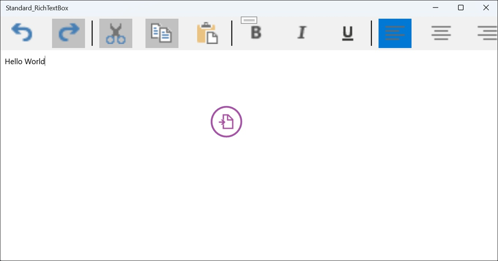

# Getting Started with UWP RichTextBox (SfRichTextBoxAdv)

Syncfusion® UWP RichTextBox (SfRichTextBoxAdv) enables you to create, edit, view, and print Word documents in UWP applications. This section guides you through the steps to get started and create a RichTextBox in a UWP application.

## Create a RichTextBox in UWP using SfRichTextBoxAdv

In this walkthrough, you will create a UWP application that uses the Syncfusion® UWP SfRichTextBoxAdv control.

The steps below cover the essential tasks required to add and use the SfRichTextBoxAdv control in a UWP project. 

### Create a New UWP Project

1. Open **Visual Studio**.
2. Click **Create a new project**.
3. Select **Blank App (Universal Windows)** or **UWP App** from the project templates.
4. Click **Next**.
5. Enter the **project name**, location, and other required details.
6. Click **Create**.

### Add SfRichTextBoxAdv dependencies





 **Using NuGet Package Manager (UI):** 

1.	In Solution Explorer, right-click the project and select **Manage NuGet Packages**.
2.	Search for [Syncfusion.SfRichTextBoxAdv.UWP](https://www.nuget.org/packages/Syncfusion.SfRichTextBoxAdv.UWP) and install the latest version.
3.	Verify that all required dependencies are installed and the project is successfully restored.

**Using Package Manager Console:**




Install-Package Syncfusion.SfRichTextBoxAdv.UWP








The following assembly references are required to use the **SfRichTextBoxAdv** control in your application.

- Syncfusion.SfRichTextBoxAdv.UWP
- Syncfusion.DocIO.UWP
- Syncfusion.SfRadialMenu.UWP
- Syncfusion.SfShared.UWP





N> 1. Starting with v16.2.0.41 (2018 Vol 2), if you reference Syncfusion&reg; assemblies from trial setup or from the NuGet feed, you also have to add "Syncfusion.Licensing" assembly reference and include a license key in your projects. Please refer to this [link](https://help.syncfusion.com/common/essential-studio/licensing/overview) to know about registering Syncfusion license key in your UWP application to use our components.

### Add SfRichTextBoxAdv control





Open the Toolbox window and drag the **SfRichTextBoxAdv** control onto the Design view of the UWP application to add it to the user interface.





To add the control manually in XAML, follow these steps:

1.	Import Syncfusion® UWP SfRichTextBoxAdv control namespace Syncfusion.UI.Xaml.RichTextBoxAdv in the XAML page.

2.	Declare SfRichTextBoxAdv control in the XAML page.




<Page
    x:Class="SfRichTextBoxAdv.MainPage"
    xmlns="http://schemas.microsoft.com/winfx/2006/xaml/presentation"
    xmlns:x="http://schemas.microsoft.com/winfx/2006/xaml"
    xmlns:local="using:SfRichTextBoxAdv"
    xmlns:RichTextBoxAdv="using:Syncfusion.UI.Xaml.RichTextBoxAdv"
    xmlns:d="http://schemas.microsoft.com/expression/blend/2008"
    xmlns:mc="http://schemas.openxmlformats.org/markup-compatibility/2006"
    mc:Ignorable="d"
    Background="{ThemeResource ApplicationPageBackgroundThemeBrush}">
    <Grid>
        <RichTextBoxAdv:SfRichTextBoxAdv x:Name="richTextBoxAdv" ManipulationMode="All"/>
    </Grid>
</Page>







To add the control manually in C#, add the following code in *.xaml.cs




using Syncfusion.UI.Xaml.RichTextBoxAdv;

public sealed partial class MainPage : Page
{
    public MainPage()
    {
        // Create an instance of SfRichTextBoxAdv control
        SfRichTextBoxAdv richTextBoxAdv = new SfRichTextBoxAdv();

        // Add the SfRichTextBoxAdv control to the container (Grid)
        Root_Grid.Children.Add(richTextBoxAdv);
    }
}







### Run the Application

1. Press **F5** or click **Start Debugging** in Visual Studio.
2. The UWP application is deployed and launched on the selected target device and displays the SfRichTextBoxAdv control
3. Press Ctrl+O to open an existing document. The selected document will be displayed within the SfRichTextBoxAdv control, as shown below.

You can download a complete working sample from [GitHub](https://github.com/SyncfusionExamples/UWP-RichTextBox-Examples/tree/main/Samples/SfRichTextBoxAdv).

## Use SfRichTextBoxAdv as a standard RichTextBox

Use the following code to configure the SfRichTextBoxAdv control as a standard RichTextBox with rich text formatting options.



<Page
    x:Class="Standard_RichTextBox.MainPage"
    xmlns="http://schemas.microsoft.com/winfx/2006/xaml/presentation"
    xmlns:x="http://schemas.microsoft.com/winfx/2006/xaml"
    xmlns:local="using:Standard_RichTextBox"
    xmlns:d="http://schemas.microsoft.com/expression/blend/2008"
    xmlns:mc="http://schemas.openxmlformats.org/markup-compatibility/2006"
    mc:Ignorable="d"
    xmlns:RichTextBoxAdv="using:Syncfusion.UI.Xaml.RichTextBoxAdv"
    Background="{ThemeResource ApplicationPageBackgroundThemeBrush}">
    <Page>
        <Page.Resources>
            <RichTextBoxAdv:UnderlineToggleConverter x:Key="UnderlineToggleConverter"/>
            <RichTextBoxAdv:LeftAlignmentToggleConverter x:Key="LeftAlignmentToggleConverter"/>
            <RichTextBoxAdv:CenterAlignmentToggleConverter x:Key="CenterAlignmentToggleConverter"/>
            <RichTextBoxAdv:RightAlignmentToggleConverter x:Key="RightAlignmentToggleConverter"/>
            <RichTextBoxAdv:JustifyAlignmentToggleConverter x:Key="JustifyAlignmentToggleConverter"/>
            
            
        </Page.Resources>

        <Grid Background="#F1F1F1">
            <Grid.RowDefinitions>
                <RowDefinition Height="Auto"/>
                <RowDefinition Height="*"/>
            </Grid.RowDefinitions>
            <Grid>
                <!-- Defines the data context as RichTextBoxAdv -->
                <StackPanel Orientation="Horizontal" DataContext="{Binding ElementName=richTextBoxAdv}">
                    <!-- UI option to perform Undo/Redo using command binding -->
                    <StackPanel Orientation="Horizontal">
                        <Button Command="{Binding UndoCommand}" IsTabStop="False">
                            <Image Source="/Images/Undo.png" Height="40" Width="40" />
                        </Button>
                        <Button Command="{Binding RedoCommand}" IsTabStop="False">
                            <Image Source="/Images/Redo.png" Height="40" Width="40" />
                        </Button>
                    </StackPanel>
                    <!-- UI option to perform Clipboard operations using command binding -->
                    <Border Width="2" Height="46" Background="#1F1F1F"/>
                    <StackPanel Orientation="Horizontal">
                        <Button Command="{Binding CutCommand}" IsTabStop="False">
                            <Image Source="/Images/Cut.png" Height="40" Width="40" />
                        </Button>
                        <Button Command="{Binding CopyCommand}" IsTabStop="False">
                            <Image Source="/Images/Copy.png" Height="40" Width="40" />
                        </Button>
                        <Button Command="{Binding PasteCommand}" IsTabStop="False">
                            <Image Source="/Images/Paste.png" Height="40" Width="40" />
                        </Button>
                    </StackPanel>
                    <!-- UI option to apply character formatting using property binding -->
                    <Border Width="2" Height="46" Background="#1F1F1F"/>
                    <StackPanel Orientation="Horizontal">
                        <ToggleButton IsChecked="{Binding Selection.CharacterFormat.Bold, Mode=TwoWay}" IsTabStop="False">
                            <Image Source="/Images/Bold.png" Height="40" Width="40" />
                        </ToggleButton>
                        <ToggleButton IsChecked="{Binding Selection.CharacterFormat.Italic, Mode=TwoWay}" IsTabStop="False">
                            <Image Source="/Images/Italic.png" Height="40" Width="40" />
                        </ToggleButton>
                        <ToggleButton IsChecked="{Binding Selection.CharacterFormat.Underline, Converter={StaticResource UnderlineToggleConverter}, Mode=TwoWay}" IsTabStop="False">
                            <Image Source="/Images/Underline.png" Height="40" Width="40" />
                        </ToggleButton>
                    </StackPanel>
                    <Border Width="2" Height="46" Background="#1F1F1F"/>
                    <!-- UI option to apply paragraph formatting using property binding -->
                    <StackPanel Orientation="Horizontal">
                        <ToggleButton IsChecked="{Binding Selection.ParagraphFormat.TextAlignment, Converter={StaticResource LeftAlignmentToggleConverter}, Mode=TwoWay}" IsTabStop="False">
                            <Image Source="/Images/Left.png" Height="40" Width="40" />
                        </ToggleButton>
                        <ToggleButton IsChecked="{Binding Selection.ParagraphFormat.TextAlignment, Converter={StaticResource CenterAlignmentToggleConverter}, Mode=TwoWay}" IsTabStop="False">
                            <Image Source="/Images/Center.png" Height="40" Width="40" />
                        </ToggleButton>
                        <ToggleButton IsChecked="{Binding Selection.ParagraphFormat.TextAlignment, Converter={StaticResource RightAlignmentToggleConverter}, Mode=TwoWay}" IsTabStop="False">
                            <Image Source="/Images/Right.png" Height="40" Width="40" />
                        </ToggleButton>
                        <ToggleButton IsChecked="{Binding Selection.ParagraphFormat.TextAlignment, Converter={StaticResource JustifyAlignmentToggleConverter}, Mode=TwoWay}" IsTabStop="False">
                            <Image Source="/Images/Justify.png" Height="40" Width="40" />
                        </ToggleButton>
                    </StackPanel>
                </StackPanel>
            </Grid>
            <RichTextBoxAdv:SfRichTextBoxAdv x:Name="richTextBoxAdv" Grid.Row="1" ManipulationMode="All" LayoutType="Continuous"/>
        </Grid>
    </Page>    
</Page>





You can download a standard RichTextBox example from [GitHub](https://github.com/SyncfusionExamples/UWP-RichTextBox-Examples/tree/main/Samples/Standard%20RichTextBox).

When the application is executed, the standard RichTextBox control is displayed as illustrated below.

## See also

- [Import and Export](./Import-and-Export)
- [Selection](./Selection)
- [Commands](./Commands)