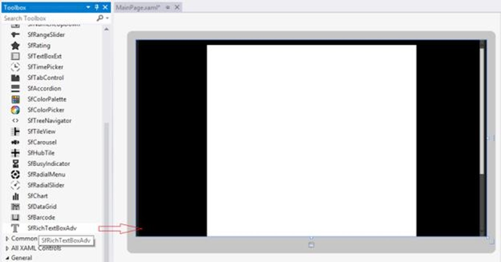
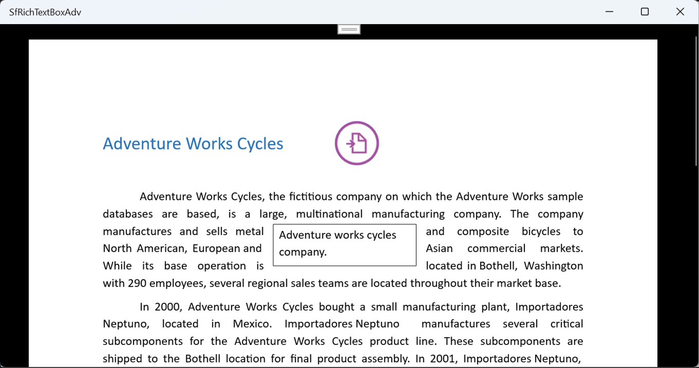

# Getting Started with Syncfusion&reg; UWP RichTextBox

Syncfusion&reg; [UWP RichTextBox](https://www.syncfusion.com/docx-editor-sdk/uwp-docx-editor) (SfRichTextBoxAdv) enables you to create, edit, view, and print Word documents in UWP applications. This section guides you through the steps to get started and create a RichTextBox in a UWP application.

## Create a New UWP Project

- Open **Visual Studio**.
- Click **Create a new project**.
- In the **Create a new project** window, search for **UWP**, and select **UWP Blank App**.
- Click **Next**, and enter the following details:
  - **Project name**: `DocumentEditor`
  - **Location**: Choose your preferred location
  - **Solution name**: `DocumentEditor`

N> The **project name** is used as the default namespace (for example, in `x:Class`). It is recommended to use **DocumentEditor** to match the code examples provided.

- Select the **target version** and **minimum version** of Windows as required. See [Syncfusion® UWP system requirements](https://help.syncfusion.com/uwp/system-requirements) for tooling and supported Windows versions.
- Click **Create**.

## Add SfRichTextBoxAdv dependencies





 **Using NuGet Package Manager (UI):** 

1.	In Solution Explorer, right-click the project and choose **Manage NuGet Packages**.
2.	Search for [Syncfusion.SfRichTextBoxAdv.UWP](https://www.nuget.org/packages/Syncfusion.SfRichTextBoxAdv.UWP) and install the latest version.
3.	Verify that all [required dependencies](https://help.syncfusion.com/uwp/control-dependencies#sfrichtextboxadv) are installed and the project is successfully restored.

**Using Package Manager Console:**




Install-Package Syncfusion.SfRichTextBoxAdv.UWP








The following assembly references are required to use the **SfRichTextBoxAdv** control in your application.

- Syncfusion.SfRichTextBoxAdv.UWP
- Syncfusion.DocIO.UWP
- Syncfusion.OfficeChart.UWP
- Syncfusion.SfRadialMenu.UWP
- Syncfusion.SfShared.UWP





N> 1. A valid Syncfusion&reg; license key is required from **v16.2.0.41 (2018 Vol 2)** onwards.
N> 2. The required `Syncfusion.Licensing` assembly is installed automatically as a NuGet dependency — no separate reference is needed.
N> 3. If you are using the **Assemblies** installation, you must add a reference to `Syncfusion.Licensing.dll` in your project.
N> 4. Register the license key in the `App` constructor of `App.xaml.cs` before any Syncfusion control is initialized. For the exact `RegisterLicense` code, refer to [Register Syncfusion® License key in a UWP application](https://help.syncfusion.com/common/essential-studio/licensing/how-to-register-in-an-application#uwp).

## Add SfRichTextBoxAdv control





Open the Toolbox window and drag the **SfRichTextBoxAdv** control onto the Design view of the UWP application to add it to the user interface.





To add the control manually in XAML, follow these steps:

1. Import the **SfRichTextBoxAdv** control namespace `Syncfusion.UI.Xaml.RichTextBoxAdv` in the **XAML page**.

2. Declare the **SfRichTextBoxAdv** control in the **XAML page**.




<Page
    x:Class="DocumentEditor.MainPage"
    xmlns="http://schemas.microsoft.com/winfx/2006/xaml/presentation"
    xmlns:x="http://schemas.microsoft.com/winfx/2006/xaml"
    xmlns:local="using:DocumentEditor"
    xmlns:RichTextBoxAdv="using:Syncfusion.UI.Xaml.RichTextBoxAdv"
    xmlns:d="http://schemas.microsoft.com/expression/blend/2008"
    xmlns:mc="http://schemas.openxmlformats.org/markup-compatibility/2006"
    mc:Ignorable="d"
    Background="{ThemeResource ApplicationPageBackgroundThemeBrush}">
    <Grid>
        <RichTextBoxAdv:SfRichTextBoxAdv x:Name="richTextBoxAdv" ManipulationMode="All"/>
    </Grid>
</Page>







To add the control manually in C#, add the following code in **MainPage.xaml.cs**




using Syncfusion.UI.Xaml.RichTextBoxAdv;
using Windows.UI.Xaml.Controls;

namespace DocumentEditor
{
    public sealed partial class MainPage : Page
    {
        public MainPage()
        {
            this.InitializeComponent();

            // Create a Grid layout container
            Grid rootGrid = new Grid();

            // Create an instance of the SfRichTextBoxAdv control
            SfRichTextBoxAdv richTextBoxAdv = new SfRichTextBoxAdv();

            // Add the SfRichTextBoxAdv control to the Grid
            rootGrid.Children.Add(richTextBoxAdv);

            // Set the Grid as the content of the Page
            this.Content = rootGrid;
        }
    }
}







## Run the Application

1. Press **F5** or click **Debug > Start Debugging** in Visual Studio.
2. The UWP application is deployed and launched on the selected target device and displays the SfRichTextBoxAdv control.
3. Press **Ctrl+O** to open an existing document. The selected document will be displayed within the SfRichTextBoxAdv control, as shown below.

N> [View Sample in GitHub](https://github.com/SyncfusionExamples/UWP-RichTextBox-Examples/tree/main/Samples/SfRichTextBoxAdv).

## See also

- [Import and Export](https://help.syncfusion.com/document-processing/word/word-processor/uwp/import-and-export)
- [Selection](https://help.syncfusion.com/document-processing/word/word-processor/uwp/selection)
- [Commands](https://help.syncfusion.com/document-processing/word/word-processor/uwp/commands)
