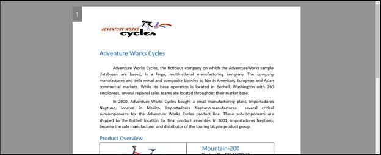
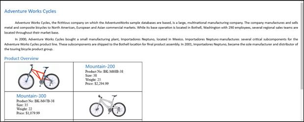
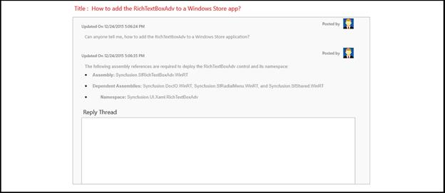

# Layout types in UWP RichTextBox

The [`SfRichTextBoxAdv`](https://help.syncfusion.com/cr/uwp/Syncfusion.SfRichTextBoxAdv.SfRichTextBoxAdv.html) control allows you to choose between the following layout types via the [`LayoutType`](https://help.syncfusion.com/cr/uwp/Syncfusion.SfRichTextBoxAdv.LayoutType.html) property.

| Layout type | Use case | Behavior |
| --- | --- | --- |
| `Pages` | Word-style paginated view | Content is rendered across multiple pages, similar to the Print Layout view of Microsoft Word. |
| `Continuous` | Forum, blog, or scrolling viewer | Content is rendered as a single scrolling page, similar to the Web Layout view of Microsoft Word. |
| `Block` | Read-only display of rich content | Content is rendered as a single read-only page; clipboard copy is supported. |

N> The XAML snippets in this document assume the `RichTextBoxAdv` namespace is mapped to `using:Syncfusion.UI.Xaml.RichTextBoxAdv` on the page root (for example, the `Page` or `UserControl` element). The `ManipulationMode` property is the standard UWP `UIElement.ManipulationMode` and is set to `All` here to enable touch and pen support.

## Pages

When using the `Pages` layout type, the rich-text document content is rendered sequentially in several pages, similar to the Print Layout view of Microsoft Word. The size and margin of each page are defined by the section format properties.

The following code example demonstrates how to define the layout type of the `SfRichTextBoxAdv` control as `Pages`.



<RichTextBoxAdv:SfRichTextBoxAdv x:Name="richTextBoxAdv" ManipulationMode="All" LayoutType="Pages" />




using Syncfusion.UI.Xaml.RichTextBoxAdv;

// Initializes a new instance of SfRichTextBoxAdv.
SfRichTextBoxAdv richTextBoxAdv = new SfRichTextBoxAdv();
richTextBoxAdv.ManipulationMode = ManipulationModes.All;
// Defines the layout type as Pages.
richTextBoxAdv.LayoutType = LayoutType.Pages;




Imports Syncfusion.UI.Xaml.RichTextBoxAdv

' Initializes a new instance of SfRichTextBoxAdv.
Dim richTextBoxAdv As New SfRichTextBoxAdv()
richTextBoxAdv.ManipulationMode = ManipulationModes.All
' Defines the layout type as Pages.
richTextBoxAdv.LayoutType = LayoutType.Pages





## Continuous

When using the `Continuous` layout type, the entire rich-text document content is rendered continuously in a single page, similar to the Web Layout view of Microsoft Word. This layout looks like a simple text box with rich-text content and can be used for applications such as forums and blogs.

The following code example demonstrates how to define the layout type of the `SfRichTextBoxAdv` control as `Continuous`.



<RichTextBoxAdv:SfRichTextBoxAdv x:Name="richTextBoxAdv" ManipulationMode="All" LayoutType="Continuous" />




using Syncfusion.UI.Xaml.RichTextBoxAdv;

// Initializes a new instance of SfRichTextBoxAdv.
SfRichTextBoxAdv richTextBoxAdv = new SfRichTextBoxAdv();
richTextBoxAdv.ManipulationMode = ManipulationModes.All;
// Defines the layout type as Continuous.
richTextBoxAdv.LayoutType = LayoutType.Continuous;




Imports Syncfusion.UI.Xaml.RichTextBoxAdv

' Initializes a new instance of SfRichTextBoxAdv.
Dim richTextBoxAdv As New SfRichTextBoxAdv()
richTextBoxAdv.ManipulationMode = ManipulationModes.All
' Defines the layout type as Continuous.
richTextBoxAdv.LayoutType = LayoutType.Continuous





## Block

When using the `Block` layout type, the rich-text content is rendered continuously in a single page in read-only mode. This layout looks like a simple text block with rich-text content such as text, images, and tables. The `Block` layout also supports copying content to the clipboard. This can be used for applications such as forums and blogs in order to display the rich-text content with the same look and feel as the continuous layout type.

The following code example demonstrates how to define the layout type of the `SfRichTextBoxAdv` control as `Block`.



<RichTextBoxAdv:SfRichTextBoxAdv x:Name="richTextBoxAdv" ManipulationMode="All" LayoutType="Block" />




using Syncfusion.UI.Xaml.RichTextBoxAdv;

// Initializes a new instance of SfRichTextBoxAdv.
SfRichTextBoxAdv richTextBoxAdv = new SfRichTextBoxAdv();
richTextBoxAdv.ManipulationMode = ManipulationModes.All;
// Defines the layout type as Block.
richTextBoxAdv.LayoutType = LayoutType.Block;




Imports Syncfusion.UI.Xaml.RichTextBoxAdv

' Initializes a new instance of SfRichTextBoxAdv.
Dim richTextBoxAdv As New SfRichTextBoxAdv()
richTextBoxAdv.ManipulationMode = ManipulationModes.All
' Defines the layout type as Block.
richTextBoxAdv.LayoutType = LayoutType.Block





N> On Windows Phone devices, the entire rich-text content is rendered continuously in a single page as the continuous layout type, regardless of the `LayoutType` setting.

N> The `LayoutType` property and the `Pages`, `Continuous`, and `Block` layout types are supported from Syncfusion UWP RichTextBox v17.4.0.X onwards.

## See Also

- [SfRichTextBoxAdv API reference](https://help.syncfusion.com/cr/uwp/Syncfusion.SfRichTextBoxAdv.SfRichTextBoxAdv.html)
- [LayoutType](https://help.syncfusion.com/cr/uwp/Syncfusion.SfRichTextBoxAdv.LayoutType.html)
- [Background in UWP RichTextBox](https://help.syncfusion.com/uwp/richtextbox/background)
- [Getting started with UWP RichTextBox](https://help.syncfusion.com/uwp/richtextbox/getting-started)
