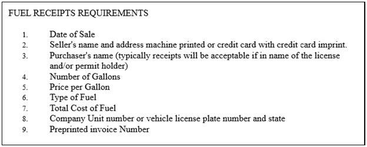
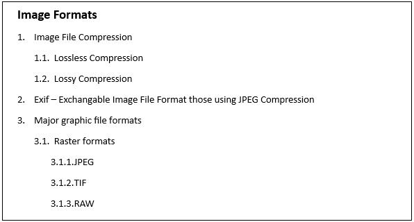

# List in UWP DOCX Editor

The [`SfRichTextBoxAdv`](https://help.syncfusion.com/cr/uwp/Syncfusion.UI.Xaml.RichTextBoxAdv.SfRichTextBoxAdv.html) supports both single-level and multilevel lists, similar to Microsoft Word. Lists are used to organize data as step-by-step instructions in documents, making key points easy to understand.

## Single level list

A single level list has all the items at the same hierarchy and indentation. It can be a numbered or a bulleted list.

The following screenshot shows single level bulleted list.

The following screenshot shows single level numbered list.

## Multilevel list

A multilevel list defines a list within a list, where up to nine levels can be defined, similar to Microsoft Word. A multilevel list can be bulleted or numbered, and can also be mixed across levels (for example, numbers, letters, and bullets). For example, one level can be bulleted and the next level can be a numbered list inside it.

## Adding a list

Each list in the document can contain a reference to any one of the abstract lists in the document. Both the abstract list and the list should be assigned a unique Id. The list should refer to the abstract list with the abstract list's Id. The list format for a paragraph should refer to the list with the list's Id.

The following code example demonstrates how to define a single-level numbered list for a document and how it is applied to a paragraph.


<RichTextBoxAdv:DocumentAdv>
    <RichTextBoxAdv:DocumentAdv.AbstractLists>
        <RichTextBoxAdv:AbstractListAdv AbstractListId="1">
            <RichTextBoxAdv:AbstractListAdv.Levels>
                <RichTextBoxAdv:ListLevelAdv ListLevelPattern="LowLetter" NumberFormat="%1." StartAt="1" FollowCharacter="Tab" RestartLevel="0">
                    <RichTextBoxAdv:ListLevelAdv.ParagraphFormat>
                        <RichTextBoxAdv:ParagraphFormat LeftIndent="48" FirstLineIndent="24"/>
                    </RichTextBoxAdv:ListLevelAdv.ParagraphFormat>
                </RichTextBoxAdv:ListLevelAdv>
            </RichTextBoxAdv:AbstractListAdv.Levels>
        </RichTextBoxAdv:AbstractListAdv>
    </RichTextBoxAdv:DocumentAdv.AbstractLists>
    <RichTextBoxAdv:DocumentAdv.Lists>
        <RichTextBoxAdv:ListAdv AbstractListId="1" ListId="1">
        </RichTextBoxAdv:ListAdv>
    </RichTextBoxAdv:DocumentAdv.Lists>
    <RichTextBoxAdv:SectionAdv>
        <RichTextBoxAdv:ParagraphAdv>
            <RichTextBoxAdv:ParagraphAdv.ParagraphFormat>
                <RichTextBoxAdv:ParagraphFormat>
                    <RichTextBoxAdv:ParagraphFormat.ListFormat>
                        <RichTextBoxAdv:ListFormat ListId="1" ListLevelNumber="0"/>
                    </RichTextBoxAdv:ParagraphFormat.ListFormat>
                </RichTextBoxAdv:ParagraphFormat>
            </RichTextBoxAdv:ParagraphAdv.ParagraphFormat>
            <RichTextBoxAdv:SpanAdv>List Item 1</RichTextBoxAdv:SpanAdv>
        </RichTextBoxAdv:ParagraphAdv>
    </RichTextBoxAdv:SectionAdv>
</RichTextBoxAdv:DocumentAdv>




// Initializes a new abstract list instance.
AbstractListAdv abstractListAdv = new AbstractListAdv(null);
abstractListAdv.AbstractListId = 1;

// Defines a new ListLevel instance.
ListLevelAdv listLevel = new ListLevelAdv(abstractListAdv);
listLevel.ParagraphFormat.LeftIndent = 48d;
listLevel.ParagraphFormat.FirstLineIndent = 24d;
listLevel.FollowCharacter = FollowCharacterType.Tab;
listLevel.ListLevelPattern = ListLevelPattern.LowLetter;
listLevel.NumberFormat = "%1.";
listLevel.RestartLevel = 0;
listLevel.StartAt = 1;

// Adds the list level to the abstract list.
abstractListAdv.Levels.Add(listLevel);

// Adds the abstract list to the document.
richTextBoxAdv.Document.AbstractLists.Add(abstractListAdv);

// Creates a new list instance.
ListAdv listAdv = new ListAdv(null);
listAdv.ListId = 1;
// Sets the abstract list Id for this list.
listAdv.AbstractListId = 1;

// Adds the list to the document.
richTextBoxAdv.Document.Lists.Add(listAdv);

// Adds the first list item.
ParagraphAdv paragraphAdv = new ParagraphAdv();
paragraphAdv.Inlines.Add(new SpanAdv() { Text = "List Item 1" });
richTextBoxAdv.Document.Sections[0].Blocks.Add(paragraphAdv);

// Defines the list format for the paragraph.
paragraphAdv.ParagraphFormat.ListFormat.ListId = 1;
paragraphAdv.ParagraphFormat.ListFormat.ListLevelNumber = 0;





The following code example demonstrates how to define number format for numbered list in the SfRichTextBoxAdv control.


// Defines the number format for the list level.
/* Note
* The percent sign (%) followed by any number from 1 through 9 represents the number style from the respective list level.
* For example, if you wanted the format for the first level to be "Article I.", "Article II.", and so on, the string for the NumberFormat property would be "Article %1." and the ListLevelPattern property would be set to ListLevelPattern.UpRoman.
*/
listLevel.NumberFormat = "Article %1.";
listLevel.ListLevelPattern = ListLevelPattern.UpRoman;





You can define bulleted list by setting list level pattern as Bullet. You can define various bullets by defining the bullet character. The following code sample demonstrates how to define dot, square and arrow bullets in the SfRichTextBoxAdv control.


// Defines a bulleted list.
listLevel.ListLevelPattern = ListLevelPattern.Bullet;
// Defining Dot Bullet
listLevel.NumberFormat = "\uf0b7";
listLevel.CharacterFormat.FontFamily = new Windows.UI.Xaml.Media.FontFamily("Symbol");
// Defines Square bullet.
listLevel.NumberFormat = "\uf0a7";
listLevel.CharacterFormat.FontFamily = new Windows.UI.Xaml.Media.FontFamily("Wingdings");
// Defines Arrow Bullet.
listLevel.NumberFormat = "\u27a4";
listLevel.CharacterFormat.FontFamily = new Windows.UI.Xaml.Media.FontFamily("Symbol");





## Level overrides

The list levels for a list are defined in the abstract list to which it refers. Additionally, you can define level overrides for any list level. The `SfRichTextBoxAdv` supports two types of level overrides.

1. Start-at override – Only the start value for the list is overridden; other properties are referred to the list level defined in the abstract list.

2. Level override – The list level is completely overridden.

The following code example demonstrates how to override the start at value for an existing list level in the SfRichTextBoxAdv control.


<RichTextBoxAdv:ListAdv AbstractListId="1" ListId="1">
    <RichTextBoxAdv:ListAdv.LevelOverrides>
        <RichTextBoxAdv:LevelOverrideAdv StartAt="2" LevelNumber="0"/>
    </RichTextBoxAdv:ListAdv.LevelOverrides>
</RichTextBoxAdv:ListAdv>




// Adds StartAtOverride for the list at first level.
// LevelNumber ranges from 0 to 8.
LevelOverrideAdv levelOverride = new LevelOverrideAdv(listAdv);
levelOverride.LevelNumber = 0;
levelOverride.StartAt = 2;
listAdv.LevelOverrides.Add(levelOverride);





The following code example demonstrates how to add level override for any existing list level in the SfRichTextBoxAdv control.


<RichTextBoxAdv:ListAdv AbstractListId="1" ListId="1">
<RichTextBoxAdv:ListAdv.LevelOverrides>
    <!-- Overrides fourth list level-->
        <RichTextBoxAdv:LevelOverrideAdv LevelNumber="3">
            <RichTextBoxAdv:LevelOverrideAdv.OverrideListLevel>
                <RichTextBoxAdv:ListLevelAdv ListLevelPattern="UpRoman" StartAt="3" NumberFormat="%1)"/>
            </RichTextBoxAdv:LevelOverrideAdv.OverrideListLevel>
        </RichTextBoxAdv:LevelOverrideAdv>
    </RichTextBoxAdv:ListAdv.LevelOverrides>
</RichTextBoxAdv:ListAdv>




// Adds ListLevel override for the list at fourth level.
// LevelNumber ranges from 0 to 8.
LevelOverrideAdv levelOverride = new LevelOverrideAdv(listAdv);
levelOverride.LevelNumber = 3;
levelOverride.OverrideListLevel = new ListLevelAdv(levelOverride);
levelOverride.OverrideListLevel.ListLevelPattern = ListLevelPattern.UpRoman;
levelOverride.OverrideListLevel.NumberFormat = "%1)";
levelOverride.OverrideListLevel.StartAt = 3;
listAdv.LevelOverrides.Add(levelOverride);





## Editing a list

You can retrieve the list applied to the current selection. By doing so, you can edit the list according to your requirements. After editing the list, you need to set it on the current selection for the changes to take effect.

N> `GetList()` returns `null` if the current selection does not have a list applied.

The following code sample demonstrates how to get the list applied to the current selection.



// Gets the list applied to the current selection.
ListAdv listAdv = richTextBoxAdv.Selection.ParagraphFormat.GetList();




The following code example demonstrates how to apply a list to the current selection in the `SfRichTextBoxAdv` control. If the selection already has a list, the existing list is modified; otherwise the list is added to the document and applied to the selection.



// Applies the list to the current selection.
richTextBoxAdv.Selection.ParagraphFormat.SetList(listAdv);
richTextBoxAdv.Selection.ParagraphFormat.ListLevelNumber = 0;




## See also

- [Commands in UWP DOCX Editor](./Commands)
- [Selection in UWP DOCX Editor](./Selection)
- [Getting started with UWP DOCX Editor](./Getting-Started)
