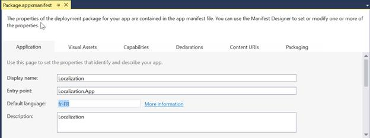
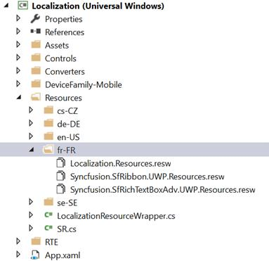
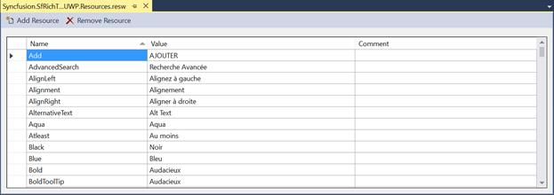
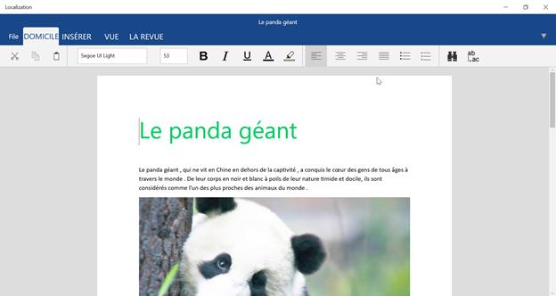

---
---
title: Localization in UWP RichTextBox control | Syncfusion
description: Learn here all about Localization support in Syncfusion UWP RichTextBox (SfRichTextBoxAdv) control and more.
platform: document-processing
control: SfRichTextBoxAdv
documentation: ug
keywords: localization,resw,resource-file,culture,language,en-us,fr-fr,resources
---
# Localization in UWP RichTextBox

Localization is the process of configuring the application to a specific language. [`SfRichTextBoxAdv`](https://help.syncfusion.com/cr/uwp/Syncfusion.SfRichTextBoxAdv.SfRichTextBoxAdv.html) provides support for localizing all the static text in the radial menu and in all its dialogs. Localization can be done by adding a resource file (`.resw`) and setting the desired culture in the application.

## Setting the language in the app manifest file

The following steps illustrate how to configure the app package for localization using the Manifest Designer.

1. In **Solution Explorer**, expand the project node of your UWP app.
2. Double-click the **Package.appxmanifest** file. If the manifest file is already open in the XML code view, Visual Studio prompts you to close the file.
3. On the **Application** tab, specify the **Default language** as required to localize your app. Click **More information** to learn about the supported languages.

   

4. Save the app manifest file after setting the default language.

## Adding a resource file

1. Create a folder named `Resources` in your application.
2. Create a folder named after the culture (for example, `en-US`, `fr-FR`) under `Resources` to hold the resource file for that culture.
3. Add the default English (`en-US`) `.resw` files for `SfRichTextBoxAdv` and your application — named `Syncfusion.SfRichTextBoxAdv.UWP.Resources.resw`, `Syncfusion.SfRibbon.UWP.Resources.resw`, and `Localization.Resources.resw` respectively — in the `en-US` folder. For reference, a French (`fr-FR`) `.resw` file is available in the [Syncfusion UWP RichTextBox GitHub sample](https://github.com/SyncfusionExamples/UWP-RichTextBox-Examples).

   

4. Add the resource name and its corresponding localized value in the Resource Designer of each `.resw` file.

   

> **Note:** If you have not used `SfRibbon` in your application, you can skip the `Syncfusion.SfRibbon.UWP.[Culture name].resw` file mentioned above.

The following screenshot shows the localized `SfRichTextBoxAdv`.

N> The localization resources are embedded inside the Syncfusion UWP RichTextBox assembly. You only need to add your own culture-specific `.resw` file; the default English fallback is provided by the assembly.

N> The localization support for SfRichTextBoxAdv is available from Syncfusion UWP RichTextBox v17.4.0.X onwards.

## See Also

- [SfRichTextBoxAdv API reference](https://help.syncfusion.com/cr/uwp/Syncfusion.SfRichTextBoxAdv.SfRichTextBoxAdv.html)
- [Commands in UWP RichTextBox](https://help.syncfusion.com/uwp/richtextbox/commands)
- [Getting started with UWP RichTextBox](https://help.syncfusion.com/uwp/richtextbox/getting-started)

