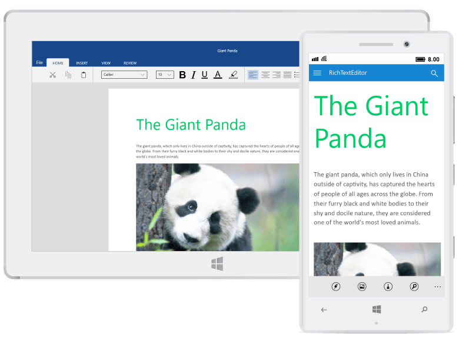

# UWP RichTextBox (SfRichTextBoxAdv) Overview

The Syncfusion &reg; UWP RichTextBox [(SfRichTextBoxAdv)](https://www.syncfusion.com/docx-editor-sdk/uwp-docx-editor) is a feature-rich, user-interactive control that enables viewing, editing, and printing rich text content with advanced formatting and layout capabilities, supporting elements such as text, images, tables, paragraphs, and comments. 

## Key Features

* View and edit rich text content, including text, [images](/uwp/richtextbox/Image), [tables](/uwp/richtextbox/table), and [comments](/uwp/richtextbox/Comment). 

* [Import and export](/uwp/richtextbox/Import-and-Export) document formats such as Word (.doc, .docx), Rich Text Format (.rtf), HTML (.htm, .html), and plain text (.txt). 

* [Print](/uwp/richtextbox/Printing-Contents) document content with page-by-page rendering. 

* Supports a wide range of image formats (except Metafile images). 

* Provides [undo and redo](/uwp/richtextbox/Undo-Redo) support for all editing and formatting operations, including text, tables, images, hyperlinks, and styling (bold, italic, etc.). 

* Supports different header and footer configurations, including first page and odd/even pages. 

* Enables [cut, copy, and paste](/uwp/richtextbox/Clipboard) operations, including rich text content via the clipboard. 

* Supports loading encrypted Word documents with valid password. 

N> Currently, the SfRichTextBoxAdv cannot edit rich text in headers and footers.