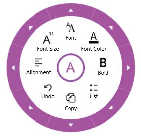
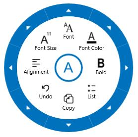

# Radial Menu in UWP RichTextBox (SfRichTextBoxAdv)

[`SfRichTextBoxAdv`](https://help.syncfusion.com/cr/uwp/Syncfusion.UI.Xaml.RichTextBoxAdv.SfRichTextBoxAdv.html) supports a built-in radial menu that provides rich-text formatting options such as bold, italic, and more. The radial menu appears automatically when the user makes a text selection or interacts with the control.

The following screenshot shows the built-in radial menu for the `SfRichTextBoxAdv` control.

N> On Windows Phone devices, the built-in radial menu is not supported.

## Enable or disable the radial menu

In `SfRichTextBoxAdv`, the built-in radial menu is enabled by default. You can enable or disable the built-in radial menu by setting the [`EnableRadialMenu`](https://help.syncfusion.com/cr/uwp/Syncfusion.SfRichTextBoxAdv.SfRichTextBoxAdv.html#enableradialmenu) property. 

The following code example demonstrates how to disable the built-in radial menu in the `SfRichTextBoxAdv` control.



<RichTextBoxAdv:SfRichTextBoxAdv x:Name="richTextBoxAdv" ManipulationMode="All" EnableRadialMenu="False" />




// Initializes a new instance of SfRichTextBoxAdv.
SfRichTextBoxAdv richTextBoxAdv = new SfRichTextBoxAdv();
richTextBoxAdv.ManipulationMode = ManipulationModes.All;

// Disables the built-in radial menu in the SfRichTextBoxAdv control.
richTextBoxAdv.EnableRadialMenu = false;



' Initializes a new instance of SfRichTextBoxAdv.
Dim richTextBoxAdv As New SfRichTextBoxAdv()
richTextBoxAdv.ManipulationMode = ManipulationModes.All

' Disables the built-in radial menu in the SfRichTextBoxAdv control.
richTextBoxAdv.EnableRadialMenu = False




## Customizing the radial menu appearance

You can customize the appearance of the built-in radial menu to suit your needs. This is done by defining custom styles for the radial menu under the `Resources` of `SfRichTextBoxAdv`, which override the default style.

The following code example demonstrates how to customize the appearance of the navigation button, rim, radial slider, and radial pointer in the built-in radial menu.



<RichTextBoxAdv:SfRichTextBoxAdv x:Name="richTextBox" ManipulationMode="All" AcceptsTab="True" xmlns:RichTextBoxAdv="using:Syncfusion.UI.Xaml.RichTextBoxAdv">
  <!-- Specify resources for this instance -->
  <RichTextBoxAdv:SfRichTextBoxAdv.Resources>
  
    <!-- Custom style for Radial Menu -->
    
    
    <!-- Custom Style for Radial Pointer -->
    
    
    <!-- Custom Style for Radial Slider -->
    
    
    <!-- Custom Style for Navigation Button -->
    
  </RichTextBoxAdv:SfRichTextBoxAdv.Resources>
</RichTextBoxAdv:SfRichTextBoxAdv>




The following screenshot shows the radial menu with customized style.

N> The sample to demonstrate customizing the style of the built-in radial menu can be downloaded from the link [here](http://www.syncfusion.com/downloads/support/directtrac/general/ze/RadialMenuCustomization-1397995223#).

## See Also

- [Commands in UWP RichTextBox](./Commands)
- [Selection in UWP RichTextBox](./Selection)
- [Getting started with UWP RichTextBox](./Getting-Started)