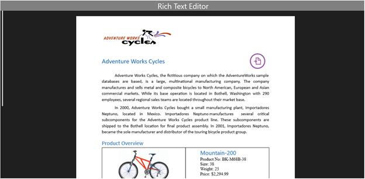

# Styles and templates in UWP RichTextBox

This section describes the styles and templates for the [`SfRichTextBoxAdv`](https://help.syncfusion.com/cr/uwp/Syncfusion.SfRichTextBoxAdv.SfRichTextBoxAdv.html) control. The control template defines the structure of the SfRichTextBoxAdv control and the style defines its visual appearance. You can modify the default control template to define a unique appearance for the control.

## Default style and template

The following XAML shows the default style and template for the SfRichTextBoxAdv control.

N> The XAML snippets in this document assume the `RichTextBoxAdv` namespace is mapped to `using:Syncfusion.UI.Xaml.RichTextBoxAdv` on the page root. The custom style must be declared in the same `Resources` scope as the control that uses it (for example, the page-level `Resources` block).







N> In the control template, you are allowed to reorder the template parts and to add your own elements. However, when changing the control template, you should be careful to include all required parts. Required template parts are marked with the `x:Name` attribute. Omission of required parts may impact some of the functionality.

The following table lists the required named visual-tree parts of the `SfRichTextBoxAdv` control template.

| Template part (`x:Name`) | Purpose |
| --- | --- |
| `content` | The `ContentControl` that hosts the document view. |
| `OptionsPane` | The search / replace options pane (collapsed by default). |
| `HorizontalScrollBar` | The horizontal `ScrollBar`. |
| `VerticalScrollBar` | The vertical `ScrollBar`. |

## Styling SfRichTextBoxAdv

You can define a custom style for the SfRichTextBoxAdv control either by creating an empty style and setting it up yourself, or by copying the default style and modifying it. The following example demonstrates how to customize the style for the SfRichTextBoxAdv control.







The following XAML example demonstrates how to apply the custom style to the SfRichTextBoxAdv control.



<RichTextBoxAdv:SfRichTextBoxAdv x:Name="richTextBoxAdv" ManipulationMode="All" Style="{StaticResource RichTextBoxAdvCustomStyle}" />




The following screenshot shows the SfRichTextBoxAdv control with the customized style, which adds a top header band labeled "Rich Text Editor" above the document view.

N> When you copy the default style from the Syncfusion assembly's `Themes/generic.xaml` and modify it, keep all the required template parts (`content`, `OptionsPane`, `HorizontalScrollBar`, `VerticalScrollBar`) in the modified template; otherwise some functionality (search pane, scrolling) may not work.

N> The `SfRichTextBoxAdv` style and template APIs are supported from Syncfusion UWP RichTextBox v17.4.0.X onwards.

## See Also

- [SfRichTextBoxAdv API reference](https://help.syncfusion.com/cr/uwp/Syncfusion.SfRichTextBoxAdv.SfRichTextBoxAdv.html)
- [Commands in UWP RichTextBox](https://help.syncfusion.com/uwp/richtextbox/commands)
- [Background in UWP RichTextBox](https://help.syncfusion.com/uwp/richtextbox/background)
- [Getting started with UWP RichTextBox](https://help.syncfusion.com/uwp/richtextbox/getting-started)

