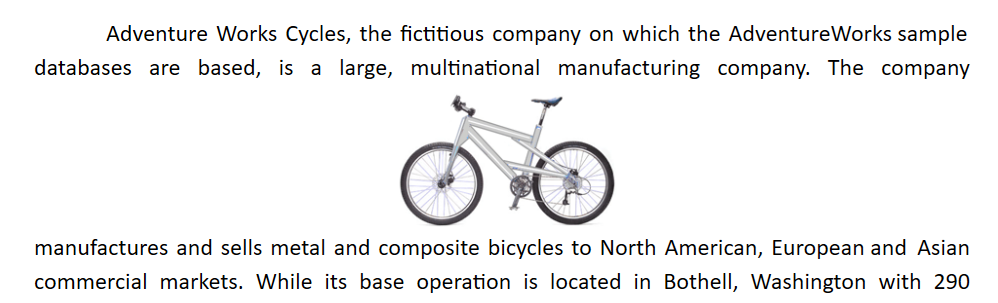

# Text Wrapping Style in UWP RichTextBox (SfRichTextBoxAdv)

Text wrapping refers to how images and shapes are positioned relative to the surrounding text in a document. Currently, [`SfRichTextBoxAdv`](https://help.syncfusion.com/cr/uwp/Syncfusion.UI.Xaml.RichTextBoxAdv.SfRichTextBoxAdv.html) only has preservation support for image and text-box shapes with the following wrapping styles.

| Wrapping style | Behavior | Supported from |
| --- | --- | --- |
| `Inline` | Image or shape is placed inline with the text, the same way as any other word or letter. | Always (preservation). |
| `Behind` | Image or shape is placed behind the text. |  v18.3.0.X. |
| `In Front of Text` | Image or shape is placed in front of the text. | v18.3.0.X. |
| `Top and Bottom` | Text wraps above and below the image or shape. No text is to the left or right. | v19.1.0.X. |
| `Square` | Text wraps around the image or text box in a square shape. | v19.2.0.X. |
| `Tight` and `Through` | Render the same way as `Square` in SfRichTextBoxAdv. | v19.2.0.X. |

## Inline

In this option, the image or shape is placed inline with the text, the same way as any other word or letter. The image or shape is automatically moved along with the text while editing. Other options keep the image or shape in a fixed position while text shifts and wraps around it.

## Behind

In this option, the image or shape is placed behind the text. This is useful for adding a watermark or a background image to a document.

## In Front of Text

In this option, the image or shape is placed in front of the text. This is useful for placing an image in front of text, or for highlighting a shape within a paragraph.

## Top and Bottom

In this option, text wraps above and below the image or shape. No text is to the left or right of the image or shape. This is useful for larger images or shapes that occupy most of the width of the document.

## Square

In this option, text wraps around the image or text box in a square shape.

## See also

- [Image support in UWP RichTextBox](./Image)
- [Shapes in UWP RichTextBox](./Shapes)
- [Getting started with UWP RichTextBox](./Getting-Started)