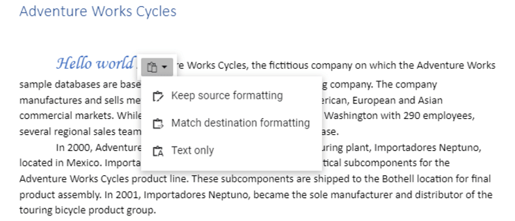

# Clipboard in Vue Document editor component

Document Editor takes advantage of system clipboard and allows you to copy or move a portion of the document into it in HTML format, so that it can be pasted in any application that supports clipboard.

## Copy

Copy a portion of document to system clipboard using built-in context menu of Document Editor. You can also do it programmatically using the following sample code.

```javascript
 this.$refs.documenteditor.ej2Instances.selection.copy();
```

## Cut

Cut a portion of document to system clipboard using built-in context menu of Document Editor. You can also do it programmatically using the following sample code.

```javascript
 this.$refs.documenteditor.ej2Instances.editor.cut();
```

## Paste

Due to limitations, you can paste contents from system clipboard as plain text in Document Editor only using the ‘CTRL + V’ keyboard shortcut.

## Local paste

Document Editor expose API to enable local paste within the control. On enabling this, the following is performed:
* Selected contents will be stored to an internal clipboard in addition to system clipboard.
* Clipboard paste will be overridden, and internally stored data that has formatted text will be pasted.
Refer to the following sample code.

```
 <ejs-documenteditor ref="documenteditor" :enableLocalPaste='true' :enableEditor='true' :isReadOnly=false style="width: 100%;height: 100%;"></ejs-documenteditor>
```

By default, **enableLocalPaste** is false.
When local paste is enabled for a Document Editor instance, you can paste contents programmatically if the internal clipboard has stored data during last copy operation. Refer to the following sample code.

```javascript
 this.$refs.documenteditor.ej2Instances.editor.pasteLocal();
```

### EnableLocalPaste behavior

|**EnableLocalPaste** |**Paste behavior details**|
|--------------------------|----------------------|
|True |Allows to paste content that is copied from the same Document Editor component alone and prevents pasting content from system clipboard. Hence the content copied from outside Document Editor component can’t be pasted.<br>Browser limitation of pasting from system clipboard using API and context menu options, will be resolved. So, you can copy and paste content within the Document Editor component using API and context menu options too.|
|False|Allows to paste content from system clipboard. Hence the content copied from both the Document Editor component and outside can be pasted.<br>Browser limitation of pasting from system clipboard using API and context menu options, will remain as a limitation.|

Note:
* Keyboard shortcut for pasting will work properly in both cases.
* Copying content from Document Editor component and pasting outside will work properly in both cases.

## Paste with formatting

Document Editor provides support to paste the system clipboard data with formatting. To enable clipboard paste with formatting options, set the `enableLocalPaste` property in Document Editor to false and use this .NET Standard library [`Syncfusion.EJ2.WordEditor.AspNet.Core`](<https://www.nuget.org/packages/Syncfusion.EJ2.WordEditor.AspNet.Core/>) by the web API service implementation. This library helps you to paste the system clipboard data with formatting.

You can paste your system clipboard data in the following ways:
* **Keep Source Formatting** This option retains the character styles and direct formatting applied to the copied text. Direct formatting includes characteristics such as font size, italics, or other formatting that is not included in the paragraph style.
* **Match Destination Formatting** This option discards most of the formatting applied directly to the copied text, but it retains the formatting applied for emphasis, such as bold and italic when it is applied to only a portion of the selection. The text takes on the style characteristics of the paragraph where it is pasted. The text also takes on any direct formatting or character style properties of text that immediately precedes the cursor when the text is pasted.
* **Text Only** This option discards all formatting and non-text elements such as pictures or tables. The text takes on the style characteristics of the paragraph where it is pasted and takes on any direct formatting or character style properties of text that immediately precedes the cursor when the text is pasted. Graphical elements are discarded and tables are converted to a series of paragraphs.

This paste option appears as follows.



## Events

DocumentEditor provides the [beforePaste](https://ej2.syncfusion.com/vue/documentation/api/document-editor/index-default#beforepaste) event, which is triggered before content is pasted into the document. This event gives an opportunity to [cancel](https://ej2.syncfusion.com/vue/documentation/api/document-editor/beforepasteeventargs#cancel) the paste operation, modify the content to be pasted using [pasteContent](https://ej2.syncfusion.com/vue/documentation/api/document-editor/beforepasteeventargs#pastecontent), and determining its format with [pasteType](https://ej2.syncfusion.com/vue/documentation/api/document-editor/beforepasteeventargs#pastetype). The event handler receives a [BeforePasteEventArgs](https://ej2.syncfusion.com/vue/documentation/api/document-editor/beforepasteeventargs) object that contains all the necessary details about the paste operation.

The following code snippet illustrates how to achieve this:




<template>
  <div>
    <div>
      <div>
        <ejs-documenteditorcontainer ref="container" style="display: block;" :height="'590px'"
          @beforePaste="handleBeforePaste" :enableToolbar="true" />
      </div>
    </div>
  </div>
</template>

<script setup>
import { DocumentEditorContainerComponent as EjsDocumenteditorcontainer } from '@syncfusion/ej2-vue-documenteditor';


const handleBeforePaste = function (args) {
  // Block HTML pasteType  and Modify the content
    if (args.pasteType === "Html") {
        args.pasteContent = `{"sections":[{"blocks":[{"inlines":[{"characterFormat":{"bold":true,"italic":true},"text":"HTML Content"}]}],"headersFooters":{}}]}`;
    }
  // Cancel paste if content matches 'Software'
   if(args.pasteContent == 'Software'){
      args.cancel = true;
    }}
</script>




<template>
  <div>
    <div>
      <div>
        <ejs-documenteditorcontainer ref="container" style="display: block;" :height="'590px'"
          @beforePaste="handleBeforePaste":enableToolbar="true" />
      </div>
    </div>
  </div>
</template>

<script>
import { DocumentEditorContainerComponent, Toolbar } from '@syncfusion/ej2-vue-documenteditor';

export default {
  components: {
    'ejs-documenteditorcontainer': DocumentEditorContainerComponent
  },
  methods: {
    handleBeforePaste (args) {
        // Block HTML pasteType  and Modify the content
        if (args.pasteType === "Html") {
            args.pasteContent = `{"sections":[{"blocks":[{"inlines":[{"characterFormat":{"bold":true,"italic":true},"text":"HTML Content"}]}],"headersFooters":{}}]}`;
        }
        // Cancel paste if content matches 'Software'
        if(args.pasteContent == 'Software'){
        args.cancel = true;
        }
    }
  }
};
</script>





## See Also

* [Feature modules](./feature-module)
* [Keyboard shortcuts](./keyboard-shortcut#clipboard)
