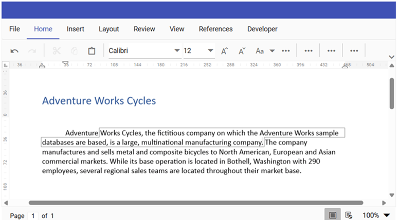
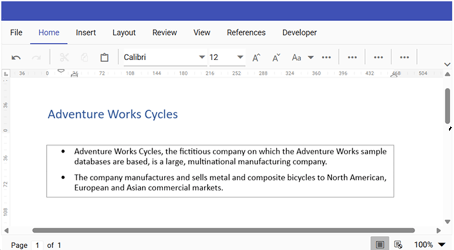

# Content Controls in Vue DOCX Editor

[Vue DOCX Editor](https://www.syncfusion.com/docx-editor-sdk/vue-docx-editor) (Document Editor) provides support for inserting, editing content controls.

Content controls can be categorized based on their occurrence in a document as follows:

**Inline Content Control:** Inserted within the text of a paragraph and flows together with the surrounding text as shown in below example.

**Block Content Control:** Inserted as a standalone element at the block level and can contain one or more paragraphs, tables, images, or other content as shown in below example.

## Types of Content Controls

* Rich Text
* Plain Text
* Check Box
* Date picker
* Drop-Down List and Combo Box
* Picture

## Insert content control

Content control can be inserted using [`insertContentControl`](https://ej2.syncfusion.com/vue/documentation/api/document-editor/editor#insertcontentcontrol) method in editor module.


//Insert Rich Text Content Control
this.$refs.container.ej2Instances.documentEditor.editor.insertContentControl('RichText');
//Insert Rich Text Content Control with default SFDT value
var sfdt = {"sections":[{"blocks":[{"inlines":[{"text": "Hello"}]}]}]};
this.$refs.container.ej2Instances.documentEditor.editor.insertContentControl('RichText', sfdt);

//Insert Plain Text Content Control
this.$refs.container.ej2Instances.documentEditor.editor.insertContentControl('Text');
//Insert Plain Text Content Control with default string
this.$refs.container.ej2Instances.documentEditor.editor.insertContentControl('Text', 'Hello World');

//Insert CheckBox Content Control
this.$refs.container.ej2Instances.documentEditor.editor.insertContentControl('CheckBox');
//Insert CheckBox Content Control with checked state
this.$refs.container.ej2Instances.documentEditor.editor.insertContentControl('CheckBox', true);

//Insert ComboBox Content Control
this.$refs.container.ej2Instances.documentEditor.editor.insertContentControl('ComboBox');
//Insert ComboBox Content Control with items
this.$refs.container.ej2Instances.documentEditor.editor.insertContentControl('ComboBox', 'One', ['One', 'Two', 'Three']);

//Insert Date Content Control
this.$refs.container.ej2Instances.documentEditor.editor.insertContentControl('Date');
//Insert Date Content Control with default date
this.$refs.container.ej2Instances.documentEditor.editor.insertContentControl('Date', '01/01/2024');

//Insert DropDownList Content Control
this.$refs.container.ej2Instances.documentEditor.editor.insertContentControl('DropDownList');
//Insert DropDownList Content Control with items
this.$refs.container.ej2Instances.documentEditor.editor.insertContentControl('DropDownList', 'One', ['One', 'Two', 'Three']);

//Insert Picture Content Control
this.$refs.container.ej2Instances.documentEditor.editor.insertContentControl('Picture');
//Insert Picture Content Control with default image
this.$refs.container.ej2Instances.documentEditor.editor.insertContentControl('Picture', 'data:image/png;base64,iVBORw0KGgoAAAANSUhEUgAAABYAAAAWCAYAAADEtGw7AAAAAXNSR0IArs4c6QAAAARnQU1BAACxjwv8YQUAAAAJcEhZcwAADsMAAA7DAcdvqGQAAADgSURBVEhLY3jx4sV/WuDBafCluXH/D6ydhlWObIMPLmn8/32KPBiD2OjyKAY7+zbDsX945/91azehiBWU9IPVgVwJMxSX4SgG65jXwrGVa+v/6TOXoojBDEZ2LQh/m676/+D+/XBzQJgsg0EY5GqQgSCDsYUz2QaDMCiosIUvCKMYDFKIjK9dvYrCB3kXJIaMkfUjY5JdDEpioCCAYZCFyGbAMFkGI0fcMDUYpAgZY4s8EEYWwxWBJLsYhJHFQIYjmwHDQ9xgkGEwDCp0QAYji8EMRhYjymBq4lGDofjFfwCV5AGEIf9DQQAAAABJRU5ErkJggg==');


## Import content control properties

Content control properties can be set using the [`ContentControlInfo`](https://ej2.syncfusion.com/vue/documentation/api/document-editor/contentControlInfo) and import it using [`importContentControlData`](https://ej2.syncfusion.com/vue/documentation/api/document-editor#importcontentcontroldata). Use this to apply property values to existing content controls in the document.


var data = [];
let contentControlData = { title: placeHolderPrefix + 'Name', tag: '', value: 'John', canDelete: false, canEdit: false, type: 'RichText' };
this.$refs.container.ej2Instances.documentEditor.importContentControlData(data);


## Export content control properties

Content control properties can be exported using the [`exportContentControlData`](https://ej2.syncfusion.com/vue/documentation/api/document-editor#exportcontentcontroldata).


var contentControlInfos = this.$refs.container.ej2Instances.documentEditor.exportContentControlData();


## Reset content control

Content control properties can be reset using the [`resetContentControlData`](https://ej2.syncfusion.com/vue/documentation/api/document-editor#resetcontentcontroldata). Use this to revert content controls back to their default property values and clear any previously imported or edited values.


var data = [];
let contentControlData = { title: placeHolderPrefix + 'Name', tag: '', value: 'John', canDelete: false, canEdit: false, type: 'RichText' };
this.$refs.container.ej2Instances.documentEditor.resetContentControlData(data);


>Note: Content control with custom XML mapping of file type WordML is converted as normal Rich Text Content Control to provide lossless round-tripping upon saving.
