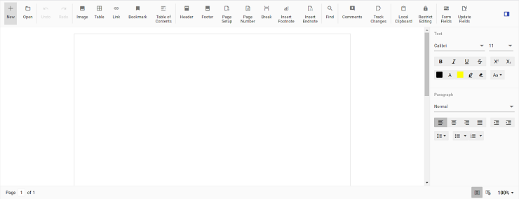

# Getting Started with Vue DOCX Editor Component in Vue 3

Syncfusion® DOCX Editor (Document Editor) enables you to create, edit, view, and print Word documents in web applications. This section guides you through the steps to get started and create a DOCX Editor in a Vue application.

This article provides a step-by-step guide for setting up a [Vite](https://vitejs.dev/) project with a JavaScript environment and integrating the Syncfusion<sup style="font-size:70%">&reg;</sup> Vue Document editor component using the [Composition API](https://vuejs.org/guide/introduction.html#composition-api) / [Options API](https://vuejs.org/guide/introduction.html#options-api).

The `Composition API` is a new feature introduced in Vue.js 3 that provides an alternative way to organize and reuse component logic. It allows developers to write components as functions that use smaller, reusable functions called composition functions to manage their properties and behavior.

The `Options API` is the traditional way of writing Vue.js components, where the component logic is organized into a series of options that define the component's properties and behavior. These options include data, methods, computed properties, watchers, life cycle hooks, and more.

## Prerequisites

[System requirements for Syncfusion<sup style="font-size:70%">&reg;</sup> Vue UI components](https://ej2.syncfusion.com/vue/documentation/system-requirements)

## Server side dependencies

The Document Editor component requires server-side interactions for the following operations:

* Open file formats other than SFDT
* Paste with formatting
* Restrict editing
* Spell check
* Save as file formats other than SFDT and DOCX

>Note: If these features are not required, the component can be deployed as a client-side solution without server-side interactions.

To know about server-side dependencies, please refer this [page](./web-services-overview).

## Set up the Vite project

A recommended approach for beginning with Vue is to scaffold a project using [Vite](https://vitejs.dev/). To create a new Vite project, use one of the commands that are specific to either NPM or Yarn.

```bash
npm create vite@latest
```

or

```bash
yarn create vite
```

Using one of the above commands will lead you to set up additional configurations for the project as below:

1.Define the project name: We can specify the name of the project directly. Let's specify the name of the project as `my-project` for this article.

```bash
? Project name: » my-project
```

2.Select `Vue` as the framework. It will create a Vue 3 project.

```bash
? Select a framework: » - Use arrow-keys. Return to submit.
Vanilla
> Vue
  React
  Preact
  Lit
  Svelte
  Others
```

3.Choose `JavaScript` as the framework variant to build this Vite project using JavaScript and Vue.

```bash
? Select a variant: » - Use arrow-keys. Return to submit.
> JavaScript
  TypeScript
  Customize with create-vue ↗
  Nuxt ↗
```

4.Upon completing the steps to create the `my-project`, run the following command to install its dependencies:

```bash
cd my-project
npm install
```

or

```bash
cd my-project
yarn install
```
## Install the Syncfusion<sup style="font-size:70%">&reg;</sup> Document Editor packages

The Syncfusion<sup style="font-size:70%">&reg;</sup> DOCX Editor package is available in the public npm registry and can be installed directly from [`npmjs.com`](https://www.npmjs.com/~syncfusionorg).

To install the Document editor component, use the following command:

```bash
  npm install @syncfusion/ej2-vue-documenteditor --save
```

or

```bash
yarn add @syncfusion/ej2-vue-documenteditor
```

## Adding CSS reference

You can import themes for the Syncfusion<sup style="font-size:70%">&reg;</sup> Vue component in various ways, such as using CSS or SASS styles from npm packages, CDN, [CRG](https://ej2.syncfusion.com/javascript/documentation/common/custom-resource-generator) and [Theme Studio](https://ej2.syncfusion.com/vue/documentation/appearance/theme-studio). Refer to [themes topic](https://ej2.syncfusion.com/vue/documentation/appearance/theme) to know more about built-in themes and different ways to refer to themes in a Vue project.

In this article, `Material` theme is applied using CSS styles, which are available in installed packages. The necessary `Material` CSS styles for the Document editor component and its dependents were imported into the `<style>` section of **src/App.vue** file.




<style>
@import '../node_modules/@syncfusion/ej2-base/styles/material.css';
@import '../node_modules/@syncfusion/ej2-buttons/styles/material.css';
@import '../node_modules/@syncfusion/ej2-inputs/styles/material.css';
@import '../node_modules/@syncfusion/ej2-popups/styles/material.css';
@import '../node_modules/@syncfusion/ej2-lists/styles/material.css';
@import '../node_modules/@syncfusion/ej2-navigations/styles/material.css';
@import '../node_modules/@syncfusion/ej2-splitbuttons/styles/material.css';
@import '../node_modules/@syncfusion/ej2-dropdowns/styles/material.css';
@import "../node_modules/@syncfusion/ej2-vue-documenteditor/styles/material.css";
</style>




## Add the Syncfusion<sup style="font-size:70%">&reg;</sup> Document Editor component

Document editor Container Component is also used to create, view and edit word document. But here, you can use predefined toolbar and properties pane to view and modify word document.

You have completed all the necessary configurations needed  for rendering the Syncfusion<sup style="font-size:70%">&reg;</sup> Vue component. Now, you are going to add the DocumentEditorContainer component using following steps.

Follow the below steps to add the Vue DocumentEditorContainer component using `Composition API` or `Options API`:

**Step 1:** First, import and register the DocumentEditorContainer component and its child directives in the `script` section of the **src/App.vue** file. If you are using the `Composition API`, you should add the `setup` attribute to the `script` tag to indicate that Vue will be using the `Composition API`.




<script setup>
  import { DocumentEditorContainerComponent as EjsDocumenteditorcontainer, Toolbar } from '@syncfusion/ej2-vue-documenteditor';
</script>




<script>
  import { DocumentEditorContainerComponent, Toolbar } from '@syncfusion/ej2-vue-documenteditor';
</script>




**Step 2:** Add the component definition in `template` section.




<template>
  <ejs-documenteditorcontainer :serviceUrl='serviceUrl' :enableToolbar='true'> </ejs-documenteditorcontainer>
</template>




**Step 3:** Declare the bound properties `serviceUrl` in the `script` section.




<script setup>
  import { provide } from 'vue';
  import { DocumentEditorContainerComponent as EjsDocumenteditorcontainer, Toolbar } from '@syncfusion/ej2-vue-documenteditor';

  const serviceUrl = 'https://document.syncfusion.com/web-services/docx-editor/api/documenteditor/';
  const documentEditorContainer = null;

  provide('DocumentEditorContainer', [Toolbar]);
</script>




<script>
  import { DocumentEditorContainerComponent, Toolbar } from '@syncfusion/ej2-vue-documenteditor';

  //Component registeration
  export default {
    name: 'App',
    components: {
      // Declaring component
      "ejs-documenteditorcontainer": DocumentEditorContainerComponent
    },
    data () {
      return {
        serviceUrl:'https://document.syncfusion.com/web-services/docx-editor/api/documenteditor/'
      };
    },
    provide: {
        DocumentEditorContainer: [Toolbar]
    }
  }
</script>





**Step 4:** Summarizing the above steps, update the `src/App.vue` file with following code.




<template>
  <ejs-documenteditorcontainer :serviceUrl='serviceUrl' :enableToolbar='true'> </ejs-documenteditorcontainer>
</template>

<script setup>
  import { provide, ref } from 'vue';
  import { DocumentEditorContainerComponent as EjsDocumenteditorcontainer, Toolbar } from '@syncfusion/ej2-vue-documenteditor';

  const serviceUrl = 'https://document.syncfusion.com/web-services/docx-editor/api/documenteditor/';
  const documentEditorContainer = ref(null);

  provide('DocumentEditorContainer', [Toolbar]);
</script>

<style>
  @import '../node_modules/@syncfusion/ej2-base/styles/material.css';
  @import '../node_modules/@syncfusion/ej2-buttons/styles/material.css';
  @import '../node_modules/@syncfusion/ej2-inputs/styles/material.css';
  @import '../node_modules/@syncfusion/ej2-popups/styles/material.css';
  @import '../node_modules/@syncfusion/ej2-lists/styles/material.css';
  @import '../node_modules/@syncfusion/ej2-navigations/styles/material.css';
  @import '../node_modules/@syncfusion/ej2-splitbuttons/styles/material.css';
  @import '../node_modules/@syncfusion/ej2-dropdowns/styles/material.css';
  @import "../node_modules/@syncfusion/ej2-vue-documenteditor/styles/material.css";
</style>




<template>
  <ejs-documenteditorcontainer :serviceUrl='serviceUrl' :enableToolbar='true'> </ejs-documenteditorcontainer>
</template>

<script>
  import { DocumentEditorContainerComponent, Toolbar } from '@syncfusion/ej2-vue-documenteditor';

  //Component registeration
  export default {
    name: 'App',
    components: {
      // Declaring component
      'ejs-documenteditorcontainer' : DocumentEditorContainerComponent
    },
    data () {
      return {
        serviceUrl:'https://document.syncfusion.com/web-services/docx-editor/api/documenteditor/'
      };
    },
    provide: {
      DocumentEditorContainer: [Toolbar]
    }
  }
</script>

<style>
  @import '../node_modules/@syncfusion/ej2-base/styles/material.css';
  @import '../node_modules/@syncfusion/ej2-buttons/styles/material.css';
  @import '../node_modules/@syncfusion/ej2-inputs/styles/material.css';
  @import '../node_modules/@syncfusion/ej2-popups/styles/material.css';
  @import '../node_modules/@syncfusion/ej2-lists/styles/material.css';
  @import '../node_modules/@syncfusion/ej2-navigations/styles/material.css';
  @import '../node_modules/@syncfusion/ej2-splitbuttons/styles/material.css';
  @import '../node_modules/@syncfusion/ej2-dropdowns/styles/material.css';
  @import "../node_modules/@syncfusion/ej2-vue-documenteditor/styles/material.css";
</style>




> The hosted Web API URL is for demo and evaluation purposes only. For production, host your own web service using the [GitHub Web Service example](https://github.com/SyncfusionExamples/EJ2-DocumentEditor-WebServices) or the [Docker image](https://hub.docker.com/r/syncfusion/word-processor-server).

## Run the application

Run the application using the following command:

```bash
npm run dev
```

or

```bash
yarn run dev
```

The output will appear as follows:

