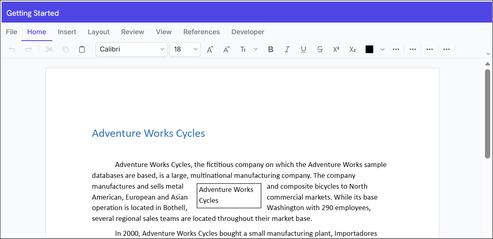

# Getting Started with Vue DOCX Editor (Vue 3)

This article provides a step-by-step guide for setting up a [Vite](https://vitejs.dev/) project with integrating the [Vue DOCX Editor](https://www.syncfusion.com/docx-editor-sdk/Vue-docx-editor) (Document Editor) component using the [Composition API](https://vuejs.org/guide/introduction.html#composition-api) or [Options API](https://vuejs.org/guide/introduction.html#options-api).





## Prerequisites

- [Node.js 24+](https://nodejs.org/en) (LTS recommended).
- Syncfusion CLI.

## Install the Syncfusion CLI 

Install the Syncfusion CLI globally using the following command:




npm install -g @syncfusion/syncfusion-cli




## Set up the Vite project using Syncfusion CLI

You can create a Vue application with [Vite](https://vite.dev/) using the Syncfusion CLI. The CLI provides two ways to create a project:

### Non-interactive mode

Non-interactive mode allows you to create a project directly using a single command with the required command-line arguments.




sf new syncfusion-vue-app --framework vue --template DOCX-Editor --theme tailwind3




In this mode, the project configuration is passed directly in the command. The above command creates a Vue application with Vite and configured it with the Syncfusion® DOCX Editor component. The generated project uses the TypeScript and the Composition API.

### Interactive mode

Interactive mode guides you through the project creation process with step-by-step prompts.




sf




When you run the `sf` command, the CLI prompts you to select the required project configuration options. To create a Vue application with Vite and the Syncfusion<sup style="font-size:70%">&reg;</sup> Grid component, select the following options:




√ Project name? ... syncfusion-vue-app
√ Choose Framework: » Vue
√ Choose Language: » JavaScript
√ Choose Template: » DOCX-Editor
√ Choose Theme: » Tailwind3
√ Choose Style Format: » CSS
√ Would you like to integrate the Syncfusion MCP Server (AI Assistant) into this project? ... no
√ Would you like to install Syncfusion Component Skills for AI-powered development? ... no      
√ Install dependencies and start app now? ... no




The above selections generate a Vue application with Vite and configure it with the Syncfusion<sup style="font-size:70%">&reg;</sup> DOCX Editor component. You can choose different values for language, theme, style format, MCP setup, and skills installation based on your project requirements.

The Syncfusion<sup style="font-size:70%">&reg;</sup> CLI creates the project with a predefined template. After the project is generated, you can customize or replace the component code based on your application requirements.

## Run the project

Once the project is created, navigate to the project directory and run the following commands in your terminal.




cd syncfusion-vue-app
npm install
npm run dev




The output will appear as follows:







## Prerequisites

* [System requirements for Vue UI components](https://ej2.syncfusion.com/vue/documentation/system-requirements)
* [Browser Compatibility](https://ej2.syncfusion.com/vue/documentation/browser)

## Create a Vue application

Use [Vite](https://vitejs.dev/) to quickly scaffold a Vue 3 project. Run one of the following commands to create a new project:

```bash
npm create vite@latest
```

or

```bash
yarn create vite
```

After running the command, follow the interactive prompts shown below to configure the project:

Step 1: Define the project name: Specify the project name directly. This guide uses `documenteditor-app`.

```bash
? Project name: » documenteditor-app
```

Step 2: Select `Vue` as the framework to target Vue 3.

```bash
? Select a framework: » - Use arrow-keys. Return to submit.
Vanilla
> Vue
  React
  Preact
  Lit
  Svelte
  Others
```

Step 3: Choose `JavaScript` as the variant to build the Vite project with JavaScript and Vue.

```bash
? Select a variant: » - Use arrow-keys. Return to submit.
> JavaScript
  TypeScript
  Customize with create-vue ↗
  Nuxt ↗
```

Step 4: After the scaffold completes, install the project dependencies:

```bash
cd documenteditor-app
npm install
```

or

```bash
cd documenteditor-app
yarn install
```

## Install the DOCX Editor packages

The DOCX Editor package is available in the public npm registry and can be installed directly from [`npmjs.com`](https://www.npmjs.com/package/@syncfusion/ej2-vue-documenteditor).

To install the DOCX Editor component, use the following command:

```bash
npm install @syncfusion/ej2-vue-documenteditor --save
```

## Register a Syncfusion License Key

Before initializing the Vue DOCX Editor control, generate a Syncfusion license key and register it in your application.

- [Generate a Syncfusion License Key](https://help.syncfusion.com/document-processing/licensing/how-to-generate)
- [Register a Syncfusion License Key in Vue](https://help.syncfusion.com/document-processing/licensing/how-to-register-in-an-application#vuejs)

## Import the required CSS styles

Add the following DOCX Editor and dependent component style definitions to the `src/style.css` file.




@import '../node_modules/@syncfusion/ej2-base/styles/tailwind3.css';
@import '../node_modules/@syncfusion/ej2-buttons/styles/tailwind3.css';
@import '../node_modules/@syncfusion/ej2-inputs/styles/tailwind3.css';
@import '../node_modules/@syncfusion/ej2-popups/styles/tailwind3.css';
@import '../node_modules/@syncfusion/ej2-lists/styles/tailwind3.css';
@import '../node_modules/@syncfusion/ej2-navigations/styles/tailwind3.css';
@import '../node_modules/@syncfusion/ej2-splitbuttons/styles/tailwind3.css';
@import '../node_modules/@syncfusion/ej2-dropdowns/styles/tailwind3.css';
@import '../node_modules/@syncfusion/ej2-vue-documenteditor/styles/tailwind3.css';




N> Refer to [themes topic](https://ej2.syncfusion.com/vue/documentation/appearance/theme) to know more about built-in themes and different ways to refer to themes in a Vue project.

## Initialize the DOCX Editor

Import and register the DOCX Editor component in the `<script>` section of `src/App.vue`. If you use the `Composition API`, add the `setup` attribute to the `<script>` tag. Then, define the component in the `<template>` section.




<template>
  <ejs-documenteditorcontainer 
   height="590px"
   :serviceUrl="serviceUrl" 
   :enableToolbar="true"> 
  </ejs-documenteditorcontainer>
</template>

<script setup>
  import { provide } from 'vue';
  import { DocumentEditorContainerComponent, Toolbar } from '@syncfusion/ej2-vue-documenteditor';
  
  // Use the following service URL only for demo purposes
  const serviceUrl = 'https://document.syncfusion.com/web-services/docx-editor/api/documenteditor/';

  provide('DocumentEditorContainer', [Toolbar]);
</script>




<template>
  <ejs-documenteditorcontainer 
    height="590px"
    :serviceUrl="serviceUrl" 
    :enableToolbar="true"> 
  </ejs-documenteditorcontainer>
</template>

<script>
  import { DocumentEditorContainerComponent, Toolbar } from '@syncfusion/ej2-vue-documenteditor';

  export default {
    name: 'App',
    components: {
       'ejs-documenteditorcontainer' : DocumentEditorContainerComponent
    },
    data () {
      return {
        // Use the following service URL only for demo purposes
        serviceUrl:'https://document.syncfusion.com/web-services/docx-editor/api/documenteditor/'
      };
    },
    provide: {
      DocumentEditorContainer: [Toolbar]
    }
  }
</script>




N> The hosted Web API URL is for demo and evaluation purposes only. For production, host your own web service using the [GitHub Web Service example](https://github.com/SyncfusionExamples/EJ2-DocumentEditor-WebServices) or the [Docker image](https://hub.docker.com/r/syncfusion/word-processor-server).

## Run the application

Run the application using the following command:

```bash
npm run dev
```

After the application starts, open the localhost URL shown in the terminal. The Vue DOCX Editor is rendered in the browser with a toolbar and an editable document area, as shown below.


N> [View Sample in GitHub](https://github.com/SyncfusionExamples/Vue-DOCX-Editor-Examples/tree/master/getting-started/vue_3).





## Server-side dependencies

The DOCX Editor component requires server-side interactions for the following operations:

* Open file formats other than SFDT
* Paste with formatting
* Restrict editing
* Spell check
* Save as file formats other than SFDT and DOCX

N> If you do not require the above functionalities, you can deploy the component as a pure client-side solution without any server-side interactions.

For detailed information about server-side dependencies, refer to the [Web Services Overview](./web-services-overview) page.

N> Looking for the full Vue DOCX Editor component overview, features, pricing, and documentation? Visit the [Vue DOCX Editor](https://www.syncfusion.com/docx-editor-sdk/vue-docx-editor) page.

## See also

- [Open a document](./import)
- [Save a document](./export)
- [Collaborative Editing](./collaborative-editing/overview)
- [Troubleshooting](https://help.syncfusion.com/document-processing/word/word-processor/vue/troubleshooting)