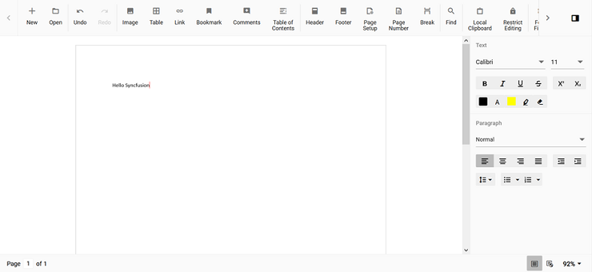

# How to Change Cursor Color in Vue DOCX Editor

[Vue DOCX Editor](https://www.syncfusion.com/docx-editor-sdk/vue-docx-editor) (Document Editor) default cursor color is black. The user can change the color by overriding the CSS property using the class name. The DOCX Editor cursor CSS has a class named `e-de-blink-cursor`.

Please refer to the code snippet below to change the cursor color to red.

```
.e-de-blink-cursor {
border-left: 1px solid red !important;
}
```

The output will be as shown below:


