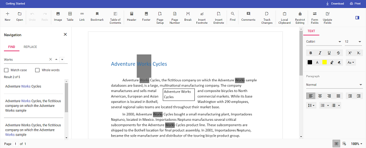

# Change search highlight color in Vue DOCX Editor

[Vue DOCX Editor](https://www.syncfusion.com/docx-editor-sdk/vue-docx-editor) (Document Editor) provides an option to change the default search highlight color using [`searchHighlightColor`](https://ej2.syncfusion.com/vue/documentation/api/document-editor/documentEditorSettingsModel#searchhighlightcolor) in Document Editor settings. The highlight color specified in [`documentEditorSettings`](https://ej2.syncfusion.com/vue/documentation/api/document-editor-container#documenteditorsettings) will be highlighted on the searched text. By default, the search highlight color is `yellow`.

Similarly, you can use the [`documentEditorSettings`](https://ej2.syncfusion.com/vue/documentation/api/document-editor#documenteditorsettings) property for the DocumentEditor also.

The following example code illustrates how to change the default search highlight color.




<template>
  

    <ejs-documenteditorcontainer ref='documenteditor' :serviceUrl='serviceUrl' :documentEditorSettings='settings'
      height="590px" id='container' :enableToolbar='true'></ejs-documenteditorcontainer>
  

</template>




<template>
  

    <ejs-documenteditorcontainer ref='documenteditor' :serviceUrl='serviceUrl' :documentEditorSettings='settings'
      height="590px" id='container' :enableToolbar='true'></ejs-documenteditorcontainer>
  

</template>




N> The Web API hosted link `https://document.syncfusion.com/web-services/docx-editor/api/documenteditor/` utilized in the Document Editor's serviceUrl property is intended solely for demonstration and evaluation purposes. For production deployment, please host your own web service with your required server configurations. You can refer and reuse the [GitHub Web Service example](https://github.com/SyncfusionExamples/EJ2-DocumentEditor-WebServices) or [Docker image](https://hub.docker.com/r/syncfusion/word-processor-server) for hosting your own web service and use for the serviceUrl property.

The output will be as shown below:

