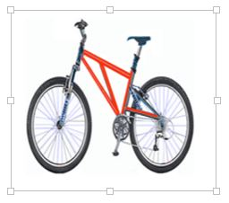

# Images in Vue DOCX Editor

[Vue DOCX Editor](https://www.syncfusion.com/docx-editor-sdk/vue-docx-editor) (Document Editor) supports common raster image formats such as PNG, BMP, JPEG, SVG, and GIF. You can insert an image file or online image in the document using the [`insertImage()`](https://ej2.syncfusion.com/vue/documentation/api/document-editor/editor#insertimage) method. Refer to the following sample code.

The following example shows how to open bookmark dialog in DOCX Editor.









        


Image files are internally converted to base64 strings, whereas online images are preserved as URLs.

N> EMF and WMF images can't be inserted, but these types of images will be preserved in DOCX Editor when using ASP.NET MVC Web API.

## Image resizing

DOCX Editor provides a built-in image resizer that can be injected into your application based on the requirements. This allows you to resize the image by dragging the resizing points using a mouse or touch interactions. This resizer appears as follows.



## Changing size

DOCX Editor exposes an API to get or set the size of the selected image. Refer to the following sample code.

```ts
this.$refs.documenteditor.ej2Instances.selection.imageFormat.width = 800;
this.$refs.documenteditor.ej2Instances.selection.imageFormat.height = 800;
```

N> Images are stored and processed (read/write) as base64 string in DOCX Editor. The online image URL is preserved as a URL in DocumentEditor upon saving.

## Text wrapping style

Text wrapping refers to how images fit with surrounding text in a document. Please [refer to this page](./text-wrapping-style) for more information about text wrapping styles available in Word documents.

## Positioning the image

DOCX Editor preserves the position properties of the image and displays the image based on these position properties. It does not support modifying the position properties. The image will be automatically moved along with the edited text if it is positioned relative to the line or paragraph.

## See Also

* [Feature modules](./feature-module)