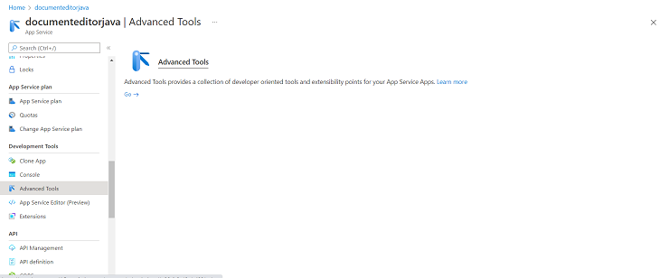
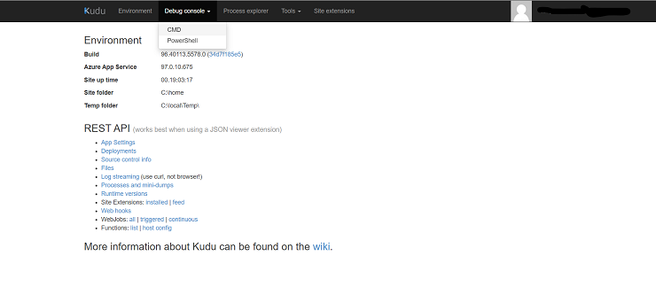
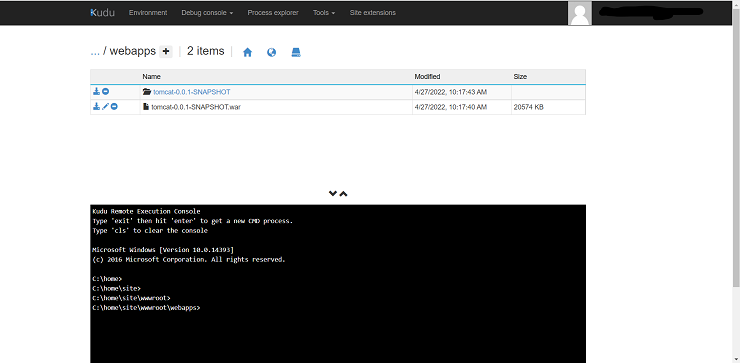

# How to Deploy Vue DOCX Editor Java Web API in Azure App

## Prerequisites

Have [`Azure account`](https://azure.microsoft.com/en-gb/) and [`Azure CLI`](https://docs.microsoft.com/en-us/cli/azure/?view=azure-cli-latest) setup in your environment.

You can get the example [`web service project from GitHub`](https://github.com/SyncfusionExamples/EJ2-DocumentEditor-Java-WebService) and then perform the following steps to create the packages and host in azure app service.

**Step 1:** Clean the package using the following command.

```console
mvn clean package
```

**Step 2:** Run the application locally using the following command.

```console
mvn spring-boot:run
```

**Step 3:** Build the package using the following command.

```console
mvn package
```

Above package generation command creates the `**tomcat-0.0.1-SNAPSHOT.war**` in the below location in the sample folder.

`target/tomcat-0.0.1-SNAPSHOT.war`

**Step 4:** Create an Azure App Service with Java & Tomcat. For example, create the App Service with name `documenteditorjava`.

**Step 5:** After creating the App Service, navigate to `Advanced Tools` options under `Development Tools`.



Then, click `Go` and select the `CMD` option under `Debug console`.



**Step 6:** Once the file manager is opened, navigate to:

`site -> wwwroot -> webapps`

**Step 7:** Now, upload the generated WAR file `tomcat-0.0.1-SNAPSHOT.war`. It is extracted automatically, as shown below:



**Step 8:** Browse to the app.

Browse to the deployed app at `http://<app_name>.azurewebsites.net`, i.e., `http://documenteditorjava.azurewebsites.net`. Browse this link and it navigates to the DOCX Editor Web API control `http://documenteditorjava.azurewebsites.net/tomcat-0.0.1-SNAPSHOT`. It returns the default GET method response.

Append the App Service running URL `http://documenteditorjava.azurewebsites.net/tomcat-0.0.1-SNAPSHOT` to the service URL in the client-side DOCX Editor control. For more information about the DOCX Editor control, refer to this [`getting started page`](../getting-started).
