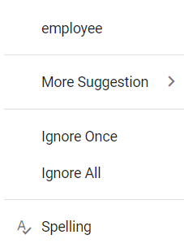
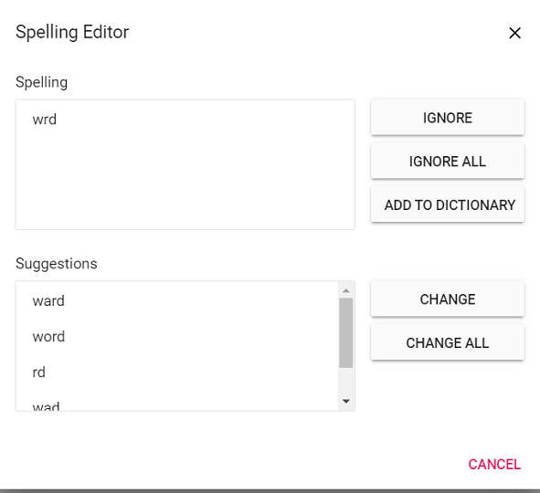

# Spell Check in Vue DOCX Editor

[Vue DOCX Editor](https://www.syncfusion.com/docx-editor-sdk/vue-docx-editor) (Document Editor) supports spell checking for document content. It identifies misspelled words and provides suggestions through a dialog and the context menu. The spell checker is compatible with [Hunspell](https://github.com/wooorm/dictionaries) dictionary files.




<template>
  <div id="app">
    <ejs-documenteditor ref="documenteditor" id="container_1" height="370px" style="width: 100%;"
      :enableSpellCheck='true'></ejs-documenteditor>
  </div>
</template>
<script setup>
import { DocumentEditorComponent as EjsDocumenteditor } from '@syncfusion/ej2-vue-documenteditor';
import { onMounted, ref } from 'vue';

const documenteditor = ref(null);
onMounted(function () {
  //Set language id to map dictionary.
  documenteditor.value.ej2Instances.spellChecker.languageID = 1033;
  documenteditor.value.ej2Instances.spellChecker.removeUnderline = false;
  documenteditor.value.ej2Instances.spellChecker.allowSpellCheckAndSuggestion = true;
})
</script>
<style>
@import "../node_modules/@syncfusion/ej2-vue-documenteditor/styles/material.css";
</style>




<template>
  <div id="app">
    <ejs-documenteditor ref="documenteditor" id="container_1" height="370px" style="width: 100%;"
      :enableSpellCheck='true'></ejs-documenteditor>
  </div>
</template>
<script>
import { DocumentEditorComponent } from '@syncfusion/ej2-vue-documenteditor';

export default {
  components: {
    'ejs-documenteditor': DocumentEditorComponent
  },
  data: function () {
    return {
    };
  },
  mounted: function () {
    //Set language id to map dictionary.
    this.$refs.documenteditor.ej2Instances.spellChecker.languageID = 1033;
    this.$refs.documenteditor.ej2Instances.spellChecker.removeUnderline = false;
    this.$refs.documenteditor.ej2Instances.spellChecker.allowSpellCheckAndSuggestion = true;
  }
}
</script>
<style>
@import "../node_modules/@syncfusion/ej2-vue-documenteditor/styles/material.css";
</style>




## Features

* Supports context menu suggestions.
* Provides built-in options to Ignore, Ignore All, Change, Change All for error words in spell check dialog.

## Enable spellCheck

To enable spell check in Document Editor, set [`enableSpellCheck`](https://ej2.syncfusion.com/vue/documentation/api/document-editor#enablespellcheck) property as `true` and then configure SpellCheckSettings.

## Disable spellCheck

To disable spell check in Document Editor, set [`enableSpellCheck`](https://ej2.syncfusion.com/vue/documentation/api/document-editor#enablespellcheck) property as `false` or remove [`enableSpellCheck`](https://ej2.syncfusion.com/vue/documentation/api/document-editor#enablespellcheck) property initialization code. The default value of this property is false.

## Spell check settings

### Remove underline

By default, misspelled words are marked with a squiggly line. This behavior can be disabled by setting the [`removeUnderline`](https://ej2.syncfusion.com/vue/documentation/api/document-editor/spellChecker#removeunderline) API to true, which prevents squiggly lines from being rendered for misspelled words.

```ts
this.$refs.documenteditor.ej2Instances.spellChecker.removeUnderline = false;
```

### AllowSpellCheckAndSuggestion

By default, on performing spell check in Document Editor, both spelling and suggestions of the misspelled words will be retrieved, and these misspelled words can be corrected through context menu suggestions. You can modify this behavior using the [`allowSpellCheckAndSuggestion`](https://ej2.syncfusion.com/vue/documentation/api/document-editor/spellChecker#allowspellcheckandsuggestion) API, which will perform only spell check.

```ts
this.$refs.documenteditor.ej2Instances.spellChecker.allowSpellCheckAndSuggestion = false;
```

### LanguageID

Document Editor provides multi-language spell check support. You can add as many languages (dictionaries) on the server side, and the language used for spell checking in Document Editor must match the [`languageID`](https://ej2.syncfusion.com/vue/documentation/api/document-editor/spellChecker#languageid) specified in the Document Editor.

```ts
this.$refs.documenteditor.ej2Instances.spellChecker.languageID = 1033 //LCID of "en-us";
```

### EnableOptimizedSpellCheck

Document Editor provides an option to perform spell check page by page when loading documents. The default value of this property is false, so when opening the document, the spell check web API will be called for each word in the document. To optimize the frequency of spell check web API calls, you can enable this property.

The following code example illustrates how to enable optimized spell checking.

```ts
this.container.documentEditor.spellChecker.enableOptimizedSpellCheck = true;
```

### Spell check dictionary cache

Starting from `v20.1.0.xx`, we have optimized the performance and memory usage of spell checker by adding a static method to initialize the dictionaries with specified cache count.

By default, the spell checker holds only one language dictionary in memory. If you want to hold multiple dictionaries in memory, you need to set the cache limit by using `InitializeDictionaries` method as in the below example.

```c#
List<DictionaryData> spellDictCollection = new List<DictionaryData>();
string personalDictPath = string.Empty;
int cacheCount = 2;
// Initialize dictionaries
SpellChecker.InitializeDictionaries(spellDictCollection, personalDictPath, cacheCount);
```

If dictionaries are initialized using `InitializeDictionaries` method, then we should use the default constructor of the `SpellChecker` to check spelling and get suggestions as in the below example code. This will prevent reinitialization of already loaded dictionaries.

```c#
public string SpellCheck([FromBody] SpellCheckJsonData spellChecker)
{
      try
      {
            SpellChecker spellCheck = new SpellChecker();
            spellCheck.GetSuggestions(spellChecker.LanguageID, spellChecker.TexttoCheck, spellChecker.CheckSpelling, spellChecker.CheckSuggestion, spellChecker.AddWord);
            return Newtonsoft.Json.JsonConvert.SerializeObject(spellCheck);
      }
      catch
      {
            return "{\"SpellCollection\":[],\"HasSpellingError\":false,\"Suggestions\":null}";
      }
}
```

Previously on every `SpellChecker.GetSuggestion()` method call, the `.aff` and dictionary data will be parsed to generate suggestions for misspelled words. However, starting from `v20.1.0.xx`, the `.aff` and dictionary data will be parsed only for the first time alone while calling `SpellChecker.GetSuggestion()` method.

### Add new root word and possible words to dictionary

If you find any root word is missing in the dictionary file, then you can add that new root word and the rule to form the possible words to dictionary file using `AddNewWord` API in the server-side Spell check library.

N> The rules are framed automatically using the root word, the possible words and affix file. If you pass null for the parameters `affPath` and `possibleWords`, then it will add a single root word to the dictionary. This API is included starting from `v20.2.0.xx`.

The following code example demonstrates how to add a new root word to the dictionary along with the rule to form the possible words.

```c#
SpellChecker spellChecker = new SpellChecker();
// Adds the specified new root word to the dictionary along with the rule to form the possible words.
spellChecker.AddNewWord("en.dic", "en.aff", "construct", new string[] { "constructs", "reconstruct", "constructed", "constructive" });
```

## Context menu

Right-click on a misspelled word to open the context menu with spell check options. See the screenshot below for reference.



### Suggestions

Context menu shows the suggestions for mis-spelled words. By clicking on the required word from suggestion, the error word gets replaced automatically.

### Add to dictionary

Using this option, you can add the current word to the dictionary. As a result, the spell checker will not treat the word as an error in the future.

### Ignore Once and Ignore All

If you do not wish to add the word to the dictionary and do not want to show the error, use Ignore Once or Ignore All options.

**Ignore:** Ignores only the current occurrence of a word from the error.

**Ignore All:** Ignores all occurrences of a word in the entire document.

### Spelling

Using this option, you can open the spell check dialog. Please see below screenshot for your reference.



* Refer to the [Spell checker](https://help.syncfusion.com/document-processing/word/word-processor/vue/web-services/core#spell-check) link for configuring the spell checker on the server side.