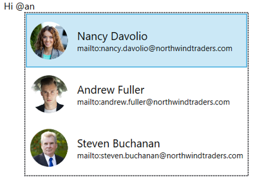
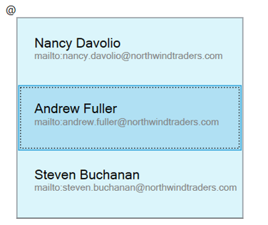
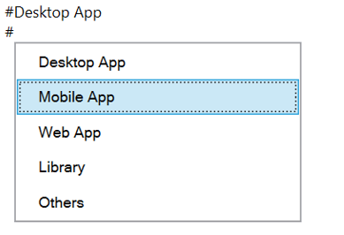
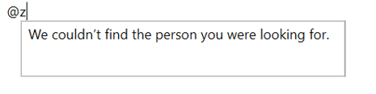
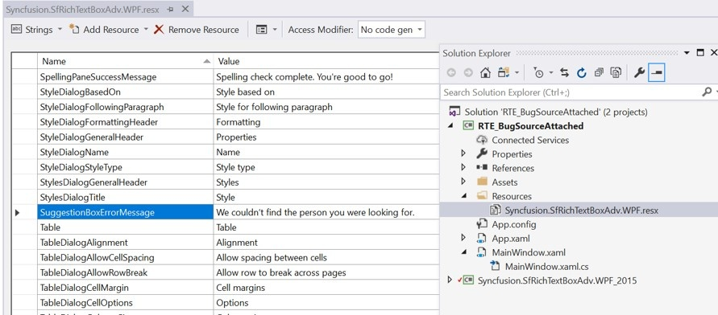

# Automatic Suggestion in WPF RichTextBox (SfRichTextBoxAdv)

## Automatic Suggestion functionality for using @mentions
[WPF RichTextBox](https://www.syncfusion.com/docx-editor-sdk/wpf-docx-editor) control shows an inline dropdown with a list of suggested names while typing the mention character (@ symbol). The list of suggested names filters as you type additional characters. You can use the up or down arrow keys to move the selection and the Tab or Enter key to insert the selected item. You can also use the mouse to click any option in the list. The selected item from the suggestion list will be inserted as hyperlink with the display text and its respective link.



The following sample code demonstrates how to use @mentions in RichTextBox.


<Window.Resources>
	<x:Array Type="{x:Type RichTextBoxAdv:NameSuggestionItem}" x:Key="suggestionItems">
		<RichTextBoxAdv:NameSuggestionItem Name = "Nancy Davolio" Link="mailto:nancy.davolio@northwindtraders.com" ImageSource="/Assets/People_Circle0.png" />
		<RichTextBoxAdv:NameSuggestionItem Name = "Andrew Fuller" Link="mailto:andrew.fuller@northwindtraders.com" ImageSource="/Assets/People_Circle5.png"/>
		<RichTextBoxAdv:NameSuggestionItem Name = "Steven Buchanan" Link="mailto:steven.buchanan@northwindtraders.com" ImageSource="/Assets/People_Circle18.png"/>
	</x:Array>
</Window.Resources>
    <Grid>
        <RichTextBoxAdv:SfRichTextBoxAdv x:Name="richTextboxadv" LayoutType="Continuous">
            <RichTextBoxAdv:SfRichTextBoxAdv.SuggestionSettings>
                <RichTextBoxAdv:SuggestionSettings>
                    <RichTextBoxAdv:SuggestionSettings.SuggestionProviders>
                        <RichTextBoxAdv:NameSuggestionProvider     ItemsSource="{StaticResource suggestionItems}">
                        </RichTextBoxAdv:NameSuggestionProvider>
                    </RichTextBoxAdv:SuggestionSettings.SuggestionProviders>
                </RichTextBoxAdv:SuggestionSettings>
            </RichTextBoxAdv:SfRichTextBoxAdv.SuggestionSettings>
        </RichTextBoxAdv:SfRichTextBoxAdv>
    </Grid>


	ISuggestionProvider suggestionProvider = new NameSuggestionProvider();
	List<NameSuggestionItem> suggestionItems = new List<NameSuggestionItem>();

	NameSuggestionItem suggestionItem = new NameSuggestionItem();
	suggestionItem.Name = "Nancy Davolio";
	suggestionItem.Link = "mailto:nancy.davolio@northwindtraders.com";
	BitmapImage bitmapImage = new BitmapImage(new Uri(new DirectoryInfo(@"..\..\Assets\People_Circle0.png").FullName));
	suggestionItem.ImageSource = bitmapImage;
	suggestionItems.Add(suggestionItem);

	suggestionItem = new NameSuggestionItem();
	suggestionItem.Name = "Andrew Fuller";
	suggestionItem.Link = "mailto:andrew.fuller@northwindtraders.com";
	bitmapImage = new BitmapImage(new Uri(new DirectoryInfo(@"..\..\Assets\People_Circle5.png").FullName));
	suggestionItem.ImageSource = bitmapImage;
	suggestionItems.Add(suggestionItem);

	suggestionItem = new NameSuggestionItem();
	suggestionItem.Name = "Steven Buchanan";
	suggestionItem.Link = "mailto:steven.buchanan@northwindtraders.com";
	bitmapImage = new BitmapImage(new Uri(new DirectoryInfo(@"..\..\Assets\People_Circle18.png").FullName));
	suggestionItem.ImageSource = bitmapImage;
	suggestionItems.Add(suggestionItem);

	(suggestionProvider as NameSuggestionProvider).ItemsSource = suggestionItems;
	richTextboxadv.SuggestionSettings.SuggestionProviders.Add(suggestionProvider);


    Dim suggestionProvider As ISuggestionProvider = New NameSuggestionProvider()
	Dim suggestionItems As List<NameSuggestionItem> = New List<NameSuggestionItem>()
	
	Dim suggestionItem As NameSuggestionItem = New NameSuggestionItem()
	suggestionItem.Name = "Nancy Davolio"
	suggestionItem.Link = "mailto:nancy.davolio@northwindtraders.com"
	Dim bitmapImage As BitmapImage = New BitmapImage(New Uri(New DirectoryInfo("..\..\Assets\People_Circle0.png").FullName))
	suggestionItem.ImageSource = bitmapImage
	suggestionItems.Add(suggestionItem)
	
	suggestionItem = New NameSuggestionItem()
	suggestionItem.Name = "Andrew Fuller"
	suggestionItem.Link = "mailto:andrew.fuller@northwindtraders.com"
	bitmapImage = New BitmapImage(New Uri(New DirectoryInfo("..\..\Assets\People_Circle5.png").FullName))
	suggestionItem.ImageSource = bitmapImage
	suggestionItems.Add(suggestionItem)
	
	suggestionItem = New NameSuggestionItem()
	suggestionItem.Name = "Steven Buchanan"
	suggestionItem.Link = "mailto:steven.buchanan@northwindtraders.com"
	bitmapImage = New BitmapImage(New Uri(New DirectoryInfo("..\..\Assets\People_Circle18.png").FullName))
	suggestionItem.ImageSource = bitmapImage
	suggestionItems.Add(suggestionItem)
	
	TryCast(suggestionProvider, NameSuggestionProvider).ItemsSource = suggestionItems
    richTextboxadv.SuggestionSettings.SuggestionProviders.Add(suggestionProvider)



For details on the API surface used in the samples above, see the following references:

| Type / Member | API reference |
| --- | --- |
| `NameSuggestionItem` (the `Name`, `Link`, and `ImageSource` properties) | [NameSuggestionItem](https://help.syncfusion.com/cr/wpf/Syncfusion.Windows.Controls.RichTextBoxAdv.NameSuggestionItem.html) |
| `SuggestionSettings` and `SuggestionSettings.SuggestionProviders` | [SuggestionSettings](https://help.syncfusion.com/cr/wpf/Syncfusion.Windows.Controls.RichTextBoxAdv.SuggestionSettings.html) |

N> [View example in GitHub](https://github.com/SyncfusionExamples/WPF-RichTextBox-Examples/tree/main/Samples/Automatic%20Suggestion/Automatic%20Suggestion)

## Customize the SuggestionBox ItemTemplate and Style
By default, the drop-down window lists the filtered items as an image, display text and link. If you want to remove the image or link, you can write your own item template.



The following sample code demonstrates how to modify the suggestion box item template and style.


<Window.Resources>
        <x:Array Type="{x:Type RichTextBoxAdv:NameSuggestionItem}" x:Key="suggestionItems">
            <RichTextBoxAdv:NameSuggestionItem Name = "Nancy Davolio" Link="mailto:nancy.davolio@northwindtraders.com"  />
            <RichTextBoxAdv:NameSuggestionItem Name = "Andrew Fuller" Link="mailto:andrew.fuller@northwindtraders.com" />
            <RichTextBoxAdv:NameSuggestionItem Name = "Steven Buchanan" Link="mailto:steven.buchanan@northwindtraders.com"/>
        </x:Array>
        <Style x:Key="SuggestionBoxStyle" TargetType="ListBox">
            <Setter Property="MinWidth" Value="300" />
            <Setter Property="MinHeight" Value="250" />
            <Setter Property="Background" Value="#FFDBF5FB"/>
            <Setter Property="ItemTemplate">
                <Setter.Value>
                    <DataTemplate DataType="local:NameSuggestionItem">
                        <StackPanel Orientation="Vertical" Height="50" VerticalAlignment="Center" Margin="12,15,0,0">
                            <TextBlock Text="{Binding Name}" FontFamily="microsoft sans serif" FontSize="14"  />
                            <TextBlock Text="{Binding Link}" FontFamily="microsoft sans serif" Foreground="Gray" FontSize="10" />
                        </StackPanel>
                    </DataTemplate>
                </Setter.Value>
            </Setter>
        </Style>
</Window.Resources>
    <Grid>
        <RichTextBoxAdv:SfRichTextBoxAdv x:Name="richTextboxadv" LayoutType="Continuous">
            <RichTextBoxAdv:SfRichTextBoxAdv.SuggestionSettings>
                <RichTextBoxAdv:SuggestionSettings>
                    <RichTextBoxAdv:SuggestionSettings.SuggestionProviders>
                        <RichTextBoxAdv:NameSuggestionProvider ItemsSource="{StaticResource suggestionItems}" 
                                                               SuggestionBoxStyle="{StaticResource SuggestionBoxStyle}">
                        </RichTextBoxAdv:NameSuggestionProvider>
                    </RichTextBoxAdv:SuggestionSettings.SuggestionProviders>
                </RichTextBoxAdv:SuggestionSettings>
            </RichTextBoxAdv:SfRichTextBoxAdv.SuggestionSettings>
        </RichTextBoxAdv:SfRichTextBoxAdv>
    </Grid>


ISuggestionProvider suggestionProvider = new NameSuggestionProvider();
List<NameSuggestionItem> suggestionItems = new List<NameSuggestionItem>();

NameSuggestionItem suggestionItem = new NameSuggestionItem();
suggestionItem.Name = "Nancy Davolio";
suggestionItem.Link = "mailto:nancy.davolio@northwindtraders.com";
suggestionItems.Add(suggestionItem);

suggestionItem = new NameSuggestionItem();
suggestionItem.Name = "Andrew Fuller";
suggestionItem.Link = "mailto:andrew.fuller@northwindtraders.com";
suggestionItems.Add(suggestionItem);

suggestionItem = new NameSuggestionItem();
suggestionItem.Name = "Steven Buchanan";
suggestionItem.Link = "mailto:steven.buchanan@northwindtraders.com";
suggestionItems.Add(suggestionItem);

// Build the SuggestionBoxStyle
Style suggestionBoxStyle = new Style(typeof(ListBox));
suggestionBoxStyle.Setters.Add(new Setter(ListBox.MinWidthProperty, 300.0));
suggestionBoxStyle.Setters.Add(new Setter(ListBox.MinHeightProperty, 250.0));
suggestionBoxStyle.Setters.Add(new Setter(ListBox.BackgroundProperty, new SolidColorBrush((Color)ColorConverter.ConvertFromString("#FFDBF5FB"))));

DataTemplate itemTemplate = new DataTemplate(typeof(NameSuggestionItem));
FrameworkElementFactory stackPanel = new FrameworkElementFactory(typeof(StackPanel));
stackPanel.SetValue(StackPanel.OrientationProperty, Orientation.Vertical);
stackPanel.SetValue(StackPanel.HeightProperty, 50.0);
stackPanel.SetValue(StackPanel.VerticalAlignmentProperty, VerticalAlignment.Center);
stackPanel.SetValue(StackPanel.MarginProperty, new Thickness(12, 15, 0, 0));

FrameworkElementFactory nameBlock = new FrameworkElementFactory(typeof(TextBlock));
nameBlock.SetBinding(TextBlock.TextProperty, new Binding("Name"));
nameBlock.SetValue(TextBlock.FontFamilyProperty, new FontFamily("microsoft sans serif"));
nameBlock.SetValue(TextBlock.FontSizeProperty, 14.0);

FrameworkElementFactory linkBlock = new FrameworkElementFactory(typeof(TextBlock));
linkBlock.SetBinding(TextBlock.TextProperty, new Binding("Link"));
linkBlock.SetValue(TextBlock.FontFamilyProperty, new FontFamily("microsoft sans serif"));
linkBlock.SetValue(TextBlock.ForegroundProperty, Brushes.Gray);
linkBlock.SetValue(TextBlock.FontSizeProperty, 10.0);

stackPanel.AppendChild(nameBlock);
stackPanel.AppendChild(linkBlock);

itemTemplate.VisualTree = stackPanel;
suggestionBoxStyle.Setters.Add(new Setter(ListBox.ItemTemplateProperty, itemTemplate));
this.Resources["SuggestionBoxStyle"] = suggestionBoxStyle;

(suggestionProvider as NameSuggestionProvider).ItemsSource = suggestionItems;
(suggestionProvider as NameSuggestionProvider).SuggestionBoxStyle = suggestionBoxStyle;
richTextboxadv.SuggestionSettings.SuggestionProviders.Add(suggestionProvider);




## Custom mention character
Any character can be used as a mention character, and the default value is @.



The following sample code demonstrates how to use ‘#’ as mention character.


<Grid>
    <RichTextBoxAdv:SfRichTextBoxAdv x:Name="richTextboxadv" LayoutType="Continuous">
        <RichTextBoxAdv:SfRichTextBoxAdv.SuggestionSettings>
            <RichTextBoxAdv:SuggestionSettings>
                <RichTextBoxAdv:SuggestionSettings.SuggestionProviders>
                    <RichTextBoxAdv:NameSuggestionProvider MentionCharacter="#" 
                                                               ItemsSource="{StaticResource suggestionItems}">
                    </RichTextBoxAdv:NameSuggestionProvider>
                </RichTextBoxAdv:SuggestionSettings.SuggestionProviders>
            </RichTextBoxAdv:SuggestionSettings>
        </RichTextBoxAdv:SfRichTextBoxAdv.SuggestionSettings>
    </RichTextBoxAdv:SfRichTextBoxAdv>
</Grid>


ISuggestionProvider suggestionProvider = new NameSuggestionProvider();
List<NameSuggestionItem> suggestionItems = new List<NameSuggestionItem>();
NameSuggestionItem suggestionItem = new NameSuggestionItem();
suggestionItem.Name = "Nancy Davolio";
suggestionItem.Link = "mailto:nancy.davolio@northwindtraders.com";
suggestionItems.Add(suggestionItem);

suggestionItem = new NameSuggestionItem();
suggestionItem.Name = "Andrew Fuller";
suggestionItem.Link = "mailto:andrew.fuller@northwindtraders.com";
suggestionItems.Add(suggestionItem);

suggestionItem = new NameSuggestionItem();
suggestionItem.Name = "Steven Buchanan";
suggestionItem.Link = "mailto:steven.buchanan@northwindtraders.com";
suggestionItems.Add(suggestionItem);
(suggestionProvider as NameSuggestionProvider).ItemsSource = suggestionItems;

suggestionProvider.MentionCharacter = '#';
richTextboxadv.SuggestionSettings.SuggestionProviders.Add(suggestionProvider);




## Multiple Suggestion Providers
Two or more suggestion providers can be used at a time, but each suggestion provider should have a different mention character. Additionally, each suggestion provider can have a different item source and suggestion box style.

<table><tr><td><br/></td><td><br/></td></tr></table>


The following sample code demonstrates how to use two suggestion providers. Here we have used ‘@’ and ‘#’ as mention characters.


<Window.Resources>
	<Style x:Key="SuggestionBoxStyle" TargetType="ListBox">
		<Setter Property="MinWidth" Value="300" />
		<Setter Property="MinHeight" Value="250" />
		<Setter Property="ItemTemplate">
			<Setter.Value>
				<DataTemplate DataType="local:NameSuggestionItem">
					<StackPanel Orientation="Vertical" Height="50" Width="200" VerticalAlignment="Center" Margin="12,15,0,0">
						<TextBlock Text="{Binding Name}" FontFamily="microsoft sans serif" FontSize="14"  />
						<TextBlock Text="{Binding Link}" FontFamily="microsoft sans serif" Foreground="Gray" FontSize="10" />
					</StackPanel>
				</DataTemplate>
			</Setter.Value>
		</Setter>
	</Style>
        
	<x:Array Type="{x:Type RichTextBoxAdv:NameSuggestionItem}" x:Key="suggestionItems">
		<RichTextBoxAdv:NameSuggestionItem Name = "Nancy Davolio" Link="mailto:nancy.davolio@northwindtraders.com" ImageSource="/Assets/People_Circle0.png" />
		<RichTextBoxAdv:NameSuggestionItem Name = "Andrew Fuller" Link="mailto:andrew.fuller@northwindtraders.com" ImageSource="/Assets/People_Circle5.png"/>
		<RichTextBoxAdv:NameSuggestionItem Name = "Steven Buchanan" Link="mailto:steven.buchanan@northwindtraders.com" ImageSource="/Assets/People_Circle18.png"/>
	</x:Array>

	<x:Array Type="{x:Type RichTextBoxAdv:NameSuggestionItem}" x:Key="suggestionItems01">
		<RichTextBoxAdv:NameSuggestionItem Name = "Desktop App" Link="10 queries"  />
		<RichTextBoxAdv:NameSuggestionItem Name = "Mobile App" Link="13 queries" />
		<RichTextBoxAdv:NameSuggestionItem Name = "Web App" Link="15 queries"/>
	</x:Array>
</Window.Resources>
<Grid>
	<RichTextBoxAdv:SfRichTextBoxAdv x:Name="richTextboxadv" LayoutType="Continuous">
		<RichTextBoxAdv:SfRichTextBoxAdv.SuggestionSettings>
			<RichTextBoxAdv:SuggestionSettings>
				<RichTextBoxAdv:SuggestionSettings.SuggestionProviders>
					<RichTextBoxAdv:NameSuggestionProvider 
							   ItemsSource="{StaticResource suggestionItems}">
					</RichTextBoxAdv:NameSuggestionProvider>
					<RichTextBoxAdv:NameSuggestionProvider MentionCharacter="#" 
								   ItemsSource="{StaticResource suggestionItems01}"
								   SuggestionBoxStyle="{StaticResource SuggestionBoxStyle}">
					</RichTextBoxAdv:NameSuggestionProvider>
				</RichTextBoxAdv:SuggestionSettings.SuggestionProviders>
			</RichTextBoxAdv:SuggestionSettings>
		</RichTextBoxAdv:SfRichTextBoxAdv.SuggestionSettings>
	</RichTextBoxAdv:SfRichTextBoxAdv>
</Grid>


ISuggestionProvider suggestionProvider = new NameSuggestionProvider();
List<NameSuggestionItem> suggestionItems = new List<NameSuggestionItem>();

NameSuggestionItem suggestionItem1 = new NameSuggestionItem();
suggestionItem1.Name = "Nancy Davolio";
suggestionItem1.Link = "mailto:nancy.davolio@northwindtraders.com";
BitmapImage bitmapImage = new BitmapImage(new Uri(new DirectoryInfo(@"..\..\Assets\People_Circle0.png").FullName));
suggestionItem1.ImageSource = bitmapImage;
suggestionItems.Add(suggestionItem1);

NameSuggestionItem suggestionItem2 = new NameSuggestionItem();
suggestionItem2.Name = "Andrew Fuller";
suggestionItem2.Link = "mailto:andrew.fuller@northwindtraders.com";
bitmapImage = new BitmapImage(new Uri(new DirectoryInfo(@"..\..\Assets\People_Circle5.png").FullName));
suggestionItem2.ImageSource = bitmapImage;
suggestionItems.Add(suggestionItem2);

NameSuggestionItem suggestionItem3 = new NameSuggestionItem();
suggestionItem3.Name = "Steven Buchanan";
suggestionItem3.Link = "mailto:steven.buchanan@northwindtraders.com";
bitmapImage = new BitmapImage(new Uri(new DirectoryInfo(@"..\..\Assets\People_Circle18.png").FullName));
suggestionItem3.ImageSource = bitmapImage;
suggestionItems.Add(suggestionItem3);

(suggestionProvider as NameSuggestionProvider).ItemsSource = suggestionItems;
richTextboxadv.SuggestionSettings.SuggestionProviders.Add(suggestionProvider);

ISuggestionProvider suggestionProviderAppType = new NameSuggestionProvider();
// Reads the SuggestionBoxStyle defined in Window.Resources (in the XAML sample above).
// Returns null if the resource is not found; the suggestion box then uses its default style.
suggestionProviderAppType.SuggestionBoxStyle = this.Resources["SuggestionBoxStyle"] as System.Windows.Style;
suggestionProviderAppType.MentionCharacter = '#';
List<NameSuggestionItem> appTypes = new List<NameSuggestionItem>();

NameSuggestionItem desktopApp = new NameSuggestionItem();
desktopApp.Name = "Desktop App";
desktopApp.Link = "10 queries";
appTypes.Add(desktopApp);

NameSuggestionItem mobileApp = new NameSuggestionItem();
mobileApp.Name = "Mobile App";
mobileApp.Link = "13 queries";
appTypes.Add(mobileApp);

NameSuggestionItem webApp = new NameSuggestionItem();
webApp.Name = "Web App";
webApp.Link = "15 queries";
appTypes.Add(webApp);

(suggestionProviderAppType as NameSuggestionProvider).ItemsSource = appTypes;
richTextboxadv.SuggestionSettings.SuggestionProviders.Add(suggestionProviderAppType);



N> [View example in GitHub](https://github.com/SyncfusionExamples/WPF-RichTextBox-Examples/tree/main/Samples/Automatic%20Suggestion/Multiple%20Suggestion%20Provider)

## Display error message when suggestions are empty
When the entered item is not in the suggestion list, the suggestion box displays a message indicating that no match was found. The default text is **“We couldn't find the person you were looking for.”** and is defined by the `SuggestionBoxErrorMessage` resource key in the default [Syncfusion.SfRichTextBoxAdv.WPF.resx](https://github.com/syncfusion/wpf-controls-localization-resx-files/blob/master/Syncfusion.SfRichTextBoxAdv.WPF/Syncfusion.SfRichTextBoxAdv.WPF.resx) file shipped with the control. The relevant entry in the resource file looks like this:

```xml
<data name="SuggestionBoxErrorMessage" xml:space="preserve">
    <value>We couldn't find the person you were looking for.</value>
</data>
```

To customize this message, follow these steps:
•	Right click your project and add new folder named Resources.
•	Add the [default resource file](https://github.com/syncfusion/wpf-controls-localization-resx-files/tree/master/Syncfusion.SfRichTextBoxAdv.WPF) of the RichTextBox control into the Resources folder.
•	Modify the value of the `SuggestionBoxErrorMessage` resource key in the resource file.

The following image illustrates the error message displayed when no matching suggestion is found.



The following image shows the default resource file used to modify the error message.




## Custom suggestion provider
[NameSuggestionProvider](https://help.syncfusion.com/cr/wpf/Syncfusion.Windows.Controls.RichTextBoxAdv.NameSuggestionProvider.html) is the default suggestion provider. You can implement your own suggestion provider by inheriting from [ISuggestionProvider](https://help.syncfusion.com/cr/wpf/Syncfusion.Windows.Controls.RichTextBoxAdv.ISuggestionProvider.html), which helps you customize the search and insert selected item functionalities.

The following sample code demonstrates how to create your own suggestion provider inherited from ISuggestionProvider.


internal class AppTypeSuggestionProvider : DependencyObject, ISuggestionProvider
{
#region Property
public char MentionCharacter
{
	get
	{
		return (char)GetValue(MentionCharacterProperty);
	}
	set
	{
		SetValue(MentionCharacterProperty, value);
	}
}

public Style SuggestionBoxStyle
{
	get
	{
		return (Style)GetValue(SuggestionBoxStyleProperty);
	}
	set
	{
		SetValue(SuggestionBoxStyleProperty, value);
	}
}

public IEnumerable ItemsSource
{
	get
	{
		return (IEnumerable)GetValue(ItemsSourceProperty);
	}
	set
	{
		SetValue(ItemsSourceProperty, value);
	}
}

public static DependencyProperty MentionCharacterProperty
{
	get
	{
		return mentionCharacterProperty;
	}
}

public static DependencyProperty ItemsSourceProperty
{
	get
	{
		return itemsSourceProperty;
	}
}

public static DependencyProperty SuggestionBoxStyleProperty
{
	get
	{
		return suggestionBoxStyleProperty;
	}
}
#endregion

#region Static Dependency Properties
/// <summary>
/// Identifies the MentionCharacter dependency property.
/// </summary>
private static DependencyProperty mentionCharacterProperty = DependencyProperty.Register("MentionCharacter", typeof(char), typeof(AppTypeSuggestionProvider), new PropertyMetadata('@'));

/// <summary>
/// Identifies the ItemSource dependency property.
/// </summary>
private static DependencyProperty itemsSourceProperty = DependencyProperty.Register("ItemsSource", typeof(IEnumerable), typeof(AppTypeSuggestionProvider), new PropertyMetadata(null));

/// <summary>
/// Identifies the SuggestionBoxStyle dependency property.
/// </summary>
private static DependencyProperty suggestionBoxStyleProperty = DependencyProperty.Register("SuggestionBoxStyle", typeof(Style), typeof(AppTypeSuggestionProvider), new PropertyMetadata(null));
#endregion

public void Dispose()
{
	ClearValue(mentionCharacterProperty);
	if (ItemsSource != null)
	{
		foreach (NameSuggestionItem itemSource in ItemsSource)
		{
			itemSource.Dispose();
		}
		ClearValue(itemsSourceProperty);
	}
	ClearValue(suggestionBoxStyleProperty);
}

public void InsertSelectedItem(SfRichTextBoxAdv richTextBoxAdv, object selectedItem)
{
	NameSuggestionItem nameSuggestionItem = selectedItem as NameSuggestionItem;
	richTextBoxAdv.Selection.InsertText(MentionCharacter + nameSuggestionItem.Name);
}

public List<object> Search(string searchText)
{
	List<object> matchedItems = new List<object>();
	foreach (NameSuggestionItem item in ItemsSource)
	{
		if (item.Name.ToUpperInvariant().StartsWith(searchText.ToUpperInvariant()))
		{
			matchedItems.Add(item);
		}
	}
	return matchedItems;
}
}



The following table lists the [ISuggestionProvider](https://help.syncfusion.com/cr/wpf/Syncfusion.Windows.Controls.RichTextBoxAdv.ISuggestionProvider.html) members used in the sample above:

| Member | Purpose |
| --- | --- |
| `MentionCharacter` | Character that triggers the suggestion pop-up. Defaults to `@`. |
| `SuggestionBoxStyle` | The `Style` applied to the suggestion pop-up's `ListBox`. |
| `ItemsSource` | Collection of items shown in the suggestion list. |
| `Search(string searchText)` | Filters `ItemsSource` for items matching the typed text; returns the matches. |
| `InsertSelectedItem(SfRichTextBoxAdv richTextBoxAdv, object selectedItem)` | Inserts the selected item into the document (default: as a hyperlink; can be customized to insert plain text). |
| `Dispose()` | Releases the dependency-property values and disposes each `NameSuggestionItem` in `ItemsSource`. |

N> [View example in GitHub](https://github.com/SyncfusionExamples/WPF-RichTextBox-Examples/tree/main/Samples/Automatic%20Suggestion/Custom%20Suggestion%20Provider)

## Customize search

By default, the suggestion list is filtered as you type using the `Contains` matching logic, meaning items whose `Name` contains the entered text are displayed. You can customize this behavior, such as showing only items whose names start with or end with the entered text, by implementing a custom suggestion provider and overriding the `Search` method.

<table><tr><td>Default search – contains</td><td>Custom search – starts with</td></tr><tr><td></td><td></td></tr></table>

The following sample code demonstrates how to override search operation in your suggestion provider.



public List<object> Search(string searchText)
{
	List<object> matchedItems = new List<object>();
	foreach (NameSuggestionItem item in ItemsSource)
	{
		if (item.Name.ToUpperInvariant().StartsWith(searchText.ToUpperInvariant()))
		{
			matchedItems.Add(item);
		}
	}
	return matchedItems;
}



## Customize insert item
By default, the selected item from the suggestions list is inserted as a hyperlink. You can customize the insertion behavior—for example, to insert the selected item as plain text instead of a hyperlink—by implementing your own suggestion provider and overriding the `InsertSelectedItem` method.


The following sample code demonstrates how to override the insert selected item operation in your suggestion provider. In this example, the selected item is inserted as plain text using `InsertText`, so no hyperlink is added. If you want to insert the item as a hyperlink, use the [InsertHyperlink](https://help.syncfusion.com/cr/wpf/Syncfusion.Windows.Controls.RichTextBoxAdv.SelectionAdv.html#Syncfusion_Windows_Controls_RichTextBoxAdv_SelectionAdv_InsertHyperlink_System_String_System_String_System_String_) API instead.



public void InsertSelectedItem(SfRichTextBoxAdv richTextBoxAdv, object selectedItem)
{
	NameSuggestionItem nameSuggestionItem = selectedItem as NameSuggestionItem;
	richTextBoxAdv.Selection.InsertText(MentionCharacter + nameSuggestionItem.Name);
}



N> [View example in GitHub](https://github.com/SyncfusionExamples/WPF-RichTextBox-Examples/tree/main/Samples/Automatic%20Suggestion/Custom%20Suggestion%20Provider)

N> This feature is supported from V18.4.0.30.