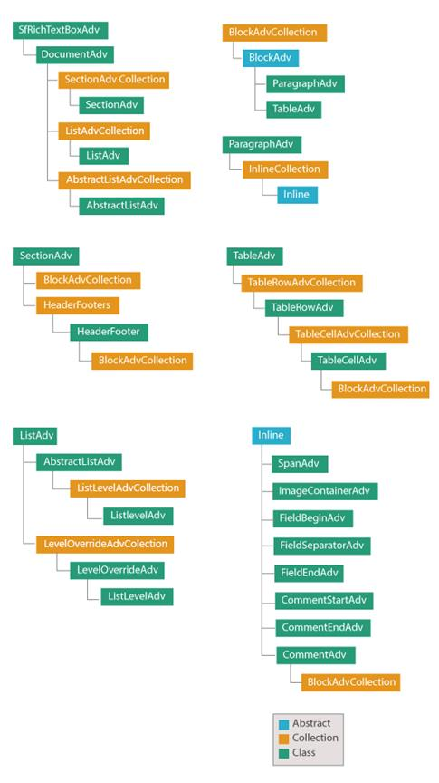

# Document Structure in WPF RichTextBox (SfRichTextBoxAdv)

## See Also

- [WPF RichTextBox Feature Tour](https://www.syncfusion.com/docx-editor-sdk/wpf-docx-editor)
- [WPF RichTextBox Examples](https://github.com/syncfusion/docx-editor-sdk-wpf-demos)