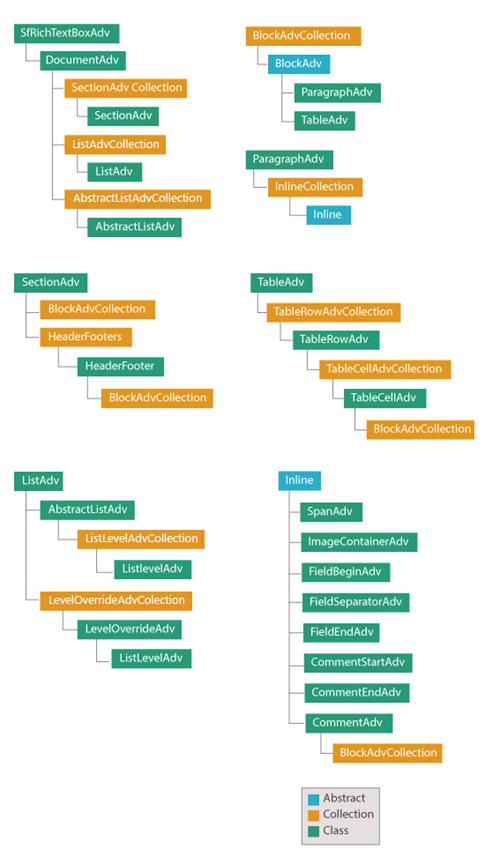

# Document Structure in WPF DOCX Editor

N> You can refer to our [WPF DOCX Editor](https://www.syncfusion.com/docx-editor-sdk/wpf-docx-editor) feature tour page for its groundbreaking feature representations. You can also explore our [WPF DOCX Editor example](https://github.com/syncfusion/docx-editor-sdk-wpf-demos) to know how to render and configure the editing tool.

## See also

- [Document Properties in WPF DOCX Editor](./Document-Properties)
- [Selection in WPF DOCX Editor](./Selection)
- [Commands in WPF DOCX Editor](./Commands)
