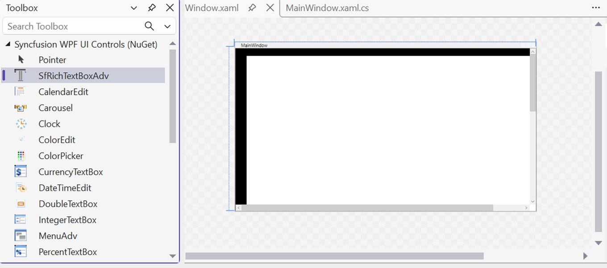
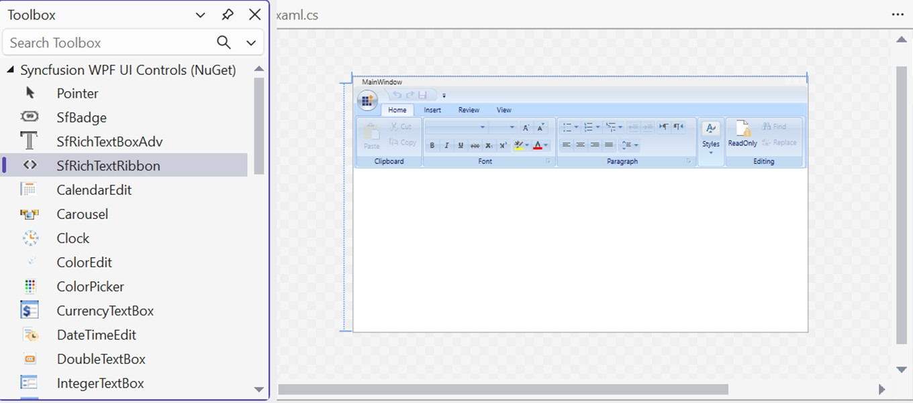
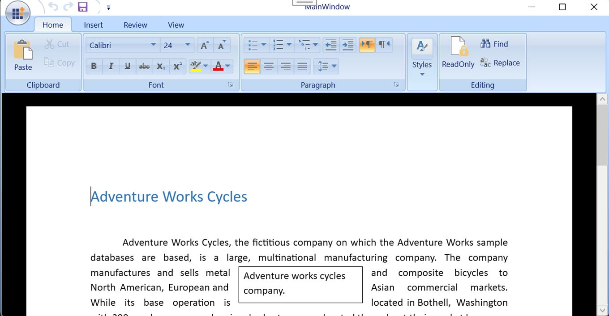
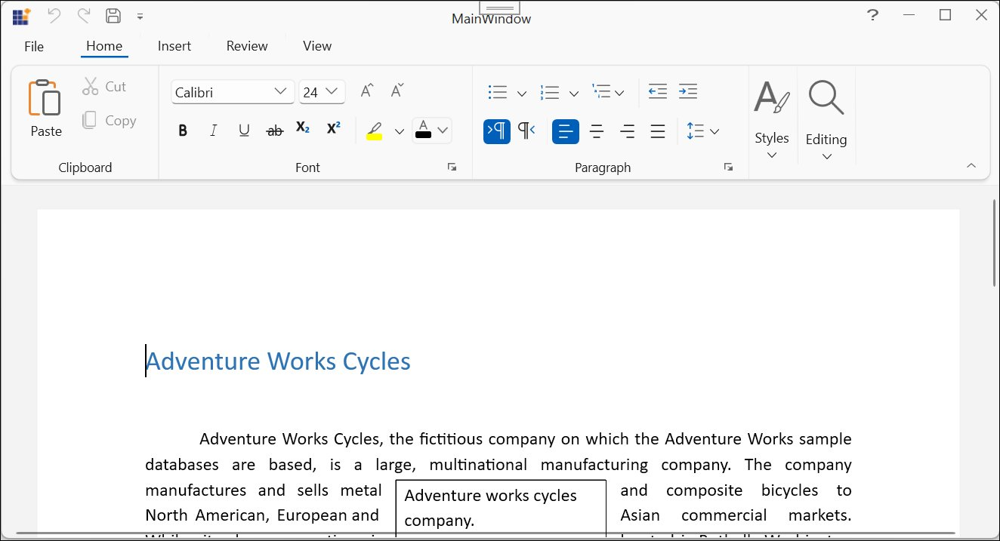

# Getting Started with Syncfusion&reg; WPF RichTextBox

[WPF RichTextBox](https://www.syncfusion.com/docx-editor-sdk/wpf-docx-editor) (SfRichTextBoxAdv) enables you to create, edit, view, and print Word documents in WPF applications. This section guides you through the steps to get started and create a RichTextBox in a WPF application.

## Create a RichTextBox in WPF using SfRichTextBoxAdv

In this walkthrough, you will create a WPF application that uses the SfRichTextBoxAdv control.

The steps below cover the essential tasks required to add and use the SfRichTextBoxAdv control in a WPF project.

### Create a New WPF Project

- Open **Visual Studio**.  
- Click **Create a new project**. 
- In the **Create a new project** window, search for **WPF App**, and select a template based on your requirement:
  - **WPF Application (.NET)**
  - **WPF App (.NET Framework)**  
- Click **Next**, and enter the following details:
  - **Project name**: `DocumentEditor`
  - **Location**: Choose your preferred location  
  - **Solution name**: `DocumentEditor`

N> The **project name** is used as the default namespace (for example, in `x:Class`). It is recommended to use **DocumentEditor** to match the code examples provided.

- Select the **target framework**:
  - For **.NET** → Click **Next** and choose the **latest supported .NET version**
  - For **.NET Framework** → Select **4.6.2 or above** in the same window
- Click **Create**

N> The control supports **.NET 8, .NET 9, .NET 10**, as well as **.NET Framework 4.6.2 and above**.

### Add SfRichTextBoxAdv dependencies





**Using NuGet Package Manager (UI):** 

1.	In Solution Explorer, right-click the project and choose **Manage NuGet Packages**.
2.	Search for [Syncfusion.SfRichTextBoxAdv.WPF](https://www.nuget.org/packages/Syncfusion.SfRichTextBoxAdv.WPF) and install the latest version.
3.	Ensure the [necessary dependencies](https://help.syncfusion.com/wpf/control-dependencies#sfrichtextboxadv) are installed correctly, and the project is restored.

**Using Package Manager Console:** 




Install-Package Syncfusion.SfRichTextBoxAdv.WPF








The following assembly references are required to use the **SfRichTextBoxAdv** control in your application.

- Syncfusion.SfRichTextBoxAdv.WPF
- Syncfusion.Compression.Base
- Syncfusion.OfficeChart.Base
- Syncfusion.Shared.WPF
- Syncfusion.DocIO.Base





N> A valid Syncfusion&reg; license key is required from **v16.2.0.41 (2018 Vol 2)** onwards.
N> * The required `Syncfusion.Licensing` assembly is installed automatically as a NuGet dependency — no separate reference is needed.
N> * If you are using the **Assemblies** installation, you must add a reference to `Syncfusion.Licensing.dll` in your project.
N> *  Register the license key in the `App` constructor of `App.xaml.cs` before any Syncfusion control is initialized. For the exact `RegisterLicense` code, refer to [Register Syncfusion® License key in a WPF application](https://help.syncfusion.com/common/essential-studio/licensing/how-to-register-in-an-application#wpf).

### Add SfRichTextBoxAdv control





Open the Toolbox window and drag the **SfRichTextBoxAdv** control onto the Design view of the WPF application to add it to the user interface.





To add the control manually in XAML, follow these steps:

1. **Import** the **Syncfusion® WPF schema** `http://schemas.syncfusion.com/wpf` or the **SfRichTextBoxAdv** control namespace `Syncfusion.Windows.Controls.RichTextBoxAdv` in the **XAML page**.

2.	Declare SfRichTextBoxAdv control in the XAML page.




<Window xmlns="http://schemas.microsoft.com/winfx/2006/xaml/presentation"
        xmlns:x="http://schemas.microsoft.com/winfx/2006/xaml"
        xmlns:syncfusion="http://schemas.syncfusion.com/wpf" 
        x:Class="DocumentEditor.MainWindow"
        Title="MainWindow" Height="450" Width="800">
    <Grid>
        <syncfusion:SfRichTextBoxAdv x:Name="richTextBoxAdv"/>
    </Grid>
</Window>







To add the control manually in C#, add the following code in MainWindow.xaml.cs




using Syncfusion.Windows.Controls.RichTextBoxAdv;
using System.Windows;
using System.Windows.Controls;

namespace DocumentEditor
{
    public partial class MainWindow : Window
    {
        public MainWindow()
        {
            InitializeComponent();

            // Create a Grid container to use as the layout root
            Grid rootGrid = new Grid();

            // Create an instance of the SfRichTextBoxAdv control
            SfRichTextBoxAdv richTextBoxAdv = new SfRichTextBoxAdv();

            // Add the SfRichTextBoxAdv control to the Grid
            rootGrid.Children.Add(richTextBoxAdv);

            // Set the Grid as the content of the Window
            this.Content = rootGrid;
        }
    }
}






### Run the Application

N> Ensure you have registered the Syncfusion® license key in `App.xaml.cs` before running — see the [licensing note](#add-sfrichtextboxadv-dependencies) earlier on this page.

1. Press **F5** or click **Debug > Start Debugging** in Visual Studio.
2. The application launches and displays the **SfRichTextBoxAdv** control.
3. Press **Ctrl+O** to open an existing document. The selected document will be displayed within the SfRichTextBoxAdv control, as shown below.

N> [View Sample in GitHub](https://github.com/SyncfusionExamples/WPF-RichTextBox-Examples/tree/main/Samples/SfRichTextBoxAdv).

## Add ribbon UI to SfRichTextBoxAdv

If you need a ribbon-based user interface, you can add **SfRichTextRibbon** with the **SfRichTextBoxAdv** control. It enhances the user experience by organizing commands into tabs and groups, similar to Microsoft Word.

### Add SfRichTextRibbon Dependencies





**Using NuGet Package Manager (UI)**

1.	In Solution Explorer, right-click the project and choose **Manage NuGet Packages**.
2.	Search for [Syncfusion.SfRichTextRibbon.WPF](https://www.nuget.org/packages/Syncfusion.SfRichTextRibbon.WPF) and install the latest version.
3.	Ensure the [necessary dependencies](https://help.syncfusion.com/wpf/control-dependencies#sfrichtextribbon) are installed correctly, and the project is restored.

**Using Package Manager Console**




Install-Package Syncfusion.SfRichTextRibbon.WPF




N> Installing the SfRichTextRibbon NuGet package will automatically install the required SfRichTextBoxAdv NuGet package as a dependency.





The following assembly references are required to use the **SfRichTextRibbon** control in your application.

- Syncfusion.SfRichTextRibbon.WPF
- Syncfusion.SfRichTextBoxAdv.WPF
- Syncfusion.Compression.Base
- Syncfusion.OfficeChart.Base
- Syncfusion.Shared.WPF
- Syncfusion.Tools.WPF
- Syncfusion.DocIO.Base





### Configure RibbonWindow for SfRichTextRibbon

To use the **SfRichTextRibbon** control in a WPF application, the application must use **Syncfusion® RibbonWindow** instead of the default **Window**.

1. In **MainWindow.xaml**, rename the root element from `<Window>` to `<syncfusion:RibbonWindow>` and, if not already present, add the Syncfusion® WPF schema declaration `xmlns:syncfusion="http://schemas.syncfusion.com/wpf"` to the root element.

2. In *MainWindow.xaml.cs*, change the base class of `MainWindow` from **Window** to **RibbonWindow** to enable full support for the **SfRichTextRibbon** control.

### Add SfRichTextRibbon to the application





1. Open the **Toolbox** window and drag the **SfRichTextRibbon** and **SfRichTextBoxAdv** controls onto the Design view of `MainWindow.xaml`.
2. Switch to the **XAML** view of `MainWindow.xaml` and bind the `SfRichTextBoxAdv` as the `DataContext` of the `SfRichTextRibbon`. For the exact binding syntax, see the **Via XAML** tab.




To add the control manually in XAML, follow these steps:

1. Import the **Syncfusion® WPF schema** `http://schemas.syncfusion.com/wpf` or the **SfRichTextRibbon** control namespace `Syncfusion.Windows.Controls.RichTextBoxAdv` in the **XAML page**.

2. Declare the **SfRichTextRibbon** and **SfRichTextBoxAdv** controls in the **XAML page**.

3. To establish interaction between **SfRichTextRibbon** and **SfRichTextBoxAdv**, bind the **SfRichTextBoxAdv** as the **DataContext** to the **SfRichTextRibbon**.




<syncfusion:RibbonWindow xmlns="http://schemas.microsoft.com/winfx/2006/xaml/presentation"
                         xmlns:x="http://schemas.microsoft.com/winfx/2006/xaml"
                         xmlns:syncfusion="http://schemas.syncfusion.com/wpf" 
                         x:Class="DocumentEditor.MainWindow"
                         Title="MainWindow" Height="450" Width="800">
<Grid>
     <Grid.RowDefinitions>
         <RowDefinition Height="Auto"/>
         <RowDefinition Height="*"/>
     </Grid.RowDefinitions>
     <syncfusion:SfRichTextRibbon x:Name="richTextRibbon" SnapsToDevicePixels="True"  DataContext="{Binding ElementName=richTextBoxAdv}"/>
     <syncfusion:SfRichTextBoxAdv x:Name="richTextBoxAdv" Background="#F1F1F1" Grid.Row="1"/>
 </Grid>
</syncfusion:RibbonWindow>







To add the control manually in C#, add the below code in MainWindow.xaml.cs




using Syncfusion.Windows.Controls.RichTextBoxAdv;
using Syncfusion.Windows.Tools.Controls;
using System.Windows;
using System.Windows.Controls;
using System.Windows.Media;

namespace DocumentEditor
{
    public partial class MainWindow : RibbonWindow
    {
        public MainWindow()
        {
            InitializeComponent();

            // Create the root Grid container for layout
            Grid rootGrid = new Grid();

            // Define the first row (auto-sized for ribbon)
            RowDefinition row1 = new RowDefinition();
            row1.Height = GridLength.Auto;

            // Define the second row (fills remaining space for editor)
            RowDefinition row2 = new RowDefinition();
            row2.Height = new GridLength(1, GridUnitType.Star);

            // Add row definitions to the grid
            rootGrid.RowDefinitions.Add(row1);
            rootGrid.RowDefinitions.Add(row2);

            // Instantiate the rich text editor control
            SfRichTextBoxAdv richTextBoxAdv = new SfRichTextBoxAdv();

            // Set background color for better UI appearance
            richTextBoxAdv.Background = new SolidColorBrush((Color)ColorConverter.ConvertFromString("#F1F1F1"));

            // Instantiate the ribbon control
            SfRichTextRibbon richTextRibbon = new SfRichTextRibbon();

            // Enable pixel snapping for sharper rendering
            richTextRibbon.SnapsToDevicePixels = true;

            // Bind the ribbon's commands to the editor instance
            richTextRibbon.DataContext = richTextBoxAdv;

            // Position the ribbon in the first row
            Grid.SetRow(richTextRibbon, 0);

            // Position the editor in the second row
            Grid.SetRow(richTextBoxAdv, 1);

            // Add controls to the grid
            rootGrid.Children.Add(richTextRibbon);
            rootGrid.Children.Add(richTextBoxAdv);

            // Set the constructed grid as the content of the RibbonWindow
            this.Content = rootGrid;
        }
    }
}







N> Prefer using `SfRichTextRibbon` within `RibbonWindow` — the ribbon's **backstage view** (File tab options like New, Open, Save, Print) is only available when the ribbon is hosted in a `RibbonWindow`.

### Run the Application with Ribbon UI

1. Press **F5** or click **Debug > Start Debugging** in Visual Studio.
2. The application will launch with the **SfRichTextRibbon** and **SfRichTextBoxAdv** controls.  
3. Press **Ctrl + O** or use the **Open** option in the **SfRichTextRibbon** to open a document, which will be displayed in the **SfRichTextBoxAdv** control, with ribbon options available for editing and formatting, as shown below

N> [View Sample in GitHub](https://github.com/SyncfusionExamples/WPF-RichTextBox-Examples/tree/main/Samples/SfRichTextBoxAdv%20with%20SfRichTextRibbon).

## Theme

In this walkthrough, you will apply a theme to the WPF **SfRichTextBoxAdv** and **SfRichTextRibbon** controls.

The steps below outline the essential tasks required to configure and apply themes in a WPF application.

### Add Theme Dependencies





**Using NuGet Package Manager (UI)**

1. In Solution Explorer, right-click the project and choose **Manage NuGet Packages**.
2. In the **Browse** tab, search for and install the latest version of the following packages:
   - [Syncfusion.SfRichTextBoxAdv.WPF](https://www.nuget.org/packages/Syncfusion.SfRichTextBoxAdv.WPF) – Rich text editor control  
   - [Syncfusion.SfRichTextRibbon.WPF](https://www.nuget.org/packages/Syncfusion.SfRichTextRibbon.WPF) – Ribbon UI for the editor  
   - [Syncfusion.Themes.Windows11Light.WPF](https://www.nuget.org/packages/Syncfusion.Themes.Windows11Light.WPF) – Windows 11 Light theme
3. Ensure all dependencies are installed successfully and the project is restored without errors.

**Using Package Manager Console**




Install-Package Syncfusion.SfRichTextBoxAdv.WPF
Install-Package Syncfusion.SfRichTextRibbon.WPF
Install-Package Syncfusion.Themes.Windows11Light.WPF







The following assemblies are required to enable theme support:

- Syncfusion.SfRichTextBoxAdv.WPF
- Syncfusion.SfRichTextRibbon.WPF
- Syncfusion.Compression.Base
- Syncfusion.OfficeChart.Base
- Syncfusion.Shared.WPF
- Syncfusion.Tools.WPF
- Syncfusion.DocIO.Base
- Syncfusion.Themes.Windows11Light.WPF
- Syncfusion.SfSkinManager.WPF





### Available Themes

Syncfusion provides multiple built-in themes that can be applied based on application requirements.

In this section, the **Windows 11 Light** theme is used as an example to demonstrate how to apply a theme to the **SfRichTextBoxAdv** and **SfRichTextRibbon** controls.  

To explore the complete list of available themes and learn how to create custom themes, refer to:

  * [Apply theme using SfSkinManager](https://help.syncfusion.com/wpf/themes/skin-manager)

  * [Create a custom theme using ThemeStudio](https://help.syncfusion.com/wpf/themes/theme-studio#creating-custom-theme)

### Apply Themes to SfRichTextBoxAdv and SfRichTextRibbon





To add the controls and apply a theme manually in XAML, follow these steps:

**Add SfRichTextBoxAdv and SfRichTextRibbon in XAML**

The XAML snippet below assumes both `SfRichTextBoxAdv` and `SfRichTextRibbon` are already declared in `MainWindow.xaml`, with the `SfRichTextBoxAdv` set as the ribbon's `DataContext`. 

For the full declaration, see the [**Add SfRichTextRibbon to the application → Via XAML**](https://help.syncfusion.com/document-processing/word/word-processor/wpf/getting-started#add-sfrichtextribbon-to-the-application) section of this page.

**Apply Theme in XAML**

1. Import Syncfusion® WPF schema http://schemas.syncfusion.com/wpf or the **SfSkinManager** namespace Syncfusion.SfSkinManager into a XAML page. 
2. Define the theme using the `SfSkinManager.Theme` property.  
3. Set the `ThemeName` value to **Windows11Light** or any preferred theme.  
4. Ensure the theme is applied at the `Window` level so that it is inherited by all child controls.




<syncfusion:RibbonWindow xmlns="http://schemas.microsoft.com/winfx/2006/xaml/presentation"
                         xmlns:x="http://schemas.microsoft.com/winfx/2006/xaml"
                         xmlns:syncfusion="http://schemas.syncfusion.com/wpf" 
                         x:Class="DocumentEditor.MainWindow"
                         Title="MainWindow" Height="450" Width="800"
                         xmlns:syncfusionskin ="clr-namespace:Syncfusion.SfSkinManager;assembly=Syncfusion.SfSkinManager.WPF"
                         syncfusionskin:SfSkinManager.Theme="{syncfusionskin:SkinManagerExtension ThemeName=Windows11Light}">
<Grid>
     <Grid.RowDefinitions>
         <RowDefinition Height="Auto"/>
         <RowDefinition Height="*"/>
     </Grid.RowDefinitions>
     <syncfusion:SfRichTextRibbon x:Name="richTextRibbon" SnapsToDevicePixels="True"  DataContext="{Binding ElementName=richTextBoxAdv}"/>
     <syncfusion:SfRichTextBoxAdv x:Name="richTextBoxAdv" Background="#F1F1F1" Grid.Row="1"/>
 </Grid>
</syncfusion:RibbonWindow>




N> - The **Windows 11 Light** theme is used as the default theme. You can change the `ThemeName` based on your requirements.  
N> - The applied theme is automatically inherited by all child controls.




To apply a theme programmatically in C#, add the below code in MainWindow.xaml.cs




using Syncfusion.SfSkinManager;
using Syncfusion.Windows.Controls.RichTextBoxAdv;
using Syncfusion.Windows.Tools.Controls;
using System.Windows;
using System.Windows.Controls;
using System.Windows.Media;

namespace DocumentEditor
{
    public partial class MainWindow : RibbonWindow
    {
        public MainWindow()
        {
            InitializeComponent();

            // Create the root Grid container for layout
            Grid rootGrid = new Grid();

            // Define the first row (auto-sized for ribbon)
            RowDefinition row1 = new RowDefinition();
            row1.Height = GridLength.Auto;

            // Define the second row (fills remaining space for editor)
            RowDefinition row2 = new RowDefinition();
            row2.Height = new GridLength(1, GridUnitType.Star);

            // Add row definitions to the grid
            rootGrid.RowDefinitions.Add(row1);
            rootGrid.RowDefinitions.Add(row2);

            // Instantiate the rich text editor control
            SfRichTextBoxAdv richTextBoxAdv = new SfRichTextBoxAdv();

            // Set background color for better UI appearance
            richTextBoxAdv.Background = new SolidColorBrush((Color)ColorConverter.ConvertFromString("#F1F1F1"));

            // Instantiate the ribbon control
            SfRichTextRibbon richTextRibbon = new SfRichTextRibbon();

            // Enable pixel snapping for sharper rendering
            richTextRibbon.SnapsToDevicePixels = true;

            // Bind the ribbon's commands to the editor instance
            richTextRibbon.DataContext = richTextBoxAdv;

            // Position the ribbon in the first row
            Grid.SetRow(richTextRibbon, 0);

            // Position the editor in the second row
            Grid.SetRow(richTextBoxAdv, 1);

            // Add controls to the grid
            rootGrid.Children.Add(richTextRibbon);
            rootGrid.Children.Add(richTextBoxAdv);

            // Set the constructed grid as the content of the RibbonWindow
            this.Content = rootGrid;

            // Applies the Windows 11 Light theme to the window
            SfSkinManager.SetTheme(this, new Theme() { ThemeName = "Windows11Light" });
        }
    }
}







### Run the Application with Theme Applied

1. Press **F5** or click **Debug > Start Debugging** in Visual Studio.
2. The application will launch with the **SfRichTextRibbon** and **SfRichTextBoxAdv** controls using the **Windows 11 Light theme**.  
3. Press **Ctrl + O** or use the **Open** option in the **SfRichTextRibbon** to open a document.
4. The document is displayed in the editor, along with the themed ribbon and editor interface, as shown below.

N> [View Sample in GitHub](https://github.com/SyncfusionExamples/WPF-RichTextBox-Examples/tree/main/Samples/Theme).

## See also

- [Import and Export](https://help.syncfusion.com/document-processing/word/word-processor/wpf/import-and-export)
- [Selection](https://help.syncfusion.com/document-processing/word/word-processor/wpf/selection)
- [Commands](https://help.syncfusion.com/document-processing/word/word-processor/wpf/commands)
