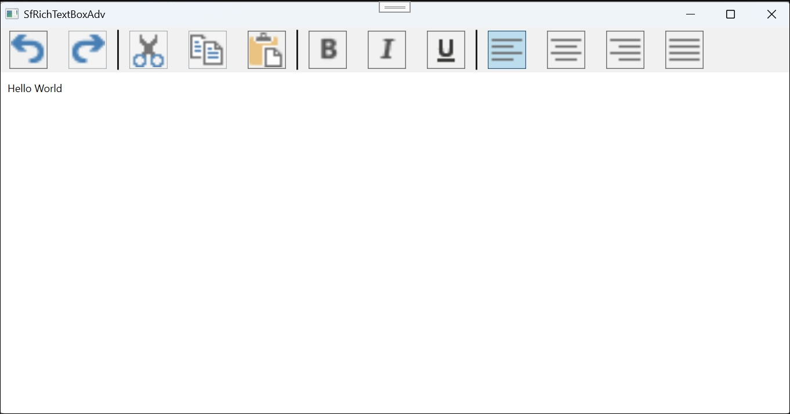

# Getting Started with WPF RichTextBox (SfRichTextBoxAdv)

Syncfusion® [WPF RichTextBox](https://www.syncfusion.com/wpf-controls/richtextbox) (SfRichTextBoxAdv) enables you to create, edit, view, and print Word documents in WPF applications. This section guides you through the steps to get started and create a RichTextBox in a WPF application.

## Create a RichTextBox in WPF using SfRichTextBoxAdv

In this walkthrough, you will create a WPF application that uses the Syncfusion® WPF SfRichTextBoxAdv control.

The steps below cover the essential tasks required to add and use the SfRichTextBoxAdv control in a WPF project.

### Create a New WPF Project

1. Open **Visual Studio**.
2. Click **Create a new project**.
3. Select **WPF App (.NET Framework)** or **WPF App (.NET Core)**.
4. Click **Next**.
5. Enter the **project name** and other required details.
6. Click **Create**.

### Add SfRichTextBoxAdv dependencies





**Using NuGet Package Manager (UI):** 

1.	In Solution Explorer, right-click the project and choose **Manage NuGet Packages**.
2.	Search for [Syncfusion.SfRichTextBoxAdv.Wpf](https://www.nuget.org/packages/Syncfusion.SfRichTextBoxAdv.WPF) and install the latest version.
3.	Ensure the necessary dependencies are installed correctly, and the project is restored.

**Using Package Manager Console:** 




Install-Package Syncfusion.SfRichTextBoxAdv.WPF








The following assembly references are required to use the **SfRichTextBoxAdv** control in your application.

- Syncfusion.SfRichTextBoxAdv.WPF
- Syncfusion.Compression.Base
- Syncfusion.OfficeChart.Base
- Syncfusion.Shared.WPF
- Syncfusion.DocIO.Base





N> Starting with v16.2.0.41 (2018 Vol 2), if you reference Syncfusion&reg; assemblies from trial setup or from the NuGet feed, you also have to add "Syncfusion.Licensing" assembly reference and include a license key in your project. Please refer to this [link](https://help.syncfusion.com/common/essential-studio/licensing/overview) to know about registering Syncfusion&reg; license key in your WPF application to use our components.

### Add SfRichTextBoxAdv control





Open the Toolbox window and drag the **SfRichTextBoxAdv** control onto the Design view of the WPF application to add it to the user interface.





To add the control manually in XAML, follow these steps:

1.	Import Syncfusion® WPF schema http://schemas.syncfusion.com/wpf or SfRichTextBoxAdv control namespace Syncfusion.Windows.Controls.RichTextBoxAdv in the XAML page.

2.	Declare SfRichTextBoxAdv control in the XAML page.




<Window xmlns="http://schemas.microsoft.com/winfx/2006/xaml/presentation"
        xmlns:x="http://schemas.microsoft.com/winfx/2006/xaml"
        xmlns:syncfusion="http://schemas.syncfusion.com/wpf" 
        x:Class="DocumentEditor.MainWindow"
        Title="MainWindow" Height="450" Width="800">
    <Grid>
        <syncfusion:SfRichTextBoxAdv x:Name="richTextBoxAdv"/>
    </Grid>
</Window>







To add the control manually in C#, add the following code in *.xaml.cs




using Syncfusion.Windows.Controls.RichTextBoxAdv;

public partial class MainWindow : Window
{
    public MainWindow()
    {
        // Create an instance of SfRichTextBoxAdv control
        SfRichTextBoxAdv richTextBoxAdv = new SfRichTextBoxAdv();

        // Add the SfRichTextBoxAdv control to the container (Grid)
        Root_Grid.Children.Add(richTextBoxAdv);
    }
}






### Run the Application

1. Press **F5** or click **Start** in Visual Studio.
2. The application launches and displays the **SfRichTextBoxAdv** control.
3. Press Ctrl+O to open an existing document. The selected document will be displayed within the SfRichTextBoxAdv control, as shown below.

You can download a complete working sample from [GitHub](https://github.com/SyncfusionExamples/WPF-RichTextBox-Examples/tree/main/Samples/SfRichTextBoxAdv).

## Add ribbon UI to SfRichTextBoxAdv

If you need a ribbon-based user interface, you can add **SfRichTextRibbon** with **SfRichTextBoxAdv** control. It enhances the user experience by organizing commands into tabs and groups, similar to Microsoft Word.

### Add SfRichTextRibbon Dependencies





**Using NuGet Package Manager (UI)**

1.	In Solution Explorer, right-click the project and choose **Manage NuGet Packages**.
2.	Search for [Syncfusion.SfRichTextRibbon.Wpf](https://www.nuget.org/packages/Syncfusion.SfRichTextRibbon.WPF) and install the latest version.
3.	Ensure the necessary dependencies are installed correctly, and the project is restored.

**Using Package Manager Console**




Install-Package Syncfusion.SfRichTextRibbon.WPF




N> Installing the SfRichTextRibbon NuGet package will automatically install the required SfRichTextBoxAdv NuGet package as a dependency.





The following assembly references are required to use the **SfRichTextRibbon** control in your application.

- Syncfusion.SfRichTextRibbon.WPF
- Syncfusion.SfRichTextBoxAdv.WPF
- Syncfusion.Compression.Base
- Syncfusion.OfficeChart.Base
- Syncfusion.Shared.WPF
- Syncfusion.Tools.WPF
- Syncfusion.DocIO.Base





### Add SfRichTextRibbon to the application





Open the Toolbox window and drag the **SfRichTextRibbon** and **SfRichTextBoxAdv** onto the Design view. Bind the SfRichTextBoxAdv as DataContext to the SfRichTextRibbon in XAML.




To add the control manually in XAML, follow these steps:

1.	Import the Syncfusion® WPF schema http://schemas.syncfusion.com/wpf or SfRichTextRibbon control namespace Syncfusion.Windows.Controls.RichTextBoxAdv in XAML page.
2.	To use the SfRichTextRibbon use the Syncfusion® RibbonWindow instead of Window.
3.	Declare the SfRichTextRibbon and SfRichTextBoxAdv controls in XAML page.
4.  To make an interaction between SfRichTextRibbon and SfRichTextBoxAdv, bind the SfRichTextBoxAdv as DataContext to the SfRichTextRibbon.




<Syncfusion:RibbonWindow xmlns="http://schemas.microsoft.com/winfx/2006/xaml/presentation"
                         xmlns:x="http://schemas.microsoft.com/winfx/2006/xaml"
                         xmlns:syncfusion="http://schemas.syncfusion.com/wpf" 
                         x:Class="DocumentEditor.MainWindow"
                         Title="MainWindow" Height="450" Width="800">
<Grid>
     <Grid.RowDefinitions>
         <RowDefinition Height="Auto"/>
         <RowDefinition Height="*"/>
     </Grid.RowDefinitions>
     <syncfusion:SfRichTextRibbon x:Name="richTextRibbon" SnapsToDevicePixels="True"  DataContext="{Binding ElementName=richTextBoxAdv}"/>
     <syncfusion:SfRichTextBoxAdv x:Name="richTextBoxAdv" Background="#F1F1F1" Grid.Row="1"/>
 </Grid>
</Syncfusion:RibbonWindow>







To add the control manually in C#, add the below code in *.xaml.cs




using Syncfusion.Windows.Controls.RichTextBoxAdv;
using Syncfusion.Windows.Tools.Controls;

public partial class MainWindow : RibbonWindow
{
    public MainWindow()
    {
        // Create the root Grid container for layout
        Grid rootGrid = new Grid();

        // Define the first row (auto-sized for ribbon)
        RowDefinition row1 = new RowDefinition();
        row1.Height = GridLength.Auto;

        // Define the second row (fills remaining space for editor)
        RowDefinition row2 = new RowDefinition();
        row2.Height = new GridLength(1, GridUnitType.Star);

        // Add row definitions to the grid
        rootGrid.RowDefinitions.Add(row1);
        rootGrid.RowDefinitions.Add(row2);

        // Instantiate the rich text editor control
        richTextBoxAdv = new SfRichTextBoxAdv();

        // Set background color for better UI appearance
        richTextBoxAdv.Background = new SolidColorBrush((Color)ColorConverter.ConvertFromString("#F1F1F1"));

        // Instantiate the ribbon control
        richTextRibbon = new SfRichTextRibbon();

        // Enable pixel snapping for sharper rendering
        richTextRibbon.SnapsToDevicePixels = true;

        // Set the DataContext of the ribbon to the editor
        // This allows the ribbon to interact with the editor (binding commands)
        richTextRibbon.DataContext = richTextBoxAdv;

        // Position the ribbon in the first row
        Grid.SetRow(richTextRibbon, 0);

        // Position the editor in the second row
        Grid.SetRow(richTextBoxAdv, 1);

        // Add controls to the grid
        rootGrid.Children.Add(richTextRibbon);
        rootGrid.Children.Add(richTextBoxAdv);

        // Set the constructed grid as the content of the UserControl
        this.Content = rootGrid;
    }
}







N> Prefer using `SfRichTextRibbon` within `RibbonWindow` in your application, since the backstage of Ribbon will be opened only when the ribbon is loaded under the `RibbonWindow`

### Run the Application with Ribbon UI

1. Press **F5** or click **Start** in Visual Studio.  
2. The application will launch with the **SfRichTextRibbon** and **SfRichTextBoxAdv** controls.  
3. Press **Ctrl + O** or use the **Open** option in the **SfRichTextRibbon** to open a document, which will be displayed in the **SfRichTextBoxAdv** control, with ribbon options available for editing and formatting, as shown below

You can download a complete working sample from [GitHub](https://github.com/SyncfusionExamples/WPF-RichTextBox-Examples/tree/main/Samples/SfRichTextBoxAdv%20with%20SfRichTextRibbon).

## Use SfRichTextBoxAdv as a standard RichTextBox

Use the following code to configure the SfRichTextBoxAdv control as a standard RichTextBox with rich text formatting options.



<Window x:Class="Standard_RichTextBox.MainWindow"
        xmlns="http://schemas.microsoft.com/winfx/2006/xaml/presentation"
        xmlns:x="http://schemas.microsoft.com/winfx/2006/xaml"
        xmlns:d="http://schemas.microsoft.com/expression/blend/2008"
        xmlns:mc="http://schemas.openxmlformats.org/markup-compatibility/2006"
        xmlns:local="clr-namespace:Standard_RichTextBox"
        mc:Ignorable="d"
        xmlns:RichTextBoxAdv="clr-namespace:Syncfusion.Windows.Controls.RichTextBoxAdv;assembly=Syncfusion.SfRichTextBoxAdv.Wpf"
        Title="SfRichTextBoxAdv" Height="450" Width="800">
   
    <Window.Resources>
        <RichTextBoxAdv:UnderlineToggleConverter x:Key="UnderlineToggleConverter"/>
        <RichTextBoxAdv:LeftAlignmentToggleConverter x:Key="LeftAlignmentToggleConverter"/>
        <RichTextBoxAdv:CenterAlignmentToggleConverter x:Key="CenterAlignmentToggleConverter"/>
        <RichTextBoxAdv:RightAlignmentToggleConverter x:Key="RightAlignmentToggleConverter"/>
        <RichTextBoxAdv:JustifyAlignmentToggleConverter x:Key="JustifyAlignmentToggleConverter"/>
        
        
    </Window.Resources>

    <Grid Background="#F1F1F1">
        <Grid.RowDefinitions>
            <RowDefinition Height="Auto"/>
            <RowDefinition Height="*"/>
        </Grid.RowDefinitions>
        <Grid>
            <!-- Defines the data context as RichTextBoxAdv -->
            <StackPanel Orientation="Horizontal" DataContext="{Binding ElementName=richTextBoxAdv}">
                <!-- UI option to perform Undo/Redo using command binding -->
                <StackPanel Orientation="Horizontal">
                    <Button Command="RichTextBoxAdv:SfRichTextBoxAdv.UndoCommand" CommandTarget="{Binding ElementName=richTextBoxAdv}" Focusable="False">
                        <Image Source="\Images\Undo.png" Height="40" Width="40" />
                    </Button>
                    <Button Command="RichTextBoxAdv:SfRichTextBoxAdv.RedoCommand" CommandTarget="{Binding ElementName=richTextBoxAdv}" Focusable="False">
                        <Image Source="\Images\Redo.png" Height="40" Width="40" />
                    </Button>
                </StackPanel>
                <!-- UI option to perform Clipboard operations using command binding -->
                <Border Width="2" Height="46" Background="#1F1F1F"/>
                <StackPanel Orientation="Horizontal">
                    <Button Command="RichTextBoxAdv:SfRichTextBoxAdv.CutCommand" CommandTarget="{Binding ElementName=richTextBoxAdv}" Focusable="False">
                        <Image Source="\Images\Cut.png" Height="40" Width="40" />
                    </Button>
                    <Button Command="RichTextBoxAdv:SfRichTextBoxAdv.CopyCommand" CommandTarget="{Binding ElementName=richTextBoxAdv}" Focusable="False">
                        <Image Source="\Images\Copy.png" Height="40" Width="40" />
                    </Button>
                    <Button Command="RichTextBoxAdv:SfRichTextBoxAdv.PasteCommand" CommandTarget="{Binding ElementName=richTextBoxAdv}" Focusable="False">
                        <Image Source="\Images\Paste.png" Height="40" Width="40" />
                    </Button>
                </StackPanel>
                <!-- UI option to apply character formatting using property binding -->
                <Border Width="2" Height="46" Background="#1F1F1F"/>
                <StackPanel Orientation="Horizontal">
                    <ToggleButton IsChecked="{Binding Selection.CharacterFormat.Bold}" Focusable="False">
                        <Image Source="\Images\Bold.png" Height="40" Width="40" />
                    </ToggleButton>
                    <ToggleButton IsChecked="{Binding Selection.CharacterFormat.Italic}" Focusable="False">
                        <Image Source="\Images\Italic.png" Height="40" Width="40" />
                    </ToggleButton>
                    <ToggleButton IsChecked="{Binding Selection.CharacterFormat.Underline, Converter={StaticResource UnderlineToggleConverter}}" Focusable="False">
                        <Image Source="\Images\Underline.png" Height="40" Width="40" />
                    </ToggleButton>
                </StackPanel>
                <Border Width="2" Height="46" Background="#1F1F1F"/>
                <!-- UI option to apply paragraph formatting using property binding -->
                <StackPanel Orientation="Horizontal">
                    <ToggleButton IsChecked="{Binding Selection.ParagraphFormat.TextAlignment, Converter={StaticResource LeftAlignmentToggleConverter}}" Focusable="False">
                        <Image Source="\Images\Left.png" Height="40" Width="40" />
                    </ToggleButton>
                    <ToggleButton IsChecked="{Binding Selection.ParagraphFormat.TextAlignment, Converter={StaticResource CenterAlignmentToggleConverter}}" Focusable="False">
                        <Image Source="\Images\Center.png" Height="40" Width="40" />
                    </ToggleButton>
                    <ToggleButton IsChecked="{Binding Selection.ParagraphFormat.TextAlignment, Converter={StaticResource RightAlignmentToggleConverter}}" Focusable="False">
                        <Image Source="\Images\Right.png" Height="40" Width="40" />
                    </ToggleButton>
                    <ToggleButton IsChecked="{Binding Selection.ParagraphFormat.TextAlignment, Converter={StaticResource JustifyAlignmentToggleConverter}}" Focusable="False">
                        <Image Source="\Images\Justify.png" Height="40" Width="40" />
                    </ToggleButton>
                </StackPanel>
            </StackPanel>
        </Grid>
        <RichTextBoxAdv:SfRichTextBoxAdv x:Name="richTextBoxAdv" Grid.Row="1" LayoutType="Continuous"  />
    </Grid>
</Window>





You can download a standard RichTextBox example from [GitHub](https://github.com/SyncfusionExamples/WPF-RichTextBox-Examples/tree/main/Samples/Standard%20RichTextBox).

When the application is executed, the standard RichTextBox control is displayed as illustrated below.

## Theme

SfRichTextBoxAdv supports various built-in themes. Refer to the following links to apply themes for the SfRichTextBoxAdv,

  * [Apply theme using SfSkinManager](https://help.syncfusion.com/wpf/themes/skin-manager)
	
  * [Create a custom theme using ThemeStudio](https://help.syncfusion.com/wpf/themes/theme-studio#creating-custom-theme)

N> You can also explore our [WPF RichTextBox example](https://github.com/syncfusion/docx-editor-sdk-wpf-demos) to knows how to render and configure the editing tools.

## See also

- [Import and Export](./Import-and-Export)
- [Selection](./Selection)
- [Commands](./Commands)