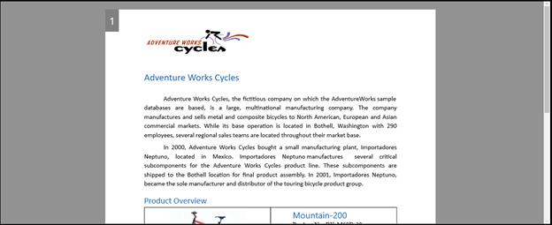
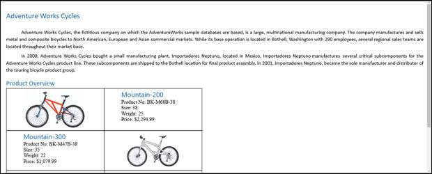
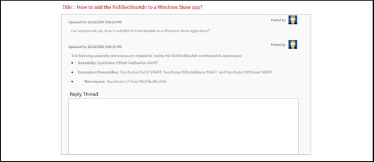

# Layout Types in WPF RichTextBox (SfRichTextBoxAdv)

The [WPF RichTextBox](https://www.syncfusion.com/docx-editor-sdk/wpf-docx-editor) (SfRichTextBoxAdv) control allows you to choose between the following layout types through the [LayoutType](https://help.syncfusion.com/cr/wpf/Syncfusion.Windows.Controls.RichTextBoxAdv.SfRichTextBoxAdv.html#Syncfusion_Windows_Controls_RichTextBoxAdv_SfRichTextBoxAdv_LayoutType) property. The default `LayoutType` is `Pages`.

* Pages

* Continuous

* Block

Use **Pages** when you need paginated rendering with page breaks, headers, footers, and section properties. Use **Continuous** when you need a single scrollable rich-text surface. Use **Block** when you need a read-only rich-text display that still supports clipboard copy.

## Pages

When using the [Pages](https://help.syncfusion.com/cr/wpf/Syncfusion.Windows.Controls.RichTextBoxAdv.LayoutType.html) layout type, the content of the document is rendered sequentially in several pages, similar to the Print Layout view of Microsoft Word. The size and margin of each page are defined by the Section format properties. Configure page size and margins through the `Section` format properties of the document.

The following code example demonstrates how to define the layout type of the SfRichTextBoxAdv control as Pages.


<RichTextBoxAdv:SfRichTextBoxAdv x:Name="richTextBoxAdv" LayoutType="Pages"/>




// Initializes a new instance of RichTextBoxAdv.
SfRichTextBoxAdv richTextBoxAdv = new SfRichTextBoxAdv();
// Defines the layout type as Pages.
richTextBoxAdv.LayoutType = LayoutType.Pages;



' Initializes a new instance of RichTextBoxAdv.
Dim richTextBoxAdv As New SfRichTextBoxAdv()
' Defines the layout type as Pages.
richTextBoxAdv.LayoutType = LayoutType.Pages





## Continuous

When using the [Continuous](https://help.syncfusion.com/cr/wpf/Syncfusion.Windows.Controls.RichTextBoxAdv.LayoutType.html) layout type, the entire content of the document is rendered continuously in a single page, similar to the Web Layout view of Microsoft Word. This layout looks like a simple text box with rich-text content and is suitable for applications such as forums and blogs.

The following code example demonstrates how to define the layout type of the SfRichTextBoxAdv control as Continuous.


<RichTextBoxAdv:SfRichTextBoxAdv x:Name="richTextBoxAdv" LayoutType="Continuous"/>




// Initializes a new instance of RichTextBoxAdv.
SfRichTextBoxAdv richTextBoxAdv = new SfRichTextBoxAdv();
// Defines the layout type as Continuous.
richTextBoxAdv.LayoutType = LayoutType.Continuous;



' Initializes a new instance of RichTextBoxAdv.
Dim richTextBoxAdv As New SfRichTextBoxAdv()
' Defines the layout type as Continuous.
richTextBoxAdv.LayoutType = LayoutType.Continuous





## Block

When using the [Block](https://help.syncfusion.com/cr/wpf/Syncfusion.Windows.Controls.RichTextBoxAdv.LayoutType.html) layout type, the content of the document is rendered continuously in a single page as read-only. In Block layout, the document is read-only by default. This layout looks like a simple text block with rich-text content such as text, images, and tables. The Block layout also supports copying contents to the clipboard. It can be used for applications such as forums and blogs in order to display the rich-text content with the same look and feel as in the Continuous layout type.

The following code example demonstrates how to define the layout type of the SfRichTextBoxAdv control as Block.


<RichTextBoxAdv:SfRichTextBoxAdv x:Name="richTextBoxAdv" LayoutType="Block"/>




// Initializes a new instance of RichTextBoxAdv.
SfRichTextBoxAdv richTextBoxAdv = new SfRichTextBoxAdv();
// Defines the layout type as Block.
richTextBoxAdv.LayoutType = LayoutType.Block;



' Initializes a new instance of RichTextBoxAdv.
Dim richTextBoxAdv As New SfRichTextBoxAdv()
' Defines the layout type as Block.
richTextBoxAdv.LayoutType = LayoutType.Block





N> You can refer to our [WPF RichTextBox](https://www.syncfusion.com/docx-editor-sdk/wpf-docx-editor) feature tour page for its groundbreaking feature representations. You can also explore our [WPF RichTextBox example](https://github.com/syncfusion/docx-editor-sdk-wpf-demos) to know how to render and configure the editing tool.

## See Also

- [Document Structure in WPF RichTextBox](Document-Structure)
- [EditorSettings in WPF RichTextBox](EditorSettings)
- [Commands in WPF RichTextBox](Commands)