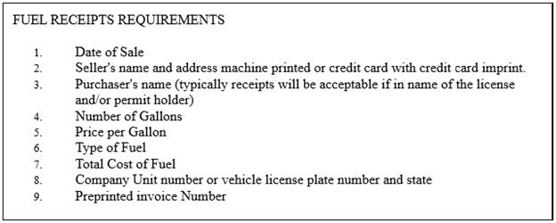
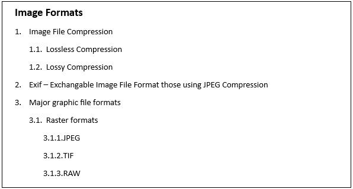

# List in WPF RichTextBox (SfRichTextBoxAdv)

The [WPF RichTextBox](https://www.syncfusion.com/docx-editor-sdk/wpf-docx-editor) (SfRichTextBoxAdv) supports both single-level and multilevel lists similar to those in Microsoft Word. Lists are used to organize data as step-by-step instructions in documents for easier understanding of key points. The list APIs are exposed through the [Lists](https://help.syncfusion.com/cr/wpf/Syncfusion.Windows.Controls.RichTextBoxAdv.DocumentAdv.html#Syncfusion_Windows_Controls_RichTextBoxAdv_DocumentAdv_Lists) and [AbstractLists](https://help.syncfusion.com/cr/wpf/Syncfusion.Windows.Controls.RichTextBoxAdv.DocumentAdv.html#Syncfusion_Windows_Controls_RichTextBoxAdv_DocumentAdv_AbstractLists) collections of the [DocumentAdv](https://help.syncfusion.com/cr/wpf/Syncfusion.Windows.Controls.RichTextBoxAdv.DocumentAdv.html) class, and the [LevelOverrideAdv](https://help.syncfusion.com/cr/wpf/Syncfusion.Windows.Controls.RichTextBoxAdv.LevelOverrideAdv.html) type. Up to **nine levels** can be defined in a multilevel list, matching the Microsoft Word limit.

## Single Level List

Single level means that all the items in the list have the same hierarchy and indentation. It can be a numbered or bulleted list.

The list style is determined by the [ListLevelPattern](https://help.syncfusion.com/cr/wpf/Syncfusion.Windows.Controls.RichTextBoxAdv.ListLevelPattern.html) property of a list level. The most common values are:

| ListLevelPattern | Style |
|------------------|-------|
| `Bullet` | Bulleted list. |
| `Arabic` | Numbered list (1, 2, 3, …). |
| `LowLetter` | Lowercase letters (a, b, c, …). |
| `UpLetter` | Uppercase letters (A, B, C, …). |
| `LowRoman` | Lowercase Roman numerals (i, ii, iii, …). |
| `UpRoman` | Uppercase Roman numerals (I, II, III, …). |
| `Number` | Spell-out cardinal numbers. |
| `Ordinal` | Ordinal numbers. |

The character that appears between the list marker and the list text is set by the [FollowCharacter](https://help.syncfusion.com/cr/wpf/Syncfusion.Windows.Controls.RichTextBoxAdv.FollowCharacterType.html) property of a list level. The available values are `Tab`, `Space`, and `Nothing`.
The following screenshot shows single level bulleted list.

The following screenshot shows single level numbered list.

## Multilevel List

Multilevel means defining a list within a list where up to nine levels can be defined similar to those in Microsoft Word. A multilevel list can be bulleted or numbered and can also mix bullet and number styles across levels. For example, one level can be bulleted and the next level can be a numbered list inside it.

Each level of a multilevel list uses its own [ListLevelPattern](https://help.syncfusion.com/cr/wpf/Syncfusion.Windows.Controls.RichTextBoxAdv.ListLevelPattern.html) value, so you can mix `Bullet` for one level, `Arabic` for another, and `LowLetter` for a third, as Microsoft Word does.
The following screenshot shows multilevel list.

## Adding List

A list in the SfRichTextBoxAdv is composed of three related types: [ListAdv](https://help.syncfusion.com/cr/wpf/Syncfusion.Windows.Controls.RichTextBoxAdv.ListAdv.html) is a concrete list instance applied to paragraphs in the document, [AbstractListAdv](https://help.syncfusion.com/cr/wpf/Syncfusion.Windows.Controls.RichTextBoxAdv.AbstractListAdv.html) defines the formatting and numbering pattern for a list (it is shared by one or more `ListAdv` instances), and [ListLevelAdv](https://help.syncfusion.com/cr/wpf/Syncfusion.Windows.Controls.RichTextBoxAdv.ListLevelAdv.html) defines the per-level formatting (indent, font, character, number pattern) inside an `AbstractListAdv`. Multiple paragraphs can share the same `ListAdv` to appear as a single numbered or bulleted sequence.

Each list in the document can contain a reference to any one of the abstract lists in the document. Both the abstract list and the list should be assigned a unique Id. A list should refer to the abstract list with the abstract list's Id. The list format for a paragraph should refer to the list with the list's Id.

The following code example demonstrates how to define a single-level numbered list for a document and how it is applied to a paragraph.


<RichTextBoxAdv:DocumentAdv>
    <RichTextBoxAdv:DocumentAdv.AbstractLists>
        <RichTextBoxAdv:AbstractListAdv AbstractListId="1">
            <RichTextBoxAdv:AbstractListAdv.Levels>
                <RichTextBoxAdv:ListLevelAdv ListLevelPattern="LowLetter" NumberFormat="%1." StartAt="1" FollowCharacter="Tab" RestartLevel="0">
                    <RichTextBoxAdv:ListLevelAdv.ParagraphFormat>
                        <RichTextBoxAdv:ParagraphFormat LeftIndent="48" FirstLineIndent="24"/>
                    </RichTextBoxAdv:ListLevelAdv.ParagraphFormat>
                </RichTextBoxAdv:ListLevelAdv>
            </RichTextBoxAdv:AbstractListAdv.Levels>
        </RichTextBoxAdv:AbstractListAdv>
    </RichTextBoxAdv:DocumentAdv.AbstractLists>
    <RichTextBoxAdv:DocumentAdv.Lists>
        <RichTextBoxAdv:ListAdv AbstractListId="1" ListId="1">
        </RichTextBoxAdv:ListAdv>
    </RichTextBoxAdv:DocumentAdv.Lists>
    <RichTextBoxAdv:SectionAdv>
        <RichTextBoxAdv:ParagraphAdv>
            <RichTextBoxAdv:ParagraphAdv.ParagraphFormat>
                <RichTextBoxAdv:ParagraphFormat>
                    <RichTextBoxAdv:ParagraphFormat.ListFormat>
                        <RichTextBoxAdv:ListFormat ListId="1" ListLevelNumber="0"/>
                    </RichTextBoxAdv:ParagraphFormat.ListFormat>
                </RichTextBoxAdv:ParagraphFormat>
            </RichTextBoxAdv:ParagraphAdv.ParagraphFormat>
            <RichTextBoxAdv:SpanAdv>List Item 1</RichTextBoxAdv:SpanAdv>
        </RichTextBoxAdv:ParagraphAdv>
    </RichTextBoxAdv:SectionAdv>
</RichTextBoxAdv:DocumentAdv>



// Initializes a new abstract list instance.
AbstractListAdv abstractListAdv = new AbstractListAdv(null);
abstractListAdv.AbstractListId = 1;

// Defines new ListLevel instance.
ListLevelAdv listLevel = new ListLevelAdv(abstractListAdv);
listLevel.ParagraphFormat.LeftIndent = 48d;
listLevel.ParagraphFormat.FirstLineIndent = 24d;
listLevel.FollowCharacter = FollowCharacterType.Tab;
listLevel.ListLevelPattern = ListLevelPattern.LowLetter;
listLevel.NumberFormat = "%1.";
listLevel.RestartLevel = 0;
listLevel.StartAt = 1;

// Adds list level to abstract list.
abstractListAdv.Levels.Add(listLevel);

// Adds abstract list to the document.
richTextBoxAdv.Document.AbstractLists.Add(abstractListAdv);

// Creates a new list instance.
ListAdv listAdv = new ListAdv(null);
listAdv.ListId = 1;
// Sets the abstract list Id for this list.
listAdv.AbstractListId = 1;

// Adds list to the document.
richTextBoxAdv.Document.Lists.Add(listAdv);

// Add list item 1
ParagraphAdv paragraphAdv = new ParagraphAdv();
SpanAdv spanAdv = new SpanAdv() { Text = "List Item 1" };
paragraphAdv.Inlines.Add(spanAdv);
richTextBoxAdv.Document.Sections[0].Blocks.Add(paragraphAdv);

// Defines the list format for the paragraph.
paragraphAdv.ParagraphFormat.ListFormat.ListId = 1;
paragraphAdv.ParagraphFormat.ListFormat.ListLevelNumber = 0;



' Initializes a new abstract list instance.
Dim abstractListAdv As New AbstractListAdv(Nothing)
abstractListAdv.AbstractListId = 1

' Defines new ListLevel instance.
Dim listLevel As New ListLevelAdv(abstractListAdv)
listLevel.ParagraphFormat.LeftIndent = 48.0
listLevel.ParagraphFormat.FirstLineIndent = 24.0
listLevel.FollowCharacter = FollowCharacterType.Tab
listLevel.ListLevelPattern = ListLevelPattern.LowLetter
listLevel.NumberFormat = "%1."
listLevel.RestartLevel = 0
listLevel.StartAt = 1

' Adds list level to abstract list.
abstractListAdv.Levels.Add(listLevel)

' Adds abstract list to the document.
richTextBoxAdv.Document.AbstractLists.Add(abstractListAdv)

' Creates a new list instance.
Dim listAdv As New ListAdv(Nothing)
listAdv.ListId = 1
' Sets the abstract list Id for this list.
listAdv.AbstractListId = 1

' Adds list to the document.
richTextBoxAdv.Document.Lists.Add(listAdv)

' Add list item 1
Dim paragraphAdv As ParagraphAdv = New ParagraphAdv()
Dim spanAdv As SpanAdv = New SpanAdv()
spanAdv.Text = "List Item 1"
paragraphAdv.Inlines.Add(spanAdv)
richTextBoxAdv.Document.Sections(0).Blocks.Add(paragraphAdv)

' Defines the list format for the paragraph.
paragraphAdv.ParagraphFormat.ListFormat.ListId = 1
paragraphAdv.ParagraphFormat.ListFormat.ListLevelNumber = 0




### Number format

The number format of a list level is set through the `NumberFormat` property. Use the percent sign (`%`) followed by a digit from `1` through `9` as a placeholder for the number style of the corresponding list level. For example, the format string `"Article %1."` combined with `ListLevelPattern.UpRoman` renders as "Article I.", "Article II.", "Article III.", and so on.

The following code example demonstrates how to define the number format for a numbered list in the SfRichTextBoxAdv control.



// Defines the number format for the list level.
listLevel.NumberFormat = "Article %1.";
listLevel.ListLevelPattern = ListLevelPattern.UpRoman;


' Defines the number format for the list level.
listLevel.NumberFormat = "Article %1."
listLevel.ListLevelPattern = ListLevelPattern.UpRoman



### Bulleted list

You can define a bulleted list by setting the list level pattern to `Bullet`. You can define different bullet styles by setting the bullet character. The bullet character is the Unicode code point of the glyph, and the `FontFamily` property selects the font that contains the glyph — for example, the `Symbol` font for `U+F0B7` (dot) and `U+27A4` (arrow), and the `Wingdings` font for `U+F0A7` (square). The following code sample demonstrates how to define dot, square, and arrow bullets in the SfRichTextBoxAdv control.


// Defines a bulleted list.
listLevel.ListLevelPattern = ListLevelPattern.Bullet;
// Defines a dot bullet.
listLevel.NumberFormat = "\uF0B7";
listLevel.CharacterFormat.FontFamily = new FontFamily("Symbol");
// Defines a square bullet.
listLevel.NumberFormat = "\uF0A7";
listLevel.CharacterFormat.FontFamily = new FontFamily("Wingdings");
// Defines an arrow bullet.
listLevel.NumberFormat = "\u27a4";
listLevel.CharacterFormat.FontFamily = new FontFamily("Symbol");



' Defines a bulleted list.
listLevel.ListLevelPattern = ListLevelPattern.Bullet
' Defines a dot bullet.
listLevel.NumberFormat = ChrW(&HF0B7)
listLevel.CharacterFormat.FontFamily = New FontFamily("Symbol")
' Defines a square bullet.
listLevel.NumberFormat = ChrW(&HF0A7)
listLevel.CharacterFormat.FontFamily = New FontFamily("Wingdings")
' Defines an arrow bullet.
listLevel.NumberFormat = "\u27a4"
listLevel.CharacterFormat.FontFamily = New FontFamily("Symbol")




## Level overrides

The list levels for a list are defined in the abstract list to which it refers. Additionally, you can define [LevelOverrideAdv](https://help.syncfusion.com/cr/wpf/Syncfusion.Windows.Controls.RichTextBoxAdv.LevelOverrideAdv.html) instances for any list level. The `LevelNumber` property identifies which level is being overridden; it ranges from `0` (first level) to `8` (ninth level). The SfRichTextBoxAdv supports two types of level overrides. Use the **Start at override** when you only need to change the starting value of a list while keeping the rest of the level's formatting; use the full **Level override** when you need to change the level's pattern, font, indent, or number format.

1. Start at override – Only the start value for the list is overridden, and the other properties are referred to the list level defined in the abstract list.

2. Level override – The list level is completely overridden.

### Start at override

The following code example demonstrates how to override the start at value for an existing list level in the SfRichTextBoxAdv control.


<RichTextBoxAdv:ListAdv AbstractListId="1" ListId="1">
    <RichTextBoxAdv:ListAdv.LevelOverrides>
        <RichTextBoxAdv:LevelOverrideAdv StartAt="2" LevelNumber="0"/>
    </RichTextBoxAdv:ListAdv.LevelOverrides>
</RichTextBoxAdv:ListAdv>



// Adds StartAtOverride for the list at first level.
// LevelNumber ranges from 0 to 8.
LevelOverrideAdv levelOverride = new LevelOverrideAdv(listAdv);
levelOverride.LevelNumber = 0;
levelOverride.StartAt = 2;
listAdv.LevelOverrides.Add(levelOverride);



' Adds StartAtOverride for the list at first level.
' LevelNumber ranges from 0 to 8.
Dim levelOverride As New LevelOverrideAdv(listAdv)
levelOverride.LevelNumber = 0
levelOverride.StartAt = 2
listAdv.LevelOverrides.Add(levelOverride)




### Level override

The following code example demonstrates how to add level override for any existing list level in the SfRichTextBoxAdv control.


<RichTextBoxAdv:ListAdv AbstractListId="1" ListId="1">
<RichTextBoxAdv:ListAdv.LevelOverrides>
    <!-- Overrides the fourth list level -->
        <RichTextBoxAdv:LevelOverrideAdv LevelNumber="3">
            <RichTextBoxAdv:LevelOverrideAdv.OverrideListLevel>
                <RichTextBoxAdv:ListLevelAdv ListLevelPattern="UpRoman" StartAt="3" NumberFormat="%1)"/>
            </RichTextBoxAdv:LevelOverrideAdv.OverrideListLevel>
        </RichTextBoxAdv:LevelOverrideAdv>
    </RichTextBoxAdv:ListAdv.LevelOverrides>
</RichTextBoxAdv:ListAdv>



// Adds ListLevel override for the list at fourth level.
// LevelNumber ranges from 0 to 8.
LevelOverrideAdv levelOverride = new LevelOverrideAdv(listAdv);
levelOverride.LevelNumber = 3;
levelOverride.OverrideListLevel = new ListLevelAdv(levelOverride);
levelOverride.OverrideListLevel.ListLevelPattern = ListLevelPattern.UpRoman;
levelOverride.OverrideListLevel.NumberFormat = "%1)";
levelOverride.OverrideListLevel.StartAt = 3;
listAdv.LevelOverrides.Add(levelOverride);



' Adds ListLevel override for the list at fourth level.
' LevelNumber ranges from 0 to 8.
Dim levelOverride As New LevelOverrideAdv(listAdv)
levelOverride.LevelNumber = 3
levelOverride.OverrideListLevel = New ListLevelAdv(levelOverride)
levelOverride.OverrideListLevel.ListLevelPattern = ListLevelPattern.UpRoman
levelOverride.OverrideListLevel.NumberFormat = "%1)"
levelOverride.OverrideListLevel.StartAt = 3
listAdv.LevelOverrides.Add(levelOverride)




## Editing list

You can retrieve the list applied to the current selection. By doing so, you can edit the list according to your requirement. After editing the list, you need to set it for the current selection in order to make the changes effective.

### Get list

The following code sample demonstrates how to retrieve the list applied to the current selection by using the [GetList](https://help.syncfusion.com/cr/wpf/Syncfusion.Windows.Controls.RichTextBoxAdv.ParagraphFormat.html#Syncfusion_Windows_Controls_RichTextBoxAdv_ParagraphFormat_GetList) method. If the current selection is not inside a list, the method returns `null`, so check for `null` before reusing the returned list.


// Gets the current list for the selection content.
ListAdv listAdv = richTextBoxAdv.Selection.ParagraphFormat.GetList();



' Gets the current list for the selection content.
Dim listAdv As ListAdv = richTextBoxAdv.Selection.ParagraphFormat.GetList()




### Set list

The following code example demonstrates how to apply a list to the selection content in the SfRichTextBoxAdv control using the [SetList](https://help.syncfusion.com/cr/wpf/Syncfusion.Windows.Controls.RichTextBoxAdv.ParagraphFormat.html#Syncfusion_Windows_Controls_RichTextBoxAdv_ParagraphFormat_SetList_Syncfusion_Windows_Controls_RichTextBoxAdv_ListAdv_) method. When the selection content has a list, it gets modified with that list. Otherwise, the list is added to the document and applied to the selection content.


// Applies list for the Selection content.
richTextBoxAdv.Selection.ParagraphFormat.SetList(listAdv);
richTextBoxAdv.Selection.ParagraphFormat.ListLevelNumber = 0;



' Applies list for the Selection content.
richTextBoxAdv.Selection.ParagraphFormat.SetList(listAdv)
richTextBoxAdv.Selection.ParagraphFormat.ListLevelNumber = 0




N> You can refer to our [WPF RichTextBox](https://www.syncfusion.com/docx-editor-sdk/wpf-docx-editor) feature tour page for its groundbreaking feature representations. You can also explore our [WPF RichTextBox example](https://github.com/syncfusion/docx-editor-sdk-wpf-demos) to know how to render and configure the editing tool.

## See Also

- [Document Structure in WPF RichTextBox](Document-Structure)
- [Selection in WPF RichTextBox](Selection)
- [Commands in WPF RichTextBox](Commands)