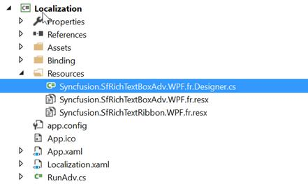
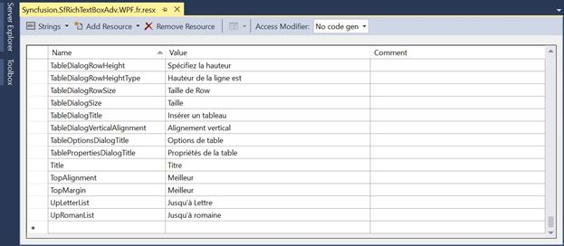
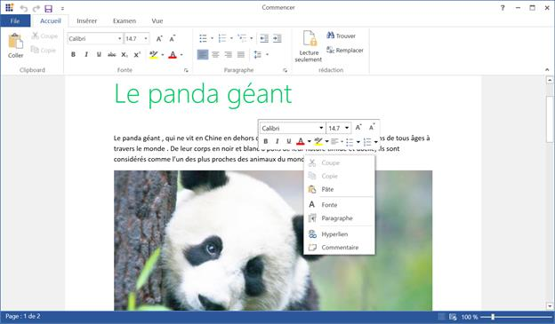

# Localization in WPF RichTextBox (SfRichTextBoxAdv)

Localization is the process of adapting the application to a specific language. [WPF RichTextBox](https://www.syncfusion.com/docx-editor-sdk/wpf-docx-editor) (SfRichTextBoxAdv) provides support to localize all the static text in the ribbon and its dialogs, including button labels, dialog titles, command tooltips, and menu items. Localization can be done by adding a resource file (Resx) and setting the desired culture in the application. The default culture is `en-US`.

The default resource files (`Syncfusion.SfRichTextBoxAdv.WPF.resx` and `Syncfusion.SfRichTextRibbon.WPF.resx`) are shipped with the `Syncfusion.SfRichTextBoxAdv.WPF` and `Syncfusion.SfRichTextRibbon.WPF` assemblies respectively. They must be added to your project (and their `Build Action` set to `Embedded Resource`) for the localized culture-specific Resx files to be picked up at runtime.

## Setting Current UI Culture

For localizing your application to a specific culture, set the `CurrentUICulture` to the required culture before invoking the `InitializeComponent()` method. The same value can be applied to `App.xaml.cs` (in the `App` constructor) instead of `MainWindow` to apply the culture application-wide.

N> `CurrentUICulture` controls the language of resource strings. If you also need to localize date, number, and currency formats, set `CurrentCulture` to the same `CultureInfo` instance.

The following code example demonstrates how to set the culture for localizing an application.



public MainWindow() 
{ 
	System.Threading.Thread.CurrentThread.CurrentUICulture = new System.Globalization.CultureInfo("fr-FR");

	InitializeComponent();
}



Partial Public Class MainWindow
Public Sub New()
System.Threading.Thread.CurrentThread.CurrentUICulture = New System.Globalization.CultureInfo("fr-FR")
InitializeComponent()
End Sub
End Class





[View the complete localization sample on GitHub](https://github.com/SyncfusionExamples/WPF-RichTextBox-Examples/tree/main/Samples/Localization)

## Adding Resource file

### Create the Resources folder

Create a folder named `Resources` in your project root (alongside your `.csproj` / `.vbproj` file).

### Add the default Resx

The default English (`en-US`) [Resx](https://github.com/SyncfusionExamples/WPF-RichTextBox-Examples/tree/main/Samples/Localization/Localization/Resources) (resource) files for `SfRichTextBoxAdv` and `SfRichTextRibbon` are available in the [GitHub sample](https://github.com/SyncfusionExamples/WPF-RichTextBox-Examples/tree/main/Samples/Localization). Copy `Syncfusion.SfRichTextBoxAdv.WPF.resx` and `Syncfusion.SfRichTextRibbon.WPF.resx` from the sample into the `Resources` folder of your application.

### Create the localized Resx

Create Resx (resource) files named `Syncfusion.SfRichTextBoxAdv.WPF.<culture>.resx` and `Syncfusion.SfRichTextRibbon.WPF.<culture>.resx`. For example, `Syncfusion.SfRichTextBoxAdv.WPF.fr-FR.resx` and `Syncfusion.SfRichTextRibbon.WPF.fr-FR.resx` for the French (`fr-FR`) culture. For your reference, see the French (`fr-FR`) [Resx](https://github.com/SyncfusionExamples/WPF-RichTextBox-Examples/tree/main/Samples/Localization/Localization/Resources) files.

### Add resource keys

Add a resource key (such as the name of the string) and its corresponding localized value in the Resource Designer of the `Syncfusion.SfRichTextBoxAdv.WPF.fr-FR.resx` and `Syncfusion.SfRichTextRibbon.WPF.fr-FR.resx` files.

N> If you have not used `SfRichTextRibbon` in your application, you can skip the `Syncfusion.SfRichTextRibbon.WPF.<culture>.resx` files mentioned above. After adding or modifying Resx files, rebuild the application so the new resources are picked up at runtime.

The following screenshot shows the localization in the SfRichTextBoxAdv and SfRichTextRibbon controls

N> You can refer to our [WPF RichTextBox](https://www.syncfusion.com/docx-editor-sdk/wpf-docx-editor) feature tour page for its groundbreaking feature representations. You can also explore our [WPF RichTextBox example](https://github.com/syncfusion/docx-editor-sdk-wpf-demos) to know how to render and configure the editing tool.

## See Also

- [Getting Started in WPF RichTextBox](Getting-Started)
- [Commands in WPF RichTextBox](Commands)
- [Document Structure in WPF RichTextBox](Document-Structure)