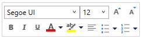

# Mini Toolbar in WPF RichTextBox (SfRichTextBoxAdv)

The [WPF RichTextBox](https://www.syncfusion.com/docx-editor-sdk/wpf-docx-editor) (SfRichTextBoxAdv) supports a built-in mini toolbar to provide rich text formatting options such as Bold, Italic, etc. The mini toolbar can be enabled or disabled through the [EnableMiniToolBar](https://help.syncfusion.com/cr/wpf/Syncfusion.Windows.Controls.RichTextBoxAdv.SfRichTextBoxAdv.html#Syncfusion_Windows_Controls_RichTextBoxAdv_SfRichTextBoxAdv_EnableMiniToolBar) property. The following screenshot shows the built-in mini toolbar of the SfRichTextBoxAdv control.

## Enable/Disable Mini Toolbar

In SfRichTextBoxAdv, the built-in mini toolbar is enabled by default (the default value of [EnableMiniToolBar](https://help.syncfusion.com/cr/wpf/Syncfusion.Windows.Controls.RichTextBoxAdv.SfRichTextBoxAdv.html#Syncfusion_Windows_Controls_RichTextBoxAdv_SfRichTextBoxAdv_EnableMiniToolBar) is `true`). You can enable or disable the built-in mini toolbar as needed. Set `EnableMiniToolBar` to `true` to explicitly enable it, or to `false` to disable it. The following code example demonstrates how to disable the built-in mini toolbar in the SfRichTextBoxAdv control.


<RichTextBoxAdv:SfRichTextBoxAdv x:Name="richTextBoxAdv" EnableMiniToolBar="False"/>



// Initializes a new instance of RichTextBoxAdv.
SfRichTextBoxAdv richTextBoxAdv = new SfRichTextBoxAdv();

// Disables the built-in mini toolbar in the SfRichTextBoxAdv.
richTextBoxAdv.EnableMiniToolBar = false;



' Initializes a new instance of RichTextBoxAdv.
Dim richTextBoxAdv As New SfRichTextBoxAdv()

' Disables the built-in mini toolbar in the SfRichTextBoxAdv.
richTextBoxAdv.EnableMiniToolBar = False




N> You can refer to our [WPF RichTextBox](https://www.syncfusion.com/docx-editor-sdk/wpf-docx-editor) feature tour page for its groundbreaking feature representations. You can also explore our [WPF RichTextBox example](https://github.com/syncfusion/docx-editor-sdk-wpf-demos) to know how to render and configure the editing tool.

## See Also

- [Commands in WPF RichTextBox](Commands)
- [EditorSettings in WPF RichTextBox](EditorSettings)
- [Document Structure in WPF RichTextBox](Document-Structure)