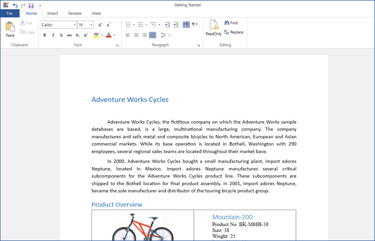

# Overview of the Syncfusion&reg; WPF RichTextBox

The [WPF RichTextBox](https://www.syncfusion.com/docx-editor-sdk/wpf-docx-editor) (SfRichTextBoxAdv) is a feature-rich, user-interactive control that enables viewing, editing, and printing rich text content with advanced formatting and layout capabilities, supporting elements such as text, images, tables, paragraphs, and comments. The control is shipped in the `Syncfusion.SfRichTextBoxAdv.WPF` assembly and is supported on .NET Framework, .NET Core, and .NET 5+ Windows targets.

## Features

* View and edit rich text content, including text, [images](./Image), [tables](./Table), and [comments](./Comment). 
* [Import and export](./Import-and-Export) document formats such as Word (.doc, .docx), Rich Text Format (.rtf), HTML (.htm, .html), XAML (.xaml), and plain text (.txt). 
* [Print](./Printing-Contents) document content with page-by-page rendering. 
* Supports a wide range of image formats (except Metafile images). 
* Provides [undo and redo](./Undo-Redo) support for all editing and formatting operations, including text, tables, images, hyperlinks, and styling (bold, italic, etc.). 
* Supports different header and footer configurations, including first page and odd/even pages. 
* Enables [cut](./Clipboard), [copy](./Clipboard), and [paste](./Clipboard) operations, including rich text content via the clipboard. 
* Supports loading encrypted Word documents with valid password. 

N> Currently, the SfRichTextBoxAdv cannot edit rich text in headers and footers.

N> For prerequisites, NuGet install steps, and a "Hello World" sample, see the [Getting Started guide](Getting-Started).

N> You can refer to our [WPF RichTextBox](https://www.syncfusion.com/docx-editor-sdk/wpf-docx-editor) feature tour page for its groundbreaking feature representations. You can also explore our [WPF RichTextBox example](https://github.com/syncfusion/docx-editor-sdk-wpf-demos) to know how to render and configure the editing tool. 