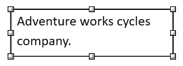

# Shapes in WPF RichTextBox (SfRichTextBoxAdv)
Shapes are drawing objects that include a text box, rectangles, lines, curves, circles, etc. They can be preset or custom geometry. Currently, [WPF RichTextBox](https://www.syncfusion.com/docx-editor-sdk/wpf-docx-editor) does not support inserting shapes. However, if the document contains a shape while importing, it is preserved properly.

## Supported shapes
The RichTextBox has preservation support for the following shapes:

* Text box
* Rectangle

## Text box Shape
A text box is a rectangular area on the document where you can enter text. When you click in a text box, a flashing cursor is displayed, indicating that you can begin typing. It allows you to enter multiple lines of text with rich text formatting.

## Shape Resizer
The RichTextBox also supports a built-in shape resizer to resize the shapes present in the document. The shape resizer supports both touch and mouse interactions.

## Text wrapping style
Text wrapping refers to how shapes fit with surrounding text in a document. Please [refer to this page](Text-Wrapping-Style) for more information about text wrapping styles available in Word documents.

## Positioning the shape
RichTextBox preserves the position properties of the shape and displays the shape based on position properties. It does not support modifying the position properties. If the shape is positioned relative to a line or paragraph, it moves automatically as text is edited.

N> Currently, the shape with text wrapping style `In-Line with Text` can only be dragged and dropped anywhere in the document.

N> This shape preservation is supported starting from v18.3.0.x, and the position properties are preserved starting from v19.1.0.x.

N> You can refer to our [WPF RichTextBox](https://www.syncfusion.com/docx-editor-sdk/wpf-docx-editor) feature tour page for its groundbreaking feature representations. You can also explore our [WPF RichTextBox example](https://github.com/syncfusion/docx-editor-sdk-wpf-demos) to know how to render and configure the editing tool.

## See Also

- [Text Wrapping Style in WPF RichTextBox](Text-Wrapping-Style)
- [Document Structure in WPF RichTextBox](Document-Structure)
- [Commands in WPF RichTextBox](Commands)

