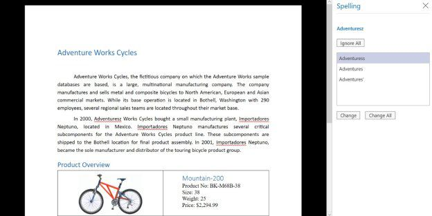

# Spell Check in WPF RichTextBox (SfRichTextBoxAdv)

The [WPF RichTextBox](https://www.syncfusion.com/docx-editor-sdk/wpf-docx-editor) (SfRichTextBoxAdv) provides support for checking spelling mistakes in the rich text document content through the [SpellChecker](https://help.syncfusion.com/cr/wpf/Syncfusion.Windows.Controls.RichTextBoxAdv.SfRichTextBoxAdv.html#Syncfusion_Windows_Controls_RichTextBoxAdv_SfRichTextBoxAdv_SpellChecker) property of type [SpellChecker](https://help.syncfusion.com/cr/wpf/Syncfusion.Windows.Controls.RichTextBoxAdv.SpellChecker.html). It also supports enabling the following spell checking options.

* Ignore words in UPPERCASE.

* Ignore words that contain numbers.

* Ignore URIs.

The following sample code demonstrates how to enable spell checker in SfRichTextBoxAdv.



<RichTextBoxAdv:SfRichTextBoxAdv x:Name="richTextBoxAdv"  xmlns:RichTextBoxAdv="clr-namespace:Syncfusion.Windows.Controls.RichTextBoxAdv;assembly=Syncfusion.SfRichTextBoxAdv.Wpf">
    <RichTextBoxAdv:SfRichTextBoxAdv.SpellChecker>
        <RichTextBoxAdv:SpellChecker IsEnabled="True" IgnoreURIs="true" IgnoreAlphaNumericWords="true" IgnoreUppercaseWords="true"/>
    </RichTextBoxAdv:SfRichTextBoxAdv.SpellChecker>
</RichTextBoxAdv:SfRichTextBoxAdv>



// Enables spell checker in RichTextBoxAdv.
richTextBoxAdv.SpellChecker.IsEnabled = true;

// Ignores alpha numeric words while spell check.
richTextBoxAdv.SpellChecker.IgnoreAlphaNumericWords = true;

// Ignores upper case words while spell check.
richTextBoxAdv.SpellChecker.IgnoreUppercaseWords = true;

// Ignores URIs while spell check.
richTextBoxAdv.SpellChecker.IgnoreURIs = true;



' Enables spell checker in RichTextBoxAdv.
richTextBoxAdv.SpellChecker.IsEnabled = True

' Ignores alpha numeric words while spell check.
richTextBoxAdv.SpellChecker.IgnoreAlphaNumericWords = True

' Ignores upper case words while spell check.
richTextBoxAdv.SpellChecker.IgnoreUppercaseWords = True

' Ignores URIs while spell check.
richTextBoxAdv.SpellChecker.IgnoreURIs = True





## Adding Custom Dictionaries

The SfRichTextBoxAdv also supports defining custom dictionaries that can be referred to while checking spelling mistakes. The SfRichTextBoxAdv ignores words that are defined in the referenced custom dictionaries. The SfRichTextBoxAdv supports the option of adding a misspelled word to a dictionary. This option will be enabled only when at least one custom dictionary is defined. The misspelled words are added to the first item in the [CustomDictionaries](https://help.syncfusion.com/cr/wpf/Syncfusion.Windows.Controls.RichTextBoxAdv.SpellChecker.html#Syncfusion_Windows_Controls_RichTextBoxAdv_SpellChecker_CustomDictionaries) collection.
The following code example demonstrates how to define custom dictionaries for spell checking.


<!-- xmlns:System="clr-namespace:System;assembly=mscorlib" -->
<!-- xmlns:RichTextBoxAdv="clr-namespace:Syncfusion.Windows.Controls.RichTextBoxAdv;assembly=Syncfusion.SfRichTextBoxAdv.Wpf" -->

<RichTextBoxAdv:SpellChecker IsEnabled="True" IgnoreURIs="true" IgnoreAlphaNumericWords="true" IgnoreUppercaseWords="true">
    <RichTextBoxAdv:SpellChecker.CustomDictionaries>
        <System:String>../../Assets/DefaultDictionary.dic</System:String>
        <System:String>../../Assets/CustomDictionary.dic</System:String>
    </RichTextBoxAdv:SpellChecker.CustomDictionaries>
</RichTextBoxAdv:SpellChecker>





You can download a complete working sample from [GitHub](https://github.com/SyncfusionExamples/WPF-RichTextBox-Samples/tree/main/How-to-add-custom-dictionaries-in-richtextbox).

## Multilingual Spell Check Support

The SfRichTextBoxAdv provides support for checking spelling mistakes based on multiple languages. You can do so by defining the Language property of the SfRichTextBoxAdv control.

N> In order to enable spell checking functionality based on a particular language, the language pack for .NET Framework must be installed on the machine.

The following code example demonstrates how to enable spell checking based on language.


<RichTextBoxAdv:SfRichTextBoxAdv x:Name="richTextBoxAdv"  xmlns:RichTextBoxAdv="clr-namespace:Syncfusion.Windows.Controls.RichTextBoxAdv;assembly=Syncfusion.SfRichTextBoxAdv.Wpf" Language="fr">
    <RichTextBoxAdv:SfRichTextBoxAdv.SpellChecker>
        <RichTextBoxAdv:SpellChecker IsEnabled="True" IgnoreURIs="true" IgnoreAlphaNumericWords="true" IgnoreUppercaseWords="true"/>
    </RichTextBoxAdv:SfRichTextBoxAdv.SpellChecker>
</RichTextBoxAdv:SfRichTextBoxAdv>





## Spelling Pane

The SfRichTextBoxAdv provides built-in spelling pane support for checking spelling mistakes and correcting error words, similar to the Microsoft Word application.
The following code example demonstrates how to show the spelling pane in SfRichTextBoxAdv through the [ShowSpellingPaneCommand](https://help.syncfusion.com/cr/wpf/Syncfusion.Windows.Controls.RichTextBoxAdv.SfRichTextBoxAdv.html#Syncfusion_Windows_Controls_RichTextBoxAdv_SfRichTextBoxAdv_ShowSpellingPaneCommand) command binding.


<!-- Binding Button to UI Command that shows the spelling pane  -->
<Button Content="Show Spelling Pane" Command="RichTextBoxAdv:SfRichTextBoxAdv.ShowSpellingPaneCommand" CommandTarget="{Binding ElementName=richTextBoxAdv}" />





N> You can refer to our [WPF RichTextBox](https://www.syncfusion.com/docx-editor-sdk/wpf-docx-editor) feature tour page for its groundbreaking feature representations. You can also explore our [WPF RichTextBox example](https://github.com/syncfusion/docx-editor-sdk-wpf-demos) to know how to render and configure the editing tool.

## See Also

- [Commands in WPF RichTextBox](Commands)
- [Document Structure in WPF RichTextBox](Document-Structure)
- [Document Properties in WPF RichTextBox](Document-Properties)
