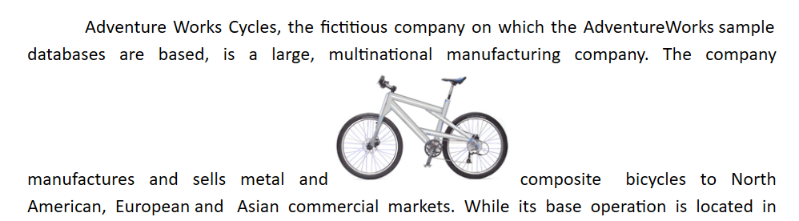
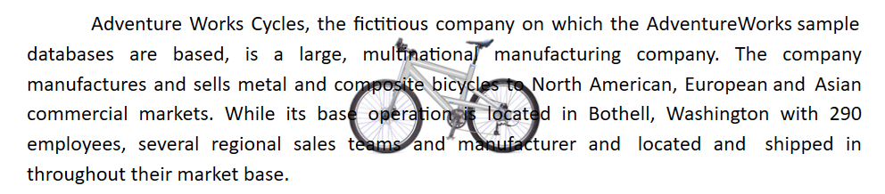
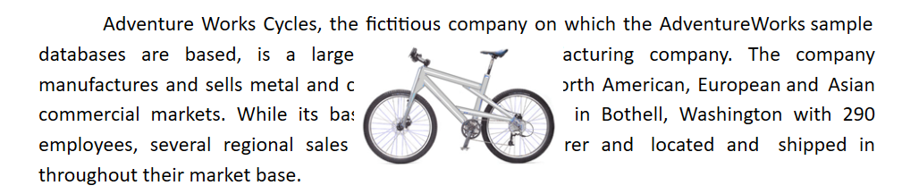
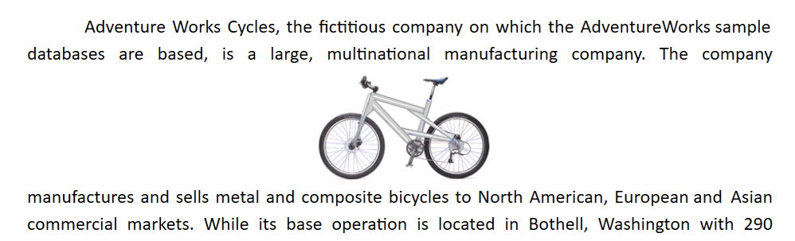
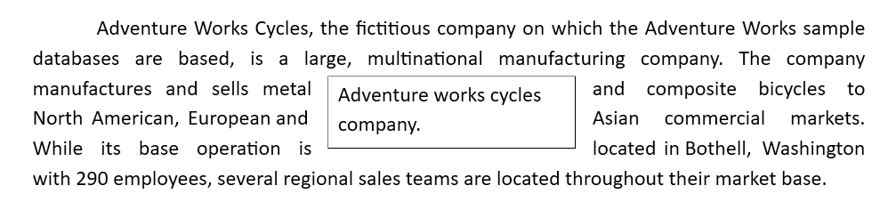

# Text Wrapping Style in WPF RichTextBox (SfRichTextBoxAdv)
Text wrapping refers to how images and shapes fit with surrounding text in a document. Currently, [WPF RichTextBox](https://www.syncfusion.com/docx-editor-sdk/wpf-docx-editor) has preservation support only for image and textbox shapes with the wrapping styles listed below.

## In-Line with Text
In this option, the image or shape is placed on the same line as the surrounding text, like any other word or letter. The image or shape moves automatically with the text as you edit, whereas the other options denote that the image or shape stays in a fixed position while the text shifts and wraps around it.

## Behind
In this option, the image or shape is placed behind the text. This can be used when you need to add a watermark or background image to a document.

## In Front of Text
In this option, the image or shape is placed in front of the text. This can be used to place an image around some text or to add a shape that highlights part of a paragraph.

## Top and Bottom
In this option, the text wraps above and below the image or shape. No text appears to the left or right of the image or shape. This can be used for larger images or shapes that occupy most of the width in a document.

## Square
In this option, Text wraps around the image or text box in a square shape.

N> The in front of and behind text wrapping styles are supported starting from v18.3.0.x; the top and bottom wrapping style is supported starting from v19.1.0.x; the Tight and Through styles are displayed like the square wrapping style starting from v19.2.0.x.

N> You can refer to our [WPF RichTextBox](https://www.syncfusion.com/docx-editor-sdk/wpf-docx-editor) feature tour page for its groundbreaking feature representations. You can also explore our [WPF RichTextBox example](https://github.com/syncfusion/docx-editor-sdk-wpf-demos) to know how to render and configure the editing tool.

## See Also

- [Shapes in WPF RichTextBox](Shapes)
- [Image in WPF RichTextBox](Image)
- [Commands in WPF RichTextBox](Commands)