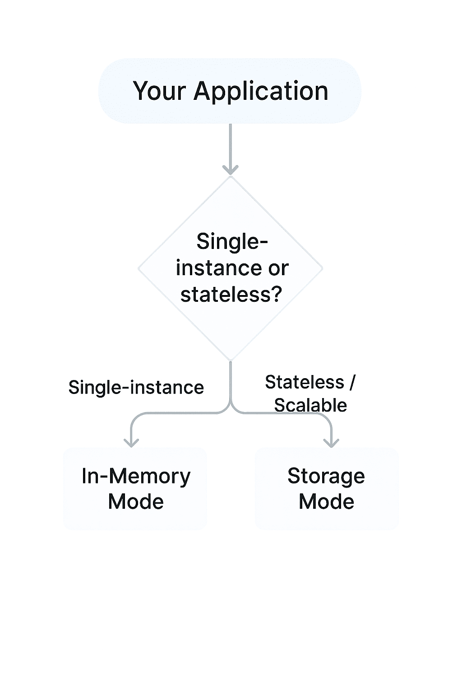

# Getting Started with Syncfusion Document SDK AI Agent Tool Library

The [Syncfusion Document SDK AI Agent Tool library](https://www.nuget.org/packages/Syncfusion.DocumentSDK.AI.AgentTools) exposes Word, Excel, PDF, PowerPoint, and Smart Data Extractor operations as AI-callable tools. It integrates with the [Microsoft Agent Framework](https://learn.microsoft.com/en-us/agent-framework/overview/?pivots=programming-language-csharp) and works with any [providers](https://learn.microsoft.com/en-us/agent-framework/agents/providers/?pivots=programming-language-csharp) like OpenAI, Claude, Gemini, etc.

Use the table below to pick the right mode for your application, then follow the linked guide.

| My app type | Mode to use | Guide |
|---|---|---|
| Desktop / Console / Single-instance | In-Memory | [Getting Started – In-Memory Mode](./getting-started-in-memory-mode) |
| Web API / Scalable / Stateless | Storage | [Getting Started – Storage Mode](./getting-started-storage-mode) |

Both modes expose the same AI tools. The difference is only in how documents are stored between tool calls.

## See Also

- [In-Memory Mode](./getting-started-in-memory-mode)
- [Storage Mode](./getting-started-storage-mode)
- [Overview](./overview)
- [Tools Reference](./tools)
- [Customization](./customization)
- [Example Prompts](./example-prompts)
- [Example Use Cases](./example-use-cases)
