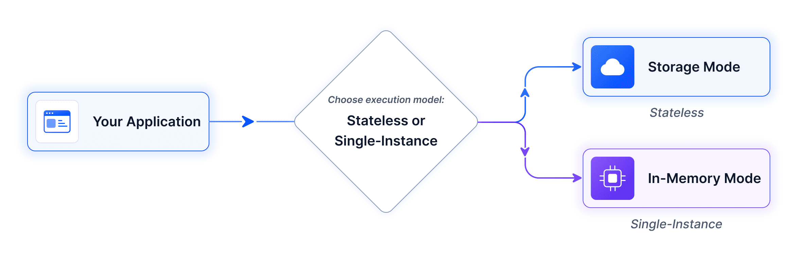

# Getting Started with Syncfusion Document SDK AI Agent Tool Library

The [Syncfusion Document SDK AI Agent Tool](https://www.nuget.org/packages/Syncfusion.DocumentSDK.AI.AgentTools) library exposes Word, Excel, PDF, PowerPoint, and Smart Data Extractor operations as AI-callable tools. It integrates with the [Microsoft Agent Framework](https://learn.microsoft.com/en-us/agent-framework/overview/?pivots=programming-language-csharp) and works with any [IChatClient](https://learn.microsoft.com/en-us/dotnet/api/microsoft.extensions.ai.ichatclient?view=net-9.0-pp) [provider](https://learn.microsoft.com/en-us/agent-framework/agents/providers/?pivots=programming-language-csharp), such as OpenAI, Claude, or Gemini.

## Document Manager Modes

The library supports two modes for managing document state during agent tool invocations. Both modes expose the same AI agent tools; the difference is in how and where documents are stored between tool calls.

The diagram below shows the two available execution paths. The application always interacts with the AI agent; the AI agent invokes the registered tools, and the tools read and write documents either through the in-memory managers or through the storage back end.



Use the table below to choose the appropriate mode for your application and follow the corresponding guide.

<table>
  <thead>
    <tr>
      <th>Use Cases</th>
      <th>Execution Mode</th>
    </tr>
  </thead>
  <tbody>
    <tr>
      <td>
        <ul>
          <li>Desktop applications</li>
          <li>Console applications</li>
          <li>Single-instance (non-scalable)</li>
        </ul>
      </td>
      <td><a href = "#in-memory-mode">In-Memory</a></td>
    </tr>
    <tr>
      <td>
        <ul>
          <li>Web APIs</li>
          <li>Scalable applications</li>
          <li>Stateless services</li>
        </ul>
      </td>
      <td><a href = "#storage-mode">Storage</a></td>
    </tr>
  </tbody>
</table>

## In-Memory Mode

Documents are held as live objects in an in-memory dictionary. Each tool accesses and modifies the object directly without opening or saving files on each call. Unused documents are cleaned up automatically after a configurable timeout (default: 10 minutes).

The example below uses the Microsoft Agents Framework with OpenAI. The same steps apply to any [provider](https://learn.microsoft.com/en-us/agent-framework/agents/providers/?pivots=programming-language-csharp) that implements [IChatClient](https://learn.microsoft.com/en-us/dotnet/api/microsoft.extensions.ai.ichatclient?view=net-11.0-pp).

### Prerequisites

| Requirement | Details |
|---|---|
| .NET SDK | .NET 8.0 or later|
| AI Provider API Key | Required to authenticate requests to the AI provider. This page uses OpenAI.|
| NuGet Packages | [Microsoft.Agents.AI.OpenAI](https://www.nuget.org/packages/Microsoft.Agents.AI.OpenAI), [Microsoft.Extensions.AI.OpenAI](https://www.nuget.org/packages/Microsoft.Extensions.AI.OpenAI) |

### Integration

**Step 1: Install and License**

Install the [Syncfusion.DocumentSDK.AI.AgentTools](https://www.nuget.org/packages/Syncfusion.DocumentSDK.AI.AgentTools) NuGet package, then register your license key at application startup:


After the packages installed, register your license key at application startup:
```csharp
string? licenseKey = Environment.GetEnvironmentVariable("SYNCFUSION_LICENSE_KEY");
if (!string.IsNullOrEmpty(licenseKey))
    Syncfusion.Licensing.SyncfusionLicenseProvider.RegisterLicense(licenseKey);
```

**Step 2: Create Managers and Collection**

Create one document manager per supported document type (`DocumentType.Word`, `DocumentType.Excel`, `DocumentType.PDF`, `DocumentType.PowerPoint`). The `timeout` controls how long an unused document stays in memory before automatic eviction (default in samples: 5 minutes; library default: 10 minutes). Register all managers in a [DocumentManagerCollection](https://help.syncfusion.com/cr/document-processing/Syncfusion.AI.AgentTools.Core.DocumentManagerCollection.html) so cross-format tools (such as [OfficeToPdfAgentTools](https://help.syncfusion.com/cr/document-processing/Syncfusion.AI.AgentTools.OfficeToPDF.OfficeToPdfAgentTools.html)) can resolve the correct manager at runtime:

```csharp
using Syncfusion.AI.AgentTools.Core;
using Syncfusion.AI.AgentTools.Word;
using Syncfusion.AI.AgentTools.Excel;
using Syncfusion.AI.AgentTools.PDF;
using Syncfusion.AI.AgentTools.PowerPoint;

var timeout = TimeSpan.FromMinutes(5);
var wordManager         = new WordDocumentManager(timeout);
var excelManager        = new ExcelWorkbookManager(timeout);
var pdfManager          = new PdfDocumentManager(timeout);
var presentationManager = new PresentationManager(timeout);

var repoCollection = new DocumentManagerCollection();
repoCollection.AddManager(DocumentType.Word,       wordManager);
repoCollection.AddManager(DocumentType.Excel,      excelManager);
repoCollection.AddManager(DocumentType.PDF,        pdfManager);
repoCollection.AddManager(DocumentType.PowerPoint, presentationManager);
```

N> Tools that operate on a single document type are initialized directly with their own manager. Only cross-format tools like [OfficeToPdfAgentTools](https://help.syncfusion.com/cr/document-processing/Syncfusion.AI.AgentTools.OfficeToPDF.OfficeToPdfAgentTools.html) require the [DocumentManagerCollection](https://help.syncfusion.com/cr/document-processing/Syncfusion.AI.AgentTools.Core.DocumentManagerCollection.html).

N> Each manager is thread-safe. When the application shuts down, dispose the `DocumentManagerCollection` (or call `Dispose` on each manager) to release the in-memory objects immediately rather than waiting for the eviction timer.

**Step 3: Instantiate Tools**

Initialize each tool class with its manager and call [GetTools()](https://help.syncfusion.com/cr/document-processing/Syncfusion.AI.AgentTools.Core.AgentToolBase.html#Syncfusion_AI_AgentTools_Core_AgentToolBase_GetTools) to collect [AITool](https://help.syncfusion.com/cr/document-processing/Syncfusion.AI.AgentTools.Core.AITool.html) objects:

```csharp
using Syncfusion.AI.AgentTools.DataExtraction;
using Syncfusion.AI.AgentTools.OfficeToPDF;
using AITool = Syncfusion.AI.AgentTools.Core.AITool;

string outputDir = Environment.GetEnvironmentVariable("OUTPUT_DIR") ?? @"D:\Output";
Directory.CreateDirectory(outputDir);

var allTools = new List<AITool>();

// Word tools
allTools.AddRange(new WordDocumentAgentTools(wordManager, outputDir).GetTools());
allTools.AddRange(new WordOperationsAgentTools(wordManager).GetTools());
allTools.AddRange(new WordSecurityAgentTools(wordManager).GetTools());

// Excel tools
allTools.AddRange(new ExcelWorkbookAgentTools(excelManager, outputDir).GetTools());
allTools.AddRange(new ExcelWorksheetAgentTools(excelManager).GetTools());
allTools.AddRange(new ExcelSecurityAgentTools(excelManager).GetTools());

// PDF tools
allTools.AddRange(new PdfDocumentAgentTools(pdfManager, outputDir).GetTools());
allTools.AddRange(new PdfOperationsAgentTools(pdfManager).GetTools());
allTools.AddRange(new PdfSecurityAgentTools(pdfManager).GetTools());

// PowerPoint tools
allTools.AddRange(new PresentationDocumentAgentTools(presentationManager, outputDir).GetTools());
allTools.AddRange(new PresentationOperationsAgentTools(presentationManager).GetTools());
allTools.AddRange(new PresentationSecurityAgentTools(presentationManager).GetTools());

// Conversion and data extraction
allTools.AddRange(new OfficeToPdfAgentTools(repoCollection, outputDir).GetTools());
allTools.AddRange(new DataExtractionAgentTools(outputDir).GetTools());
```

N> Register only the tool classes your app needs. See the full list in the [Tools Reference](./tools).

**Step 4: Convert and Register Tools**

Wrap each `Syncfusion.AI.AgentTools.Core.AITool` into a framework-compatible function using [AIFunctionFactory.Create](https://learn.microsoft.com/en-us/dotnet/api/microsoft.extensions.ai.aifunctionfactory.create?view=net-11.0-pp). The `AIFunctionFactoryOptions` class accepts `Name`, `Description`, and `AdditionalProperties`; for the full list see the [AIFunctionFactoryOptions API reference](https://learn.microsoft.com/en-us/dotnet/api/microsoft.extensions.ai.aifunctionfactoryoptions?view=net-11.0-pp).

```csharp
using Microsoft.Extensions.AI;

var aiTools = allTools
    .Select(t => AIFunctionFactory.Create(
        t.Method,
        t.Instance,
        new AIFunctionFactoryOptions { Name = t.Name, Description = t.Description }))
    .Cast<Microsoft.Extensions.AI.AITool>()
    .ToList();
```

N> AI agents support a maximum of 128 tools. Register only the tools relevant to your scenario; group them by document type and drop the ones your app will never need.

**Step 5: Define the System Prompt**

The system prompt sets the rules for how the agent works: which folders to read from, which folders to write to, and how to call the registered tools. The following example is the minimum viable version:

```csharp
static string BuildSystemPrompt(string inputDir, string outputDir) =>
    $"""
    You are a document-processing agent with access to Syncfusion Document SDK tools.

    - Read input files from:  {inputDir}
    - Write output files to: {outputDir}
    - When you produce a file, always include its full path in the final reply.
    - If a tool call fails, surface the error message verbatim and stop.
    """;
```

For the full production prompt used by the console sample, see the [AgentChatConsole sample on GitHub](https://github.com/syncfusion/document-sdk-ai-agent-tools/blob/master/Examples/Console/AgentChatConsole/Program.cs).

**Step 6: Build the Agent**

Create the agent with the chat client, system prompt, and registered tools:

```csharp
using Microsoft.Agents.AI;
using OpenAI;

string apiKey    = Environment.GetEnvironmentVariable("OPENAI_API_KEY")!;
string model     = Environment.GetEnvironmentVariable("OPENAI_MODEL") ?? "gpt-4o";
string inputDir  = Environment.GetEnvironmentVariable("INPUT_DIR")  ?? @"D:\Input";
string outputDir = Environment.GetEnvironmentVariable("OUTPUT_DIR") ?? @"D:\Output";

AIAgent agent = new OpenAIClient(apiKey)
    .GetChatClient(model)
    .AsIChatClient()
    .AsAIAgent(
        instructions: BuildSystemPrompt(inputDir, outputDir),
        tools: aiTools);
```

The system prompt sets the rules for how the agent works. For the full system prompt, see [here](https://github.com/syncfusion/document-sdk-ai-agent-tools/blob/master/Examples/Console/AgentChatConsole/Program.cs#L343).

### Complete Example

You can download a complete working sample from [GitHub](https://github.com/syncfusion/document-sdk-ai-agent-tools/blob/master/Examples/Console/AgentChatConsole/Program.cs).

## Storage Mode

Documents are read from and written to storage (Azure Blob, S3, local disk, etc.) on each tool invocation. No in-memory objects are maintained between tool calls - each operation opens the document from storage, processes it, and saves it back. This mode is ideal for distributed systems, serverless architectures, and scenarios where document persistence is required.

The example below uses Azure Blob Storage. The same pattern works with any storage back end by implementing the [IDocumentStorage](https://help.syncfusion.com/cr/document-processing/Syncfusion.AI.AgentTools.Core.IDocumentStorage.html) interface.

### Prerequisites

| Requirement | Details |
|---|---|
| .NET SDK | .NET 8.0, 9.0, or 10.0 |
| AI Provider API Key | Required to authenticate requests to the AI provider. This page uses OpenAI.|
| Azure Storage Account | Create from [Azure Portal](https://portal.azure.com) with a blob container |
| NuGet Packages | [Microsoft.Agents.AI.OpenAI](https://www.nuget.org/packages/Microsoft.Agents.AI.OpenAI), [Microsoft.Extensions.AI.OpenAI](https://www.nuget.org/packages/Microsoft.Extensions.AI.OpenAI), [Azure.Storage.Blobs](https://www.nuget.org/packages/Azure.Storage.Blobs) |

The package compatibility table at the top of the [In-Memory Mode](#in-memory-mode) section also applies here.

### Integration

**Step 1: Install and License**

Install the [Syncfusion.DocumentSDK.AI.AgentTools](https://www.nuget.org/packages/Syncfusion.DocumentSDK.AI.AgentTools) NuGet package, then register your license key at application startup:


```csharp
string? licenseKey = Environment.GetEnvironmentVariable("SYNCFUSION_LICENSE_KEY");
if (!string.IsNullOrEmpty(licenseKey))
    Syncfusion.Licensing.SyncfusionLicenseProvider.RegisterLicense(licenseKey);
```

**Step 2: Implement Storage**

Implement [IDocumentStorage](https://help.syncfusion.com/cr/document-processing/Syncfusion.AI.AgentTools.Core.IDocumentStorage.html) for your storage back end. The interface contract is:

| Method | Returns | Contract |
|---|---|---|
| `Read(string filePath)` | `Stream` | Returns a readable stream positioned at the start. The caller owns the stream and is responsible for disposing it. |
| `Write(string filePath, Stream documentStream)` | `bool` | Returns `true` on success, `false` on failure. The stream's position is not modified by the call. |
| `Exists(string filePath)` | `bool` | Returns `true` if the file is present in storage, otherwise `false`. |

Below is the class signature and method placeholders for Azure Blob Storage. You can download a complete working sample from [GitHub](https://github.com/syncfusion/document-sdk-ai-agent-tools/blob/master/Examples/ASP.NET-Core/AgentChatWeb/).

```csharp
using Azure.Storage.Blobs;
using Azure.Storage.Blobs.Models;
using Syncfusion.AI.AgentTools.Core;

public class AzureBlobStorage : IDocumentStorage
{
    private readonly BlobContainerClient _containerClient;

    public AzureBlobStorage(string connectionString, string containerName)
    {
        _containerClient = new BlobContainerClient(connectionString, containerName);
        _containerClient.CreateIfNotExists(PublicAccessType.None);
    }

    public Stream Read(string filePath)
    {
        ArgumentException.ThrowIfNullOrEmpty(filePath);
        var blob = _container.GetBlobClient(filePath);
        var ms = new MemoryStream();
        blob.DownloadTo(ms);
        ms.Position = 0;
        return ms;
    }

    public bool Write(string filePath, Stream documentStream)
    {
        ArgumentException.ThrowIfNullOrEmpty(filePath);
        ArgumentNullException.ThrowIfNull(documentStream);
        try
        {
            documentStream.Position = 0;
            var blob = _container.GetBlobClient(filePath);
            blob.Upload(documentStream, overwrite: true);
            return true;
        }
        catch
        {
            return false;
        }
    }

    public bool Exists(string filePath)
    {
        ArgumentException.ThrowIfNullOrEmpty(filePath);
        return _container.GetBlobClient(filePath).Exists();
    }
}
```

Then initialize it with your connection string and container:

```csharp
string connectionString = Environment.GetEnvironmentVariable("AZURE_BLOB_CONNECTION_STRING")!;
string containerName    = Environment.GetEnvironmentVariable("AZURE_BLOB_CONTAINER") ?? "documents";

IDocumentStorage storage = new AzureBlobStorage(connectionString, containerName);
```

N> The example above uses a connection string for simplicity. For production deployments, prefer **Managed Identity** (`DefaultAzureCredential`) or a **SAS token** over a shared key to reduce credential exposure.

N> For other storage providers (AWS S3, local disk, etc.), implement the same [IDocumentStorage](https://help.syncfusion.com/cr/document-processing/Syncfusion.AI.AgentTools.Core.IDocumentStorage.html) interface with the appropriate SDK or file system operations.

**Step 3: Create DocumentStorageManager**

In-Memory Mode uses separate managers per document type. Storage Mode instead uses a single [DocumentStorageManager](https://help.syncfusion.com/cr/document-processing/Syncfusion.AI.AgentTools.Core.DocumentStorageManager.html) for all document types. The `DocumentStorageManager` reads and writes through the `IDocumentStorage` instance on every tool call, so no in-memory document objects are retained between calls.

```csharp
using Syncfusion.AI.AgentTools.DocumentManagers;

var storageManager = new DocumentStorageManager(storage);
```

**Step 4: Instantiate Tools**

Initialize each tool class with the storage manager and collect [AITool](https://help.syncfusion.com/cr/document-processing/Syncfusion.AI.AgentTools.Core.AITool.html) objects:

```csharp
using Syncfusion.AI.AgentTools.Word;
using Syncfusion.AI.AgentTools.Excel;
using Syncfusion.AI.AgentTools.PDF;
using Syncfusion.AI.AgentTools.PowerPoint;
using Syncfusion.AI.AgentTools.OfficeToPDF;
using Syncfusion.AI.AgentTools.DataExtraction;
using AITool = Syncfusion.AI.AgentTools.Core.AITool;

var allTools = new List<AITool>();

// Word tools
allTools.AddRange(new WordImportExportAgentTools(storageManager).GetTools());
allTools.AddRange(new WordOperationsAgentTools(storageManager).GetTools());
allTools.AddRange(new WordSecurityAgentTools(storageManager).GetTools());

// Excel tools
allTools.AddRange(new ExcelWorksheetAgentTools(storageManager).GetTools());
allTools.AddRange(new ExcelSecurityAgentTools(storageManager).GetTools());
allTools.AddRange(new ExcelDataValidationAgentTools(storageManager).GetTools());

// PDF tools
allTools.AddRange(new PdfOperationsAgentTools(storageManager).GetTools());
allTools.AddRange(new PdfSecurityAgentTools(storageManager).GetTools());
allTools.AddRange(new PdfContentExtractionAgentTools(storageManager).GetTools());

// PowerPoint tools
allTools.AddRange(new PresentationOperationsAgentTools(storageManager).GetTools());
allTools.AddRange(new PresentationSecurityAgentTools(storageManager).GetTools());
allTools.AddRange(new PresentationContentAgentTools(storageManager).GetTools());
allTools.AddRange(new PresentationFindAndReplaceAgentTools(storageManager).GetTools());

// Conversion and data extraction
allTools.AddRange(new OfficeToPdfAgentTools(storageManager).GetTools());
allTools.AddRange(new DataExtractionAgentTools().GetTools());
```

N> The following tool classes are not supported in Storage mode because they require an in-memory document instance:
N>    * [WordDocumentAgentTools](https://help.syncfusion.com/cr/document-processing/Syncfusion.AI.AgentTools.Word.WordDocumentAgentTools.html)
N>    * [ExcelWorkbookAgentTools](https://help.syncfusion.com/cr/document-processing/Syncfusion.AI.AgentTools.Excel.ExcelWorkbookAgentTools.html)
N>    * [PdfDocumentAgentTools](https://help.syncfusion.com/cr/document-processing/Syncfusion.AI.AgentTools.PDF.PdfDocumentAgentTools.html)
N>    * [PresentationDocumentAgentTools](https://help.syncfusion.com/cr/document-processing/Syncfusion.AI.AgentTools.PowerPoint.PresentationDocumentAgentTools.html)
N>
N> All other tool classes work identically in both modes. The fully qualified `Syncfusion.AI.AgentTools.Core.AITool` is used directly to avoid CS0436 ambiguity with `Microsoft.Extensions.AI.AITool`. Register only the tool classes your app needs. See the full list in the [Tools Reference](./tools).

**Step 5: Convert and Register Tools**

Wrap each `Syncfusion.AI.AgentTools.Core.AITool` into a framework-compatible function using [AIFunctionFactory.Create](https://learn.microsoft.com/en-us/dotnet/api/microsoft.extensions.ai.aifunctionfactory.create?view=net-11.0-pp). The `AIFunctionFactoryOptions` class accepts `Name`, `Description`, and `AdditionalProperties`; for the full list see the [AIFunctionFactoryOptions API reference](https://learn.microsoft.com/en-us/dotnet/api/microsoft.extensions.ai.aifunctionfactoryoptions?view=net-11.0-pp).

```csharp
using Microsoft.Extensions.AI;

var aiTools = allTools
    .Select(t => AIFunctionFactory.Create(
        t.Method,
        t.Instance,
        new AIFunctionFactoryOptions { Name = t.Name, Description = t.Description }))
    .Cast<Microsoft.Extensions.AI.AITool>()
    .ToList();
```

N> AI agents support a maximum of 128 tools. Register only the tools relevant to your scenario.

**Step 6: Define the System Prompt**

The system prompt sets the rules for how the agent works. In Storage Mode the `inputDir` and `outputDir` parameters are logical folder prefixes inside the blob container (for example, `input/` and `output/`), not local file system paths.

```csharp
static string BuildSystemPrompt(string inputDir, string outputDir) =>
    $"""
    You are a document-processing agent with access to Syncfusion Document SDK tools.

    - Read input files from:  {inputDir}
    - Write output files to: {outputDir}
    - When you produce a file, always include its full path in the final reply.
    - If a tool call fails, surface the error message verbatim and stop.
    """;
```

For the full production prompt used by the ASP.NET Core sample, see the [AgentChatWeb sample on GitHub](https://github.com/syncfusion/document-sdk-ai-agent-tools/blob/master/Examples/ASP.NET-Core/AgentChatWeb).

**Step 7: Build the Agent**

Create the agent with the chat client, system prompt, and registered tools:

```csharp
using Microsoft.Agents.AI;
using OpenAI;

string apiKey = Environment.GetEnvironmentVariable("OPENAI_API_KEY")!;
string model  = Environment.GetEnvironmentVariable("OPENAI_MODEL") ?? "gpt-4o";

AIAgent agent = new OpenAIClient(apiKey)
    .GetChatClient(model)
    .AsIChatClient()
    .AsAIAgent(
        instructions: BuildSystemPrompt(@"Input\", @"Output\"),
        tools: aiTools);
```

The system prompt sets the rules for how the agent works. For the full system prompt, see [here](https://github.com/syncfusion/document-sdk-ai-agent-tools/blob/master/Examples/ASP.NET-Core/AgentChatWeb/Services/AgentService.cs#L228).

### Complete Example

You can download a complete working sample from [GitHub](https://github.com/syncfusion/document-sdk-ai-agent-tools/tree/master/Examples/ASP.NET-Core/AgentChatWeb).

## See Also

- [Overview](./overview)
- [Tools Reference](./tools)
- [Customization](./customization)
- [Example Prompts](./example-prompts)
- [Example Use Cases](./example-use-cases)
