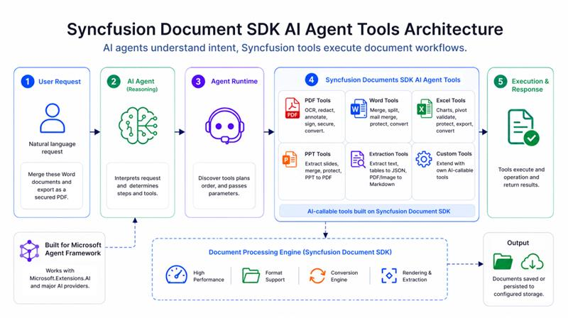

# Syncfusion Document SDK AI Agent Tools Overview

[Syncfusion Document SDK AI Agent Tool](https://www.nuget.org/packages/Syncfusion.DocumentSDK.AI.AgentTools) is a .NET library that enables AI agents to autonomously create, manipulate, convert, and extract data from Word, Excel, PDF, PowerPoint, Markdown, and other document formats. It exposes pre-built, AI-callable tools built on [Syncfusion Document SDK](https://www.syncfusion.com/document-sdk) - no document-processing logic required in your host application.

You can quickly deploy it to your infrastructure via [NuGet](https://www.nuget.org/packages/Syncfusion.DocumentSDK.AI.AgentTools). If you want to add new functionality or customize existing functionality, you can use the source code available on [GitHub](https://github.com/syncfusion/document-sdk-ai-agent-tools/tree/master/Syncfusion.DocumentSDK.AI.AgentTools). Compatible with .NET 8.0, 9.0, and 10.0.

## How It Works

## Key Capabilities

<table>
  <thead>
    <tr>
      <th>Format</th>
      <th>Key Operations</th>
      <th>Supported File Types</th>
    </tr>
  </thead>
  <tbody>
    <tr>
      <td><strong>PDF</strong></td>
      <td>
        <ul>
          <li>Digital signing</li>
          <li>Redaction</li>
          <li>Watermarking</li>
          <li>OCR</li>
          <li>Encryption</li>
          <li>Merge or split</li>
          <li>Compression</li>
          <li>Page reordering</li>
          <li>Text and image extraction</li>
          <li>Annotation and form field import or export</li>
          <li>PDF/A conversion</li>
          <li>Image to PDF</li>
        </ul>
      </td>
      <td><b>.pdf</b></td>
    </tr>
    <tr>
      <td><strong>Word</strong></td>
      <td>
        <ul>
          <li>Mail merge</li>
          <li>Bookmarks</li>
          <li>Form fields</li>
          <li>Find &amp; replace</li>
          <li>Merge or split</li>
          <li>Compare</li>
          <li>Track changes</li>
          <li>HTML import or export</li>
          <li>Markdown import or export</li>
          <li>Conversion to PDF, image, and RTF</li>
          <li>Field management</li>
          <li>Table of contents</li>
          <li>Security</li>
          <li>Clone</li>
        </ul>
      </td>
      <td><b>.docx</b>, <b>.doc</b>, <b>.rtf</b>, <b>.html</b>, <b>.txt</b>, <b>.md</b></td>
    </tr>
    <tr>
      <td><strong>Excel</strong></td>
      <td>
        <ul>
          <li>Charts</li>
          <li>Conditional formatting</li>
          <li>Data validation</li>
          <li>Pivot tables</li>
          <li>Markdown import or export</li>
          <li>Encryption &amp; protection</li>
          <li>Worksheet management</li>
          <li>Conversion to image, CSV, HTML and JSON</li>
          <li>Workbook format conversion</li>
        </ul>
      </td>
      <td><b>.xlsx</b>, <b>.xls</b>, <b>.xlsm</b>, <b>.csv</b></td>
    </tr>
    <tr>
      <td><strong>PowerPoint</strong></td>
      <td>
        <ul>
          <li>Text extraction</li>
          <li>Find &amp; replace</li>
          <li>Merge or split</li>
          <li>Markdown import or export</li>
          <li>Encryption</li>
          <li>Write protection</li>
          <li>Export as image</li>
        </ul>
      </td>
      <td><b>.pptx</b></td>
    </tr>
    <tr>
      <td><strong>Office to PDF</strong></td>
      <td>
        <ul>
          <li>Convert Word, Excel, or PowerPoint to PDF in a single tool call</li>
        </ul>
      </td>
      <td>Office (Word, Excel, PowerPoint) to <b>.pdf</b></td>
    </tr>
    <tr>
      <td><strong>Data Extraction</strong></td>
      <td>
        <ul>
          <li>Structured data</li>
          <li>Table</li>
          <li>Form extraction from pdf and image files</li>
          <li>PDF and table to Markdown conversion</li>
        </ul>
      </td>
      <td><b>.pdf</b>, <b>.png</b>, <b>.jpg</b>, <b>.jpeg</b></td>
    </tr>
  </tbody>
</table>

## Related Resources

- [Tools](./tools)
- [Getting Started](./getting-started)
- [Customization](./customization)
- [Example Prompts](./example-prompts)
- [Example Use Cases](./example-use-cases)
