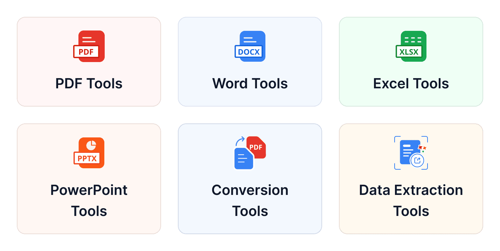

# Syncfusion Document SDK AI Agent Tools

[Agent Tools](https://learn.microsoft.com/en-us/agent-framework/get-started/add-tools?pivots=programming-language-csharp) are the callable functions exposed to the AI agent. Each tool class is initialized with the appropriate manager. You can find the available tools below.

Tools are organized into the following categories:

<table>
<thead>
<tr>
<th>Category</th>
<th>Tool Class</th>
<th>Description</th>
</tr>
</thead>
<tbody>
<tr>
<td rowspan="7"><strong>PDF</strong></td>
<td><a href="https://help.syncfusion.com/cr/document-processing/Syncfusion.AI.AgentTools.PDF.PdfDocumentAgentTools.html">PdfDocumentAgentTools</a></td>
<td>Core life cycle operations for PDF documents - creating, loading, exporting, and managing PDF documents in memory.</td>
</tr>
<tr>
<td><a href="https://help.syncfusion.com/cr/document-processing/Syncfusion.AI.AgentTools.PDF.PdfOperationsAgentTools.html">PdfOperationsAgentTools</a></td>
<td>Merge, split, reorder, and compress PDF documents.</td>
</tr>
<tr>
<td><a href="https://help.syncfusion.com/cr/document-processing/Syncfusion.AI.AgentTools.PDF.PdfSecurityAgentTools.html">PdfSecurityAgentTools</a></td>
<td>Encryption, decryption, permissions management, digital signing, and redaction for PDF documents.</td>
</tr>
<tr>
<td><a href="https://help.syncfusion.com/cr/document-processing/Syncfusion.AI.AgentTools.PDF.PdfContentExtractionAgentTools.html">PdfContentExtractionAgentTools</a></td>
<td>Extract text and images, search for text, and retrieve page information from PDF documents.</td>
</tr>
<tr>
<td><a href="https://help.syncfusion.com/cr/document-processing/Syncfusion.AI.AgentTools.PDF.PdfAnnotationAgentTools.html">PdfAnnotationAgentTools</a></td>
<td>Watermarking, managing annotations, and importing/exporting form field data in PDF documents.</td>
</tr>
<tr>
<td><a href="https://help.syncfusion.com/cr/document-processing/Syncfusion.AI.AgentTools.PDF.PdfConverterAgentTools.html">PdfConverterAgentTools</a></td>
<td>Convert PDF documents to PDF/A format and image files to PDF.</td>
</tr>
<tr>
<td><a href="https://help.syncfusion.com/cr/document-processing/Syncfusion.AI.AgentTools.PDF.PdfOcrAgentTools.html">PdfOcrAgentTools</a></td>
<td>Perform Optical Character Recognition (OCR) on scanned or image-based PDF documents.</td>
</tr>
<tr>
<td rowspan="9"><strong>Word</strong></td>
<td><a href="https://help.syncfusion.com/cr/document-processing/Syncfusion.AI.AgentTools.Word.WordDocumentAgentTools.html">WordDocumentAgentTools</a></td>
<td>Core life cycle operations for Word documents - creating, loading, exporting, and managing Word documents in memory.</td>
</tr>
<tr>
<td><a href="https://help.syncfusion.com/cr/document-processing/Syncfusion.AI.AgentTools.Word.WordOperationsAgentTools.html">WordOperationsAgentTools</a></td>
<td>Merge, split, compare, clone, manage fields, and update table of contents in Word documents.</td>
</tr>
<tr>
<td><a href="https://help.syncfusion.com/cr/document-processing/Syncfusion.AI.AgentTools.Word.WordSecurityAgentTools.html">WordSecurityAgentTools</a></td>
<td>Password protection, encryption, and decryption for Word documents.</td>
</tr>
<tr>
<td><a href="https://help.syncfusion.com/cr/document-processing/Syncfusion.AI.AgentTools.Word.WordMailMergeAgentTools.html">WordMailMergeAgentTools</a></td>
<td>Mail merge operations for populating Word document templates with structured data.</td>
</tr>
<tr>
<td><a href="https://help.syncfusion.com/cr/document-processing/Syncfusion.AI.AgentTools.Word.WordFindAndReplaceAgentTools.html">WordFindAndReplaceAgentTools</a></td>
<td>Text search and replacement operations within Word documents.</td>
</tr>
<tr>
<td><a href="https://help.syncfusion.com/cr/document-processing/Syncfusion.AI.AgentTools.Word.WordRevisionAgentTools.html">WordRevisionAgentTools</a></td>
<td>Inspect and manage tracked changes (revisions) in Word documents.</td>
</tr>
<tr>
<td><a href="https://help.syncfusion.com/cr/document-processing/Syncfusion.AI.AgentTools.Word.WordImportExportAgentTools.html">WordImportExportAgentTools</a></td>
<td>Import from and export Word documents to HTML, Markdown, and image formats.</td>
</tr>
<tr>
<td><a href="https://help.syncfusion.com/cr/document-processing/Syncfusion.AI.AgentTools.Word.WordFormFieldAgentTools.html">WordFormFieldAgentTools</a></td>
<td>Read and write form field values in Word documents.</td>
</tr>
<tr>
<td><a href="https://help.syncfusion.com/cr/document-processing/Syncfusion.AI.AgentTools.Word.WordBookmarkAgentTools.html">WordBookmarkAgentTools</a></td>
<td>Manage bookmarks and bookmark content within Word documents.</td>
</tr>
<tr>
<td rowspan="8"><strong>Excel</strong></td>
<td><a href="https://help.syncfusion.com/cr/document-processing/Syncfusion.AI.AgentTools.Excel.ExcelWorkbookAgentTools.html">ExcelWorkbookAgentTools</a></td>
<td>Core life cycle operations for Excel workbooks - creating, loading, exporting, and managing workbooks in memory.</td>
</tr>
<tr>
<td><a href="https://help.syncfusion.com/cr/document-processing/Syncfusion.AI.AgentTools.Excel.ExcelWorksheetAgentTools.html">ExcelWorksheetAgentTools</a></td>
<td>Create, manage, and populate worksheets within Excel workbooks.</td>
</tr>
<tr>
<td><a href="https://help.syncfusion.com/cr/document-processing/Syncfusion.AI.AgentTools.Excel.ExcelSecurityAgentTools.html">ExcelSecurityAgentTools</a></td>
<td>Encryption, decryption, and protection management for Excel workbooks and worksheets.</td>
</tr>
<tr>
<td><a href="https://help.syncfusion.com/cr/document-processing/Syncfusion.AI.AgentTools.Excel.ExcelChartAgentTools.html">ExcelChartAgentTools</a></td>
<td>Create charts in Excel workbooks.</td>
</tr>
<tr>
<td><a href="https://help.syncfusion.com/cr/document-processing/Syncfusion.AI.AgentTools.Excel.ExcelConditionalFormattingAgentTools.html">ExcelConditionalFormattingAgentTools</a></td>
<td>Add conditional formatting rules in Excel workbooks.</td>
</tr>
<tr>
<td><a href="https://help.syncfusion.com/cr/document-processing/Syncfusion.AI.AgentTools.Excel.ExcelConversionAgentTools.html">ExcelConversionAgentTools</a></td>
<td>Convert worksheets and charts to image, HTML, JSON, Markdown, and other file formats.</td>
</tr>
<tr>
<td><a href="https://help.syncfusion.com/cr/document-processing/Syncfusion.AI.AgentTools.Excel.ExcelDataValidationAgentTools.html">ExcelDataValidationAgentTools</a></td>
<td>Add dropdown, number, date, time, text length, and custom validation rules to Excel workbooks.</td>
</tr>
<tr>
<td><a href="https://help.syncfusion.com/cr/document-processing/Syncfusion.AI.AgentTools.Excel.ExcelPivotTableAgentTools.html">ExcelPivotTableAgentTools</a></td>
<td>Create pivot tables in Excel workbooks.</td>
</tr>
<tr>
<td rowspan="5"><strong>PowerPoint</strong></td>
<td><a href="https://help.syncfusion.com/cr/document-processing/Syncfusion.AI.AgentTools.PowerPoint.PresentationDocumentAgentTools.html">PresentationDocumentAgentTools</a></td>
<td>Core life cycle operations for PowerPoint presentations - creating, loading, exporting, and managing presentations in memory.</td>
</tr>
<tr>
<td><a href="https://help.syncfusion.com/cr/document-processing/Syncfusion.AI.AgentTools.PowerPoint.PresentationOperationsAgentTools.html">PresentationOperationsAgentTools</a></td>
<td>Merge, split, import and export Markdown, and export slides as images from PowerPoint presentations.</td>
</tr>
<tr>
<td><a href="https://help.syncfusion.com/cr/document-processing/Syncfusion.AI.AgentTools.PowerPoint.PresentationSecurityAgentTools.html">PresentationSecurityAgentTools</a></td>
<td>Password protection and encryption management for PowerPoint presentations.</td>
</tr>
<tr>
<td><a href="https://help.syncfusion.com/cr/document-processing/Syncfusion.AI.AgentTools.PowerPoint.PresentationContentAgentTools.html">PresentationContentAgentTools</a></td>
<td>Read text content and metadata from PowerPoint presentations.</td>
</tr>
<tr>
<td><a href="https://help.syncfusion.com/cr/document-processing/Syncfusion.AI.AgentTools.PowerPoint.PresentationFindAndReplaceAgentTools.html">PresentationFindAndReplaceAgentTools</a></td>
<td>Text search and replacement across all slides in a PowerPoint presentation.</td>
</tr>
<tr>
<td><strong>Conversion</strong></td>
<td><a href="https://help.syncfusion.com/cr/document-processing/Syncfusion.AI.AgentTools.OfficeToPDF.OfficeToPdfAgentTools.html">OfficeToPdfAgentTools</a></td>
<td>Convert Word, Excel, and PowerPoint documents to PDF format.</td>
</tr>
<tr>
<td><strong>Data Extraction</strong></td>
<td><a href="https://help.syncfusion.com/cr/document-processing/Syncfusion.AI.AgentTools.DataExtraction.DataExtractionAgentTools.html">DataExtractionAgentTools</a></td>
<td>AI-powered structured data extraction from PDF documents and images, returning results as JSON.</td>
</tr>
</tbody>
</table>

I> 1. The following tool classes are not supported in Storage mode:
I>    * [WordDocumentAgentTools](https://help.syncfusion.com/cr/document-processing/Syncfusion.AI.AgentTools.Word.WordDocumentAgentTools.html)
I>    * [ExcelWorkbookAgentTools](https://help.syncfusion.com/cr/document-processing/Syncfusion.AI.AgentTools.Excel.ExcelWorkbookAgentTools.html)
I>    * [PdfDocumentAgentTools](https://help.syncfusion.com/cr/document-processing/Syncfusion.AI.AgentTools.PDF.PdfDocumentAgentTools.html)
I>    * [PresentationDocumentAgentTools](https://help.syncfusion.com/cr/document-processing/Syncfusion.AI.AgentTools.PowerPoint.PresentationDocumentAgentTools.html)   
I> 2. All other tool classes work identically in both modes.

## Available Document Managers

The library supports two modes for managing document state during agent tool invocations, including [in-memory](./getting-started#in-memory-mode) mode and [storage](./getting-started#storage-mode) mode, where the operational mode is determined based on the manager used during tool initialization.

- [Document Managers](#document-managers) (In‑Memory Mode)
- [Document Storage Manager](#document-storage-manager) (Storage Mode)

### Document Managers

Document Managers are in-memory containers that manage document life cycles during AI agent operations. They provide common functionality including document creation, import/export, active document tracking, and automatic expiration-based cleanup.

| Document Manager | Description |
|---|---|
| [WordDocumentManager](https://help.syncfusion.com/cr/document-processing/Syncfusion.AI.AgentTools.Word.WordDocumentManager.html) | Manages Word documents in memory. Supports **.docx**, **.doc**, **.rtf**, **.html**,  and **.txt** formats with auto-detection on import. |
| [ExcelWorkbookManager](https://help.syncfusion.com/cr/document-processing/Syncfusion.AI.AgentTools.Excel.ExcelWorkbookManager.html) | Manages Excel workbooks in memory. Owns an `ExcelEngine` instance and implements `IDisposable` for proper resource cleanup. Supports **.xlsx**, **.xls**, **.xlsm**, and **.csv** on export. |
| [PdfDocumentManager](https://help.syncfusion.com/cr/document-processing/Syncfusion.AI.AgentTools.PDF.PdfDocumentManager.html) | Manages PDF documents in memory. Supports both new `PdfDocument` instances and loaded `PdfLoadedDocument` instances, including password-protected files. |
| [PresentationManager](https://help.syncfusion.com/cr/document-processing/Syncfusion.AI.AgentTools.PowerPoint.PresentationManager.html) | Manages PowerPoint presentations in memory. Supports creating new empty presentations and loading existing **.pptx** files, including password-protected ones. |

**DocumentManagerCollection**

[DocumentManagerCollection](https://help.syncfusion.com/cr/document-processing/Syncfusion.AI.AgentTools.Core.DocumentManagerCollection.html) is a centralized registry that holds one document manager for each [DocumentType](https://help.syncfusion.com/cr/document-processing/Syncfusion.AI.AgentTools.Core.DocumentType.html). It is designed for tool classes that need to work across multiple document types within a single operation - specifically when the source and output documents belong to different document managers.

**Why it is needed:** Consider a Word-to-PDF conversion. The source Word document lives in [WordDocumentManager](https://help.syncfusion.com/cr/document-processing/Syncfusion.AI.AgentTools.Word.WordDocumentManager.html), but the resulting PDF must be stored in [PdfDocumentManager](https://help.syncfusion.com/cr/document-processing/Syncfusion.AI.AgentTools.PDF.PdfDocumentManager.html). Rather than hard coding both document managers into the tool class, [OfficeToPdfAgentTools](https://help.syncfusion.com/cr/document-processing/Syncfusion.AI.AgentTools.OfficeToPDF.OfficeToPdfAgentTools.html) accepts a [DocumentManagerCollection](https://help.syncfusion.com/cr/document-processing/Syncfusion.AI.AgentTools.Core.DocumentManagerCollection.html) and detects the correct manager dynamically at runtime based on the `sourceType` argument.

N> Tools that operate on a single document type (e.g., [WordDocumentAgentTools](https://help.syncfusion.com/cr/document-processing/Syncfusion.AI.AgentTools.Word.WordDocumentAgentTools.html), [PdfAnnotationAgentTools](https://help.syncfusion.com/cr/document-processing/Syncfusion.AI.AgentTools.PDF.PdfAnnotationAgentTools.html)) are initialized directly with their own manager. Only cross-format tools such as [OfficeToPdfAgentTools](https://help.syncfusion.com/cr/document-processing/Syncfusion.AI.AgentTools.OfficeToPDF.OfficeToPdfAgentTools.html) require a [DocumentManagerCollection](https://help.syncfusion.com/cr/document-processing/Syncfusion.AI.AgentTools.Core.DocumentManagerCollection.html).

### Document Storage Manager

Document Storage Manager reads documents from and writes them back to storage (such as Azure Blob Storage, S3, or local disk) on each tool invocation; no in‑memory objects are maintained, so every tool call opens and saves document instances, making this mode well-suited for web APIs and applications that require horizontal scaling, support large documents, or need state persistence across sessions.

## See Also

- [Overview](./overview)
- [Getting Started](./getting-started)
- [Customization](./customization)
- [Example Prompts](./example-prompts)
- [Example Use Cases](example-use-cases)
