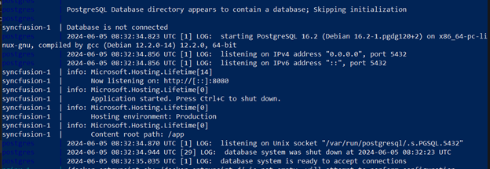
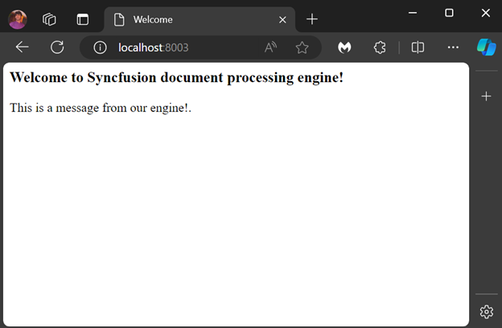

# Docker Container

Docker technology automates application deployment using lightweight containers. Developers can use Docker Containers to package an application with all its libraries and dependencies, enabling deployment as a single package. The Syncfusion document processing engine is available on Docker Hub for Docker users. This guide explains how to run a Docker command or write configuration in a YAML file for the Docker Compose tool.

## Deployment Requirements 

**Hardware Requirements**

To run the document processing API, the following hardware requirements are necessary:

- 	Operating system: Linux
- 	CPU: 2-core
- 	Memory: 8GB RAM
- 	Disk space: 8GB or more

**Software Requirements**

The following software requirements are necessary to run the document processing API:

- 	Database: PostgreSQL
- 	Applications: [Docker](https://docs.docker.com/engine/) and [Docker Compose](https://docs.docker.com/compose/)
- 	Web Browsers: Microsoft Edge, Mozilla Firefox, and Chrome

## Container Configuration

**Required Volumes**

<table>
<thead>
<tr>
<th>Mount Path in Container <br/><br/></th>
<th>Description<br/><br/></th>
</tr>
</thead>
<tbody>  
<tr>
<td>
/FileData<br/><br/></td><td>
Save oth input and output files<br/><br/></td></tr>
<tr>
<td>
/usr/local/share/fonts/<br/><br/></td><td>
Folder with fonts, which will be used to create documents with corresponding font<br/><br/></td></tr>
</tbody>
</table>

**Parameters**

<table>
<thead>
<tr>
<th>Name<br/><br/></th>
<th>Type<br/><br/></th>
<th>Description<br/><br/></th>
</tr>
</thead>
<tbody>  
<tr>
<td>
ASPNETCORE_HTTP_PORTS<br/><br/></td><td>
Required<br/><br/></td><td>
This option determines the port where document processing engine listens for traffic.<br/><br/></td></tr>
<tr>
<tr>
<td>
PGHOST<br/><br/></td><td>
Required<br/><br/></td><td>
Postgresql host address.<br/><br/></td></tr>
<tr>
<tr>
<td>
PGUSER<br/><br/></td><td>
Required<br/><br/></td><td>
Postgresql use name.<br/><br/></td></tr>
<tr>
<tr>
<td>
PGPASSWORD<br/><br/></td><td>
Required<br/><br/></td><td>
Postgresql password.<br/><br/></td></tr>
<tr>
<tr>
<td>
PGDATABASE<br/><br/></td><td>
Required<br/><br/></td><td>
Postgresql database name.<br/><br/></td></tr>
<tr>
<tr>
<td>
PGPORT<br/><br/></td><td>
Required<br/><br/></td><td>
Postgresql port address.<br/><br/></td></tr>
<tr>
<tr>
<td>
SYNCFUSION_LICENSE_KEY<br/><br/></td><td>
Required<br/><br/></td><td>
To apply license key of the product.<br/><br/></td></tr>
<tr>
<tr>
<td>
WORKER_POOL_SIZE<br/><br/></td><td>
Optional<br/><br/></td><td>
This setting determines the number of concurrent processes initiated for managing document processing tasks. Default value is 3.<br/><br/></td></tr>
<tr>
<tr>
<td>
ENABLE_JWT_SECURITY<br/><br/></td><td>
Optional<br/><br/></td><td>
Enable the JWT authentication, Default value is "false".<br/><br/></td></tr>
<tr>
<tr>
<td>
JWT_PUBLIC_KEY<br/><br/></td><td>
Optional<br/><br/></td><td>
This is the public key used to verify the JSON Web Token (JWT) payload signature. Ensure that this public key corresponds to the private key used to generate JWTs in your app.<br/><br/></td></tr>
<tr>
<tr>
<td>
ENABLE_DELETE_RESOURCE<br/><br/></td><td>
Optional<br/><br/></td><td>
This enables to delete job details and both input and generated files. by default, "true".<br/><br/></td></tr>
<tr>
<tr>
<td>
RESOURCE_EXPIRATION_TIME <br/><br/></td><td>
Optional<br/><br/></td><td>
The expiration time in minutes is used to delete resources such as job details and other input and generated files after ethe expiration time, this setting is used only if  ENABLE_DELETE_RESOURCE enabled. by default, value is "30" minutes.<br/><br/></td></tr>
</tbody>
</table>

## How to Configure and Run the Container

1.	Create your Docker Compose YAML file: Include the following configurations in your docker-compose.yml file:

```
networks:
  network:
    driver: bridge

services:
  syncfusion.api:
    container_name: document_processing
    image: praveen245/document-processing-engine:latest    
    environment:
      - ASPNETCORE_HTTP_PORTS=8080
      - PGHOST=database
      - PGUSER=postgres
      - PGPASSWORD=postgres
      - PGDATABASE=documentprocessing
      - PGPORT=5432
      - SYNCFUSION_LICENSE_KEY= {Your key here} 
    depends_on:
      - database
    networks:
      - network
    volumes: 
      - ./storage:/FileData
      - ./fonts:/usr/local/share/fonts/
    ports:
      - "8003:8080"

  database:
    container_name: database
    image: postgres:latest
    environment:
      - POSTGRES_USER=postgres
      - POSTGRES_PASSWORD=postgres
      - POSTGRES_DB=documentprocessing
    volumes:
      - ./.containers/products-db:/var/lib/postgresql/data
    networks:
      - network
    ports:
      - "5432:5432"

```
N> The document processing API is a commercial product and requires a valid license key for production use. Replace {Your key here} with the actual Syncfusion license key.

2.	Run the Docker Compose Command: Execute the following command to start the document processing service and PostgreSQL containers, displaying the logs:

```
docker-compose up
```



3.	Access the Service: After successfully running the server, open http://localhost:8003 in your browser.



