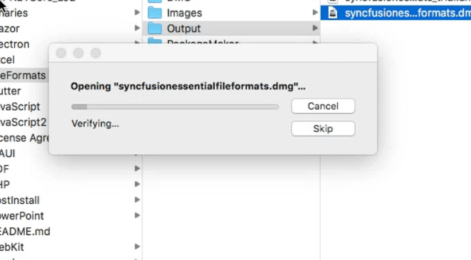
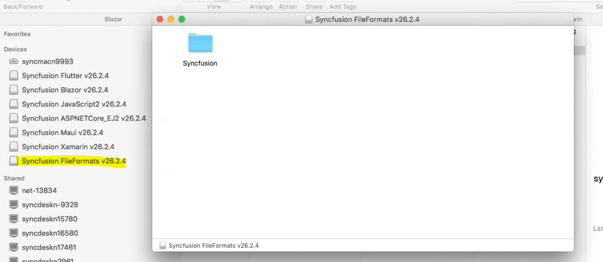
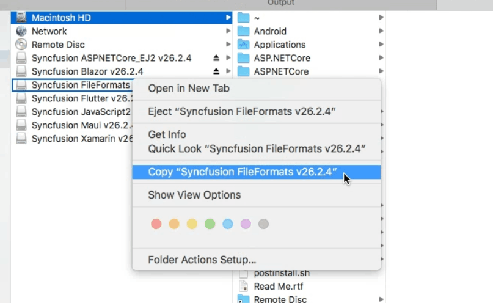
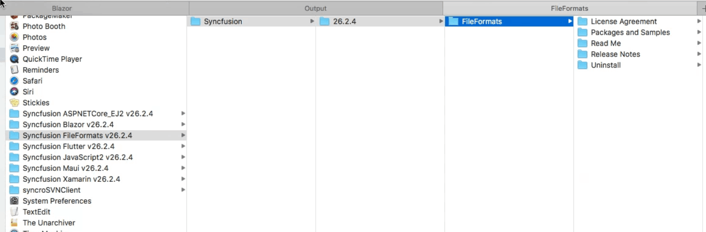
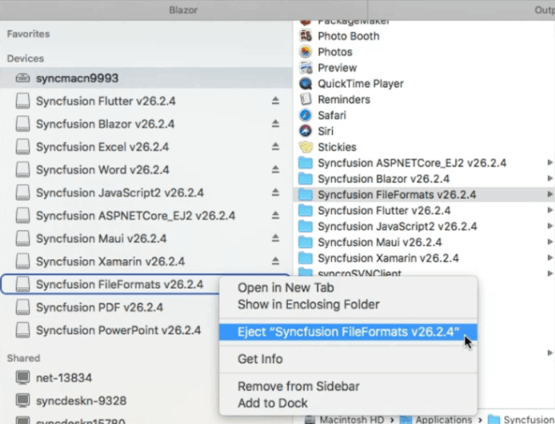

# Installing Syncfusion&reg; Document Solutions Mac installer

## Steps to resolve the warning message in Catalina OS or later

   While running Essential Studio&reg;Document Solutions Mac Installers on macOS Catalina or later, the following alert will be displayed.

     
     
   If you receive this alert, follow the steps below for the easiest solution.

   1. Right-click the downloaded DMG file.
   2. Select the "Open With" option and choose "DiskImageMounter (Default)". The following pop-up appears.

      

   3. Click "Open"; the installer window will open.

## Step-by-Step Installation

The steps below show how to install Essential Studio&reg; Document Solution Mac installer.

1. Locate the downloaded DMG file and open it with a double-click.

   

2. This action will automatically mount the disk image and create a virtual drive on your desktop or in the Finder sidebar.

   

3. Copy the mounted disk file.

   

   N> The Unlock key is not required to install the Mac installer. The Syncfusion&reg; Document Solution Mac installer can be used for development purposes without registering an Unlock key.

4. And paste it in the "Applications" folder.

   

5. Now you can open the folder to explore the Syncfusion&reg; Document Solution Mac installer.

   

6. To remove the DMG file, right-click the virtual drive on your desktop or in the Finder sidebar and select "Eject". Also, delete the folder from the Applications folder.

   

## License key registration in samples

After installation, the license key is required to register the demo source that is included in the Mac installer. To learn the steps for license registration for the ASP.NET Core (EJ2) samples in the Essential Studio&reg; Document Solutions Mac installer, refer to the following:

* Register the license key in the [Program.cs](https://ej2.syncfusion.com/aspnetcore/documentation/licensing/how-to-register-in-an-application#for-aspnet-core-application-using-net-60) file if you created the ASP.NET Core web application with Visual Studio 2022 and .NET 6.0.
* Register the license key in Configure method of [Startup.cs](https://ej2.syncfusion.com/aspnetcore/documentation/licensing/how-to-register-in-an-application#for-aspnet-core-application-using-net-50-or-net-31)