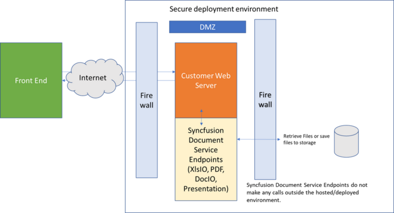

# Welcome to Syncfusion Essential Document Processing Platform

Essential Document Processing is a collection of .NET class libraries to create, edit, write, and convert PDF, Excel, Word, and PowerPoint file formats in .NET Framework [C#, VB.NET], .NET Core, UWP, and Xamarin applications without Microsoft Office or Adobe dependencies.

## How to best read this user guide

* The best way to get started would be to read the “Getting Started” section for the component you would like to start first. The “Getting Started” and “Assemblies required” sections gives enough information, so it is recommended to read these sections end-to-end before starting to write a code. All other information can be referred as needed. 
* After learning the basics about the component, integrate the component into your application. A good starting point is to refer to the code examples in the sample browser and in this user guide. It is very likely that you can find a code example that resembles your intended usage scenario. 
* Another valuable resource is available in the [API reference](https://help.syncfusion.com/cr/document-processing) that provides detailed information on the object hierarchy as well as the settings available on every object.

## Additional help resources

The [Knowledge Base](https://support.syncfusion.com/kb) section contains responses for common questions asked by the customers. This would be a good place to search for the topics that are not covered in the User Guide.

Similar to the Knowledge Base, the [Forum](https://www.syncfusion.com/forums/) section also contains responses to the questions that are asked by other customers.

## Create a support incident

If you are unable to find the information you are looking for in the self-help resources mentioned above, please contact us by creating a [support ticket](https://www.syncfusion.com/support/directtrac/incidents).

## List of Document Processing libraries:

<table>
<tr>
<th width="25%">
Document Processing library
</th>
<th width="75%">
Description
</th>
</tr>
<tr>
<td>
Essential PDF
</td>
<td>
.NET Class library used to create, read, and write PDF files in [.NET Framework](https://www.syncfusion.com/document-processing/pdf-framework/net/) [Windows Forms, WPF, ASP.NET MVC, ASP.NET], [.NET Core](https://www.syncfusion.com/document-processing/pdf-framework/net-core/), [UWP](https://www.syncfusion.com/document-processing/pdf-framework/uwp/) and [Xamarin](https://www.syncfusion.com/document-processing/pdf-framework/xamarin/) applications.
</td>
</tr>
<tr>
<td>
Essential XlsIO
</td>
<td>
.NET Class library used to create, read, edit, write, and convert Microsoft Excel files in [.NET Framework](https://www.syncfusion.com/document-processing/excel-framework/net/) [Windows Forms, WPF, ASP.NET MVC, ASP.NET], [.NET Core](https://www.syncfusion.com/document-processing/excel-framework/net-core/), [UWP](https://www.syncfusion.com/document-processing/excel-framework/uwp/), and [Xamarin](https://www.syncfusion.com/document-processing/excel-framework/xamarin/) applications.
</td>
</tr>
<tr>
<td>
Essential DocIO
</td>
<td>
.NET Class library used to create, read, edit, and convert Microsoft Word files in [.NET Framework](https://www.syncfusion.com/document-processing/word-framework/net/) [Windows Forms, WPF, ASP.NET MVC, ASP.NET], [.NET Core](https://www.syncfusion.com/document-processing/word-framework/net-core/), [UWP](https://www.syncfusion.com/document-processing/word-framework/uwp/), and [Xamarin](https://www.syncfusion.com/document-processing/word-framework/xamarin/) applications.
</td>
</tr>
<tr>
<td>
Essential Presentation
</td>
<td>
.NET Class library used to create, read, edit, and convert Microsoft PowerPoint (PPTX) files in [.NET Framework](https://www.syncfusion.com/document-processing/powerpoint-framework/net/) [Windows Forms, WPF, ASP.NET MVC, ASP.NET], [.NET Core](https://www.syncfusion.com/document-processing/powerpoint-framework/net-core/), [UWP](https://www.syncfusion.com/document-processing/powerpoint-framework/uwp/), and [Xamarin](https://www.syncfusion.com/document-processing/powerpoint-framework/xamarin/) applications.
</td>
</tr>
</table>

## Document Processing Security Information

Syncfusion products are used in some of the most sensitive applications.  We must be concerned about security.

We prioritized security when developing our products.  Each control is self-contained and does not require outside server or Syncfusion API.  Our products exist as defined by the developer and only do the commands defined by the developer.  We built them to work with any security paradigms that our customers can utilize.

Our customers cannot use any hosted Web APIs provided by syncfusion.  We provide the necessary libraries and code examples for our customers to build their own APIs by allowing them to customize the functionality and manage their own security.

	
## Quick Start links:

[Create a PDF file in C# without Adobe](https://help.syncfusion.com/document-processing/pdf/pdf-library/net/create-pdf-file-in-c-sharp-vb-net)
[Create Excel file in C# without Microsoft Office](https://help.syncfusion.com/document-processing/excel/excel-library/net/create-excel-file-csharp-vbnet)
[Create Word file in C# without Microsoft Office](https://help.syncfusion.com/document-processing/word/word-library/net/getting-started)
[Create PowerPoint file in C# without Microsoft Office](https://help.syncfusion.com/document-processing/powerpoint/powerpoint-library/net/getting-started)
